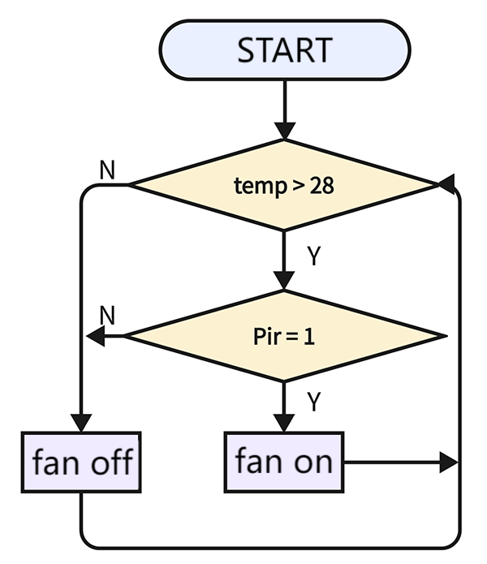
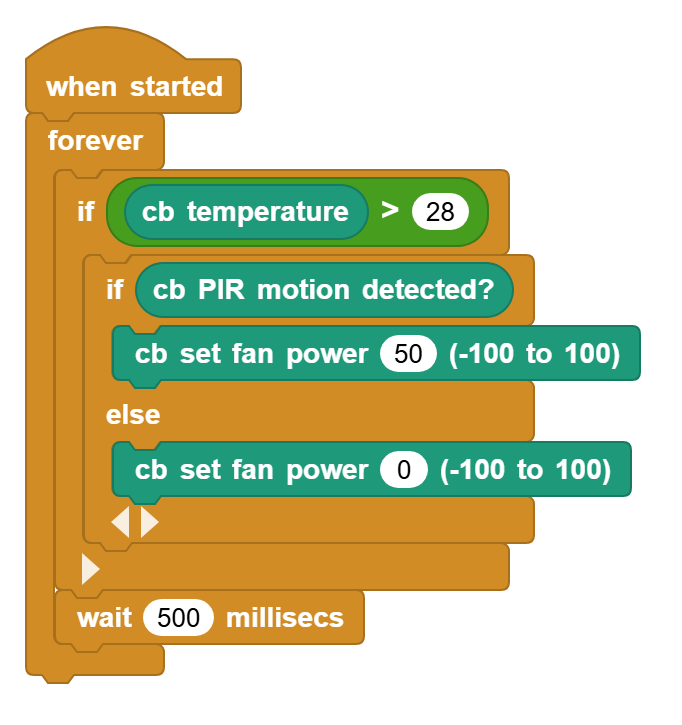

# 3.27 Auto-fan

## 3.27.1 Overview

The weather is getting hotter in summer, so some public places will be equipped with some auto-fans that sense the ambient temperature value. When the temperature reaches a set value, he fan turns on. We add a PIR motion sensor to lower energy consumption. Thus, the fan will turn on only when the temperature reaches the value and someone is sensed nearby. Now let's do it!

## 2.27.2 Code Flow

## 3.27.3 Test Code

You can manually build blocks, or directly open the code file we provide: `3-27-Auto-fan.ubp`. If you have any questions about how to open code files or upload code, please back to `1.9 Upload Code`.

**Build code blocks:**

1. In , drag  and  to the script area, and stack them together.

2. Determine whether the temperature value is higher than 28, and whether there is a human. If there is someone, turn on the fan; if there is no one, do not turn on the fan.

## 3.27.4 Test Result

Connect the coding box to the MicroBlocks via USB or Bluetooth, and click  to upload the code to the coding box. When the temperature value is higher than 28 and the PIR motion sensor detects someone, the fan turns on. If one of the two conditions are not satisfied, the fan will not rotate.