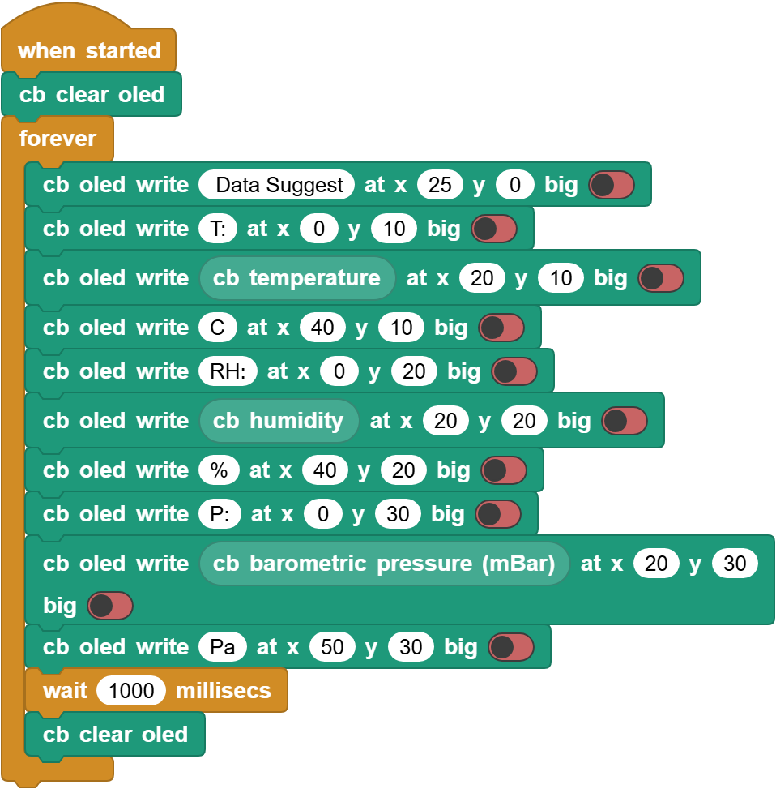
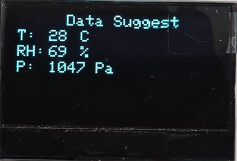

# 3.28 Environment Monitoring

## 3.28.1 Overview

In this project, we use an OLED display to reveal the values of temperature, humidity, air pressure and altitude in the environment. It can be regarded as a mini environmental monitoring device. 

## 3.28.2 Test Code

You can manually build blocks, or directly open the code file we provide: `3-28-Environment Monitoring.ubp`. If you have any questions about how to open code files or upload code, please back to `1.9 Upload Code`.

**Build code blocks:**

1. In , drag  and  to the script area, and stack them together.

2. Before building blocks,  is required to clear all OLED display to prevent initial display content.
2. Add a  to show `Data Suggest` at the position of (X:25, Y:0). Turn the `big` off.
2. Add another  to show `T:` at the position of (X:0, Y:10) at the next line.
2. Show temperature value at the position of (X:20, Y:10) followed a `C` at (X:40, Y:10).
2. Similarly, build blocks to show humidity values and pressure values. Add a delay of 1 second and clear the OLED at last.

**Complete code:**

## 3.28.3 Test Result

Connect the coding box to the MicroBlocks via USB or Bluetooth, and click  to upload the code to the coding box. You will see the values of temperature, humidity, air pressure and altitude on the OLED display. These values refresh every second.

