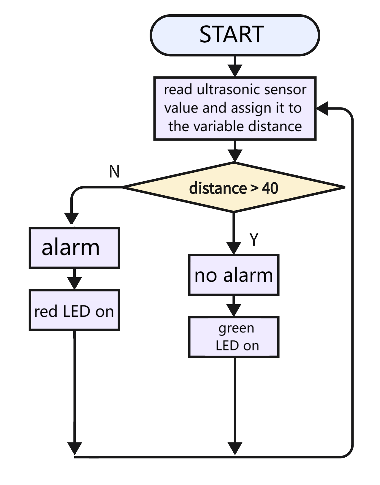

# 3.29 Car Backing Radar

## 3.29.1 Overview

When a car is in reverse, it will alarm the distance of the obstacles behind the parking space. In this project, we build a mini car backing radar with an ultrasonic sensor for distance detection, a speaker to alarm, and a traffic light module as an indicator.

## 3.29.2 Code Flow

## 3.29.3 Test Code

You can manually build blocks, or directly open the code file we provide: `3-29-Car Backing Radar.ubp`. If you have any questions about how to open code files or upload code, please back to `1.9 Upload Code`.

**Build code blocks:**

1. In , drag  and  to the script area, and stack them together.

2. Declare a variable named `distance`. Assign the detected value of the ultrasonic sensor to it.
3. Determine whether `distance` > 40. If yes, the speaker stays quiet, the red LED is off while the green one is ON.
4. Determine whether `distance` < 40. If yes, the speaker alarms, the red LED is ON while the green one is off.

**Complete code:**

## 3.29.4 Test Result

Connect the coding box to the MicroBlocks via USB or Bluetooth, and click  to upload the code to the coding box. When the the detected distance value is greater than 40cm, the green LED is on and the amplifier does not emit sound. If the value is less than 40cm, the red LED will light up and the amplifier will alarm.