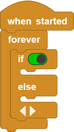
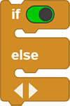
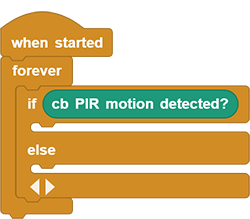
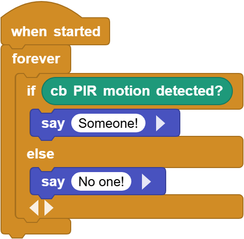
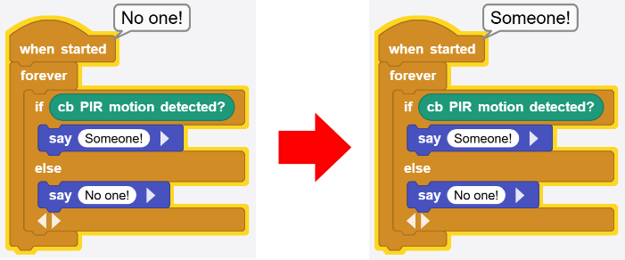

# 3.3 PIR Motion Sensor

## 3.3.1 Overview

The PIR motion sensor adopts RE200B-P element. 

Based on pyroelectric effect, the sensor is able to detect the infrared ray emitted by human body or animal. With Fresnel lens, it can even detect farther and wider. When a nearby human or animal motion is detected, the sensor outputs a high level.

## 3.3.2 Schematic Diagram

**Working principle:** The human body maintains at 37 degrees, so it will emit a specific wavelength of about 10μm infrared. The sensor captures 10μM infrared to determine whether there is a motion.

## 3.3.3 Code Blocks

Blocks in :

1.  “IF” block checks the Boolean condition. If it is true, the included blocks run once.  allows for expansions by adding multiple “ELSE IF” conditions. If the previous branches are not true, each of the following ELSE IF will be continuously evaluated and executed.

--------------------

Blocks in :

1.  is a block included in coding box library. It reads the value of the PIR motion sensor in the coding box. When a person is detected, the sensor outputs a high level (1); when not, the sensor outputs a low level (0).

## 3.3.4 Test Code

You can manually build blocks, or directly open the code file we provide: `3-3-Pir.ubp`. If you have any questions about how to open code files or upload code, please back to `1.9 Upload Code`.

**Build code blocks:**

1. In , drag  and  to the script area, and stack them together.

2. In , drag  block and put it in ; Click  to add an “else”.

3. In , drag  block and put it in .

4. In , drag two  and put them in  respectively. Output `Someone!` in “if” and `No one!` in “else”.

   **Complete code:**

## 3.3.5 Test Result

Connect the coding box to the MicroBlocks via USB or Bluetooth, and click  to upload the code to the coding box. When the PIR motion sensor detects a human, it outputs `Someone!`. If not, it shows `No one!`.

