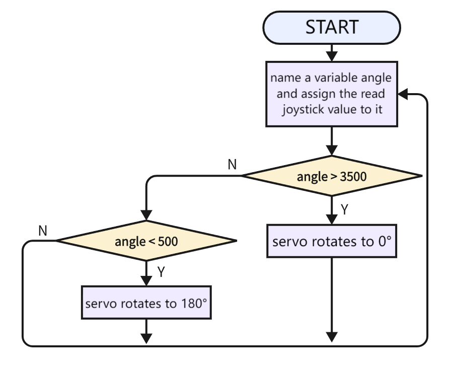
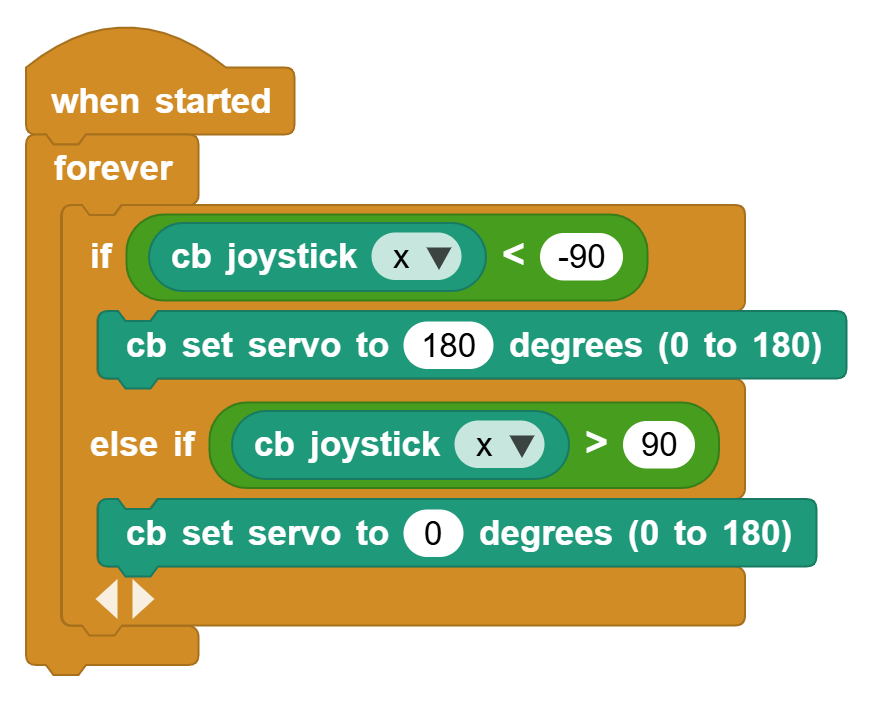

# 3.31  Joystick Control Servo

## 3.31.1 Overview

We control the servo via the axis X of the joystick. This model is widely applied to mechanical ON/OFF of lights and doors.

## 3.31.2 Code Flow

## 3.31.3 Test Code

You can manually build blocks, or directly open the code file we provide: `3-31-Joystick Control Servo.ubp`. If you have any questions about how to open code files or upload code, please back to `1.9 Upload Code`.

**Build code blocks:**

1. In , drag  and  to the script area, and stack them together.

2. Determine whether the joystick is less than -90. If yes, the servo rotates to 180 degrees.
3. Determine whether the joystick is greater than 90. If yes, the servo rotates to 0 degrees.

**Complete code:**

## 3.31.4 Test Result

Connect the coding box to the MicroBlocks via USB or Bluetooth, and click  to upload the code to the coding box. Push the joystick to the left and the servo rotates to 180 degree. Push it to the right and the servo rotates to 0 degree.