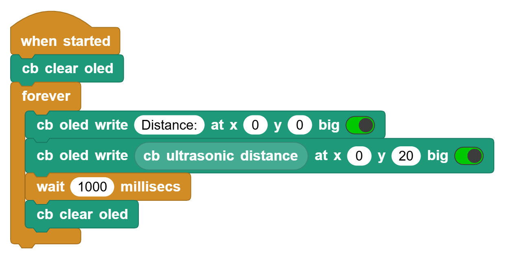
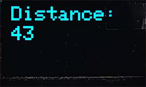

# 3.32 Ultrasonic Ranger

## 3.32.1 Overview

In this project, we combine the ultrasonic sensor and the OLED module to build a distance meter, whose detection range is 4-300CM.

## 3.32.2 Test Code

You can manually build blocks, or directly open the code file we provide: `3-32-Ultrasonic Ranger.ubp`. If you have any questions about how to open code files or upload code, please back to `1.9 Upload Code`.

**Build code blocks:**

1. In , drag  and  to the script area, and stack them together.

2. OLED displays `Distance:` at the position of (X:0, Y:0).
3. OLED displays the distance value detected by the ultrasonic sensor at the position of (X:0, Y:20).
4. Delay 1 second and then clear the OLED display.

**Complete code:**

## 3.32.2 Test Result

Connect the coding box to the MicroBlocks via USB or Bluetooth, and click  to upload the code to the coding box. “Distance:” will be displayed on the first line. What followed is the distance value in “CM” in the second line.

