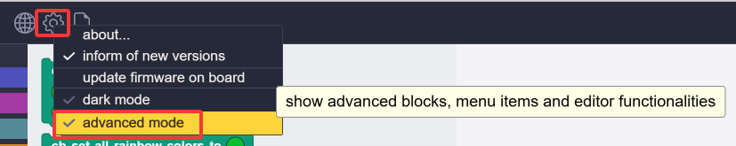
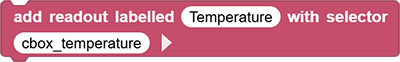
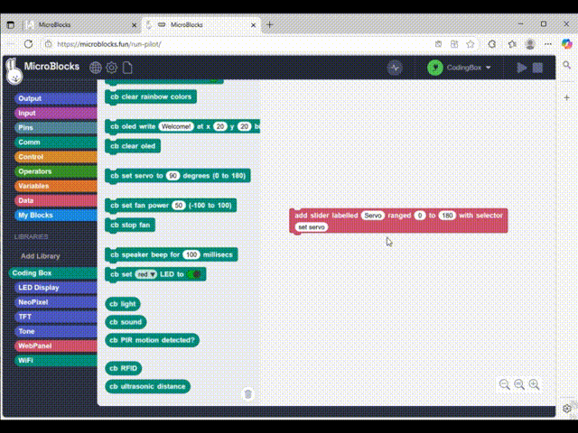
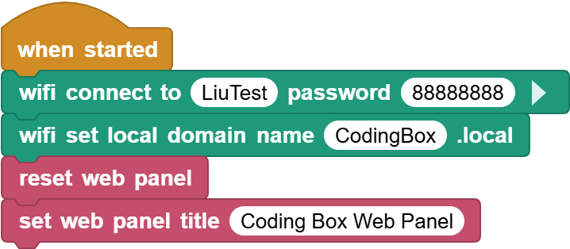
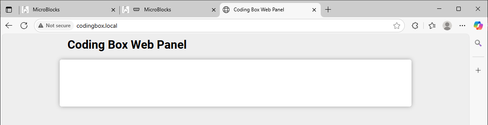

# 3.33 wifi

## 3.33.1 Overview

As a powerful microcontroller, ESP32 boasts a built-in Wi-Fi and Bluetooth nodule that is widely used in Internet of Things (IoT). With this function, it can remotely control the data transmission through the wireless network. 

In applications, ESP32 can be used as a client to connect to a Wi-Fi network, or as a hotspot to create its own network. Through these connections, ESP32 receives commands to control external devices, such as turning on/off lights and adjusting temperature. In the code, protocols like HTTP and MQTT are used to communicate with the server to achieve data sending and receiving, so as to remotely control and monitoring.

## 7.33.2 ESP32 wifi Introduction

ESP32 development board comes with built-in Wi-Fi (2.4G) and Bluetooth (4.2), which enable it to easily connect to Wi-Fi network and communicate with other devices in the network. You can display web pages in your browser via ESP32.

- Base station mode (STA / Wi-Fi Client mode): ESP32 is connected to Wi-Fi hotspot (AP).
- AP mode (Soft-AP / Wi-Fi hotspot mode): Wi-Fi device(s) is(are) connected to ESP32.
- AP-STA mode: ESP32 is both Wi-Fi hotspot and a Wi-Fi device connected to another Wi-Fi.
- These modes supports multiple security modes, including WPA, WPA2 and WEP.
- It is able to scan Wi-Fi hotspot (active or passive)
- It support promiscuous mode monitoring IEEE802.11 Wi-Fi packets.

------

For more wifi reference, please visit [https://docs.espressif.com/projects/esp-idf/en/latest/esp32/api-reference/network/esp_wifi.html](https://docs.espressif.com/projects/esp-idf/en/latest/esp32/api-reference/network/esp_wifi.html)

espressif official: [https://www.espressif.com.cn/en/home](https://www.espressif.com.cn/en/home)

## 3.33.2 Code Blocks

In :

1.  block is used to set the WiFi name and password for the ESP32 connection. After a successful connection, it will print the IP address of the ESP32. For example, if the connected WIFI name is: LiuTest, the password is: 88888888

2.  block is used to set the URL of the access control page of the browser. You can name it according to your own needs. If multiple coding boxes are occupying the same WiFi, you must customize this name. For example, herein, we just need to type `microblocks.local` in the browser to enter our control page.

If you are interested, you can learn more detailed information in the official website: [WIFI | MicroBlocks Wiki](https://wiki.microblocks.fun/en/network_libraries/wifi)

In :

1.  block is used to reset the Web page to update the data read by the ESP32.
2.  block is used to set the name of the Web page. It is “Micro Blocks Web Panel” by default.
3.  block is used to generate a display tag named “Temperature” on the Web page to show the temperature value. The usage method is as follows:

(1). Click  to open “advanced mode”

(2). Find the temperature block to “copy callable name”, so then this block name is duplicated.

(3). Paste this name into “get temperature” of :

Dynamic demo:

4.  block is used to add a slider to the Web page. When in use, we first set the name of the slider, and then set the value range of the servo to 0-180. At last, we call to set the name of the servo module.

5.  block is used to add a color control label for WS2812 on a Web page. When in use, we set a name for the code block that controls the display of WS2812, and then copy and paste it to the blank behind the “with selector”.
6.  block is used to add a button on the Web page. When in use, we set a name first and then copy and paste it to the blank behind the “with selector”. Each click of the button will execute this block once.
7.  block adds a button on the Web page (unlike the above one, this one can be “dual-controlled”, say, the first click turns on LED, and the second click turns it off).

Note that we must tick the “advanced mode” before we “copy callable name”.

## 3.33.3 Test Code

You can manually build blocks, or directly open the code file we provide: `3-33-Web Panel.ubp`. If you have any questions about how to open code files or upload code, please back to `1.9 Upload Code`.

**Build code blocks:**

1. In , drag  to the script area.
2. In , drag  and put it under the , and then set the WIFI name to “LiuTest” and password to “88888888”.
3. In , drag  and put it under , and set the Web name to `codingbox.local`.
4. In , drag  and put it under  .
5. In , drag  and put it under , and set the title to `Coding Box Web Panel`.

**Complete code:**

## 3.33.4 Test Result

Connect the coding box to the MicroBlocks via USB or Bluetooth. Click  to upload code. After connecting to wifi, you can see an IP address: . Now connect your control device (mobile phone, tablet, computer) to the same wifi and search `codingbox.local` on the browser to enter the Web page. 

Note: 1. Only when the control device (mobile phone, tablet, computer) and the coding box are connected to the same wifi can the Web control page be accessed. 2. The coding box can only connect to wifi with a frequency of 2.4GHz. 3. It comsumes more power when using the wifi function, so an external power supply or AA battery installation is required to ensure a sufficient power. Ortherwise, the box will keep restarting and resetting.

