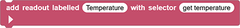
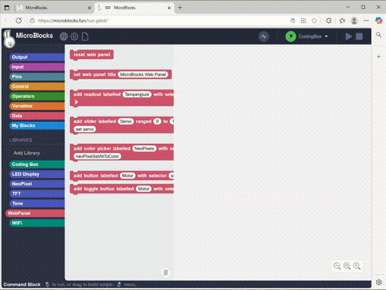
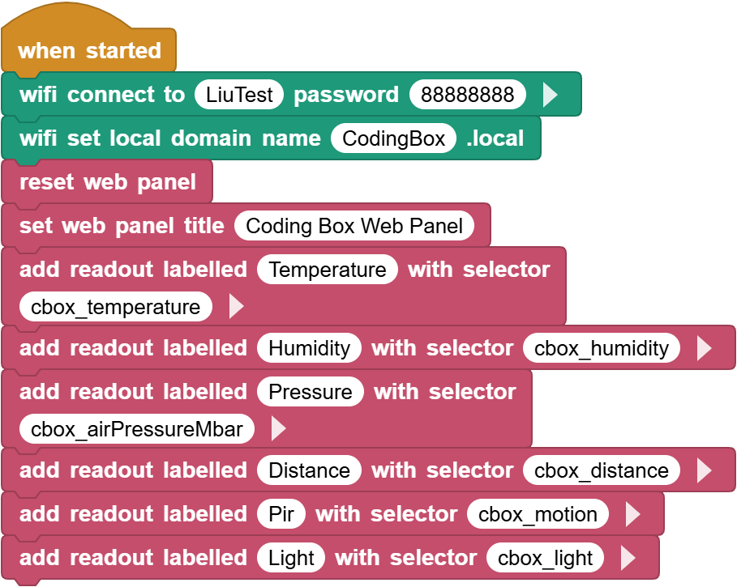
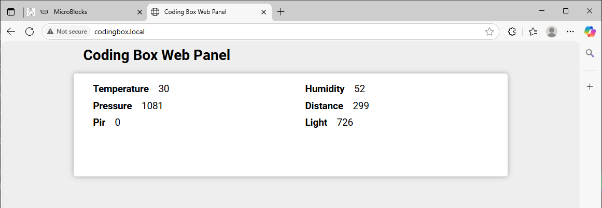

# 3.34 wifi Real-time Display

## 3.34.1 Overview

In this project, we display the values of temperature and humidity sensor, pressure sensor, photoresistor, sound sensor, PIR motion sensor and ultrasonic sensor on the web page. 

## 3.34.2 Test Code

You can manually build blocks, or directly open the code file we provide: `3-34-Web Display Panel.ubp`. If you have any questions about how to open code files or upload code, please back to `1.9 Upload Code`.

**Build code blocks:**

1. In , drag  to the script area.

2. Drag  and set the WIFI name to “LiuTest” and password to “88888888”.
3. Drag  and set the Web name to “CodingBox.local”.
4. Add  to refresh the data of each sensor on the Web page.
5. Add  and set the title to “Coding Box Web Panel”.
6. At last, drag some  to display the sensor data on the Web page, including temperature, humidity, air pressure, ultrasonic ranging distance, PIR motion and light sensor in sequence.

For example, add a temperature sensor value:

**Complete code:**

## 3.34.3 Test Result

Connect the coding box to the MicroBlocks via USB or Bluetooth. Click  to upload code. After connecting to wifi, you can see an IP address: . Now connect your control device (mobile phone, tablet, computer) to the same wifi and search `codingbox.local` on the browser to enter the Web page. 

