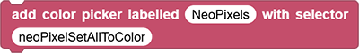
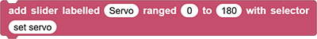
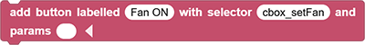
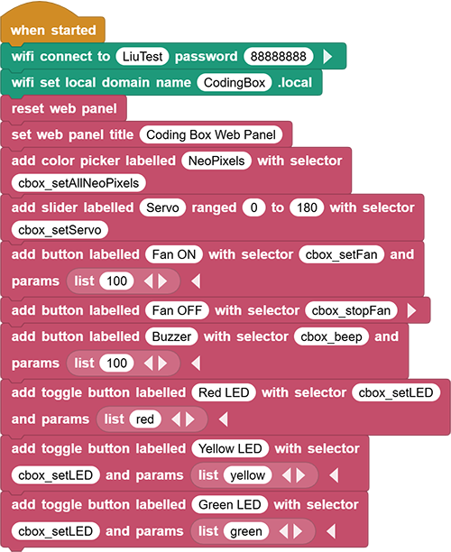
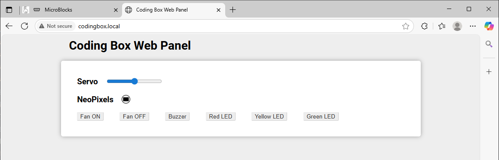

# 3.35 WiFi Control

## 3.35.1 Overview

We control LED, buzzer, servo and the fan on the web page button wirelessly. 

## 3.35.2 Test Code

You can manually build blocks, or directly open the code file we provide: `3-35-Web Control Panel.ubp`. If you have any questions about how to open code files or upload code, please back to `1.9 Upload Code`.

**Build code blocks:**

1. In , drag  to the script area.
2. Drag  and set the WIFI name to “LiuTest” and password to “88888888”.
3. Drag  and set the Web name to “CodingBox.local”.
4. Add  to refresh the data of each sensor on the Web page.
5. Add  and set the title to “Coding Box Web Panel”.

6. Use  to add a component that controls the display color of WS2812, and modify the blank behind “with selector” to `cbox_setAllNeoPixels`.
7. Use  to add a slider that controls the servo. Remain the name as default and set the range to 0-180, and modify the blank behind “with selector” to `cbox_setServo`.
8. Use  to add a button that controls the fan on. Set name as “Fan ON”, and modify the blank behind “with selector” to `cbox_setFan`. Click  to add a “params” blank.
9. In , drag  and put it into the “params” blank of the , and modify “cat” to “100”.
10. Use  to add a button that controls the fan off. Set name as “Fan OFF”, and modify the blank behind “with selector” to `cbox_stopFan`.
11. Use  to add a button that controls the buzzer. Set name as “Buzzer”, and modify the blank behind “with selector” to `cbox_beep`. Click  to add a “params” blank, and put  in it and set to “100”.
12. Use  to add a button that controls the red LED. Set name as “Red LED”, and modify the blank behind “with selector” to `cbox_setLED`. Click  to add a “params” blank, and put  in it and set to “red”.
13. Use  to add a button that controls the yellow LED. Set name as “Yellow LED”, and modify the blank behind “with selector” to `cbox_setLED`. Click  to add a “params” blank, and put  in it and set to “yellow”.
14. Use  to add a button that controls the green LED. Set name as “Green LED”, and modify the blank behind “with selector” to `cbox_setLED`. Click  to add a “params” blank, and put  in it and set to “green”.

**Complete code:**

## 3.35.3 Test Result

Connect the coding box to the MicroBlocks via USB or Bluetooth. Click  to upload code. After connecting to wifi, you can see an IP address: . Now connect your control device (mobile phone, tablet, computer) to the same wifi and search `codingbox.local` on the browser to enter the Web page. 

Slide the slider to control the servo angle. Click the color area below NeoPixels and then click the blank area to set the display color of WS2812. Click the “Fan ON” to turn on the Fan, and click the “Fan OFF” to turn it off. Click “Buzzer” and the buzzer will sound. 

Click “Red LED” to turn on the Red LED, and press again to turn off the red LED. For the “Yellow LED” and “Green LED”, they work in the same way, but the LED colors are different.

