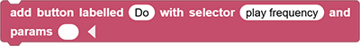
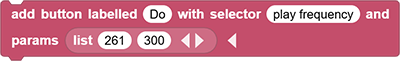
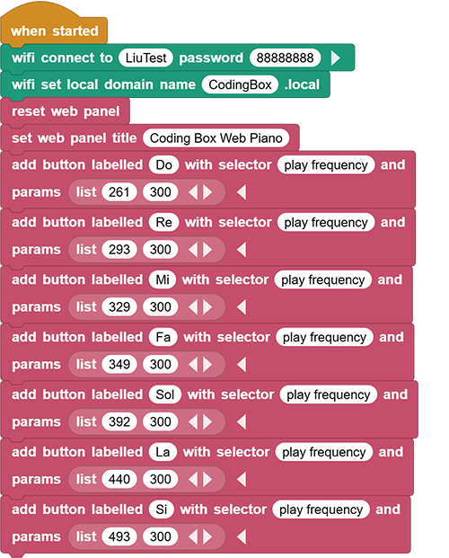
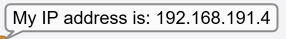
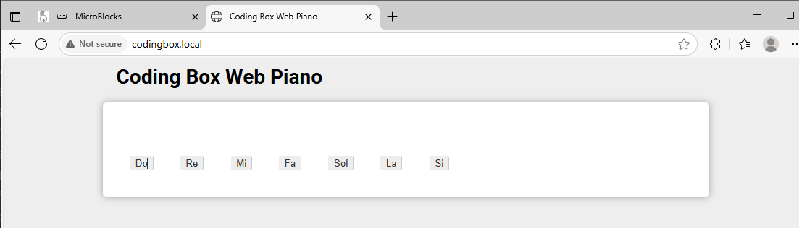

# 3.36 wifi Piano

## 3.36.1 Overview

In this project, we set seven buttons to control the speaker to play tones of Do, Re, Mi, Fa, So, La, Si.

## 3.36.2 Test Code

You can manually build blocks, or directly open the code file we provide: `3-36-Web Piano Panel.ubp`. If you have any questions about how to open code files or upload code, please back to `1.9 Upload Code`.

**Build code blocks:**

1. In , drag  to the script area.
2. Drag  and set the WIFI name to “LiuTest” and password to “88888888”.
3. Drag  and set the Web name to “CodingBox.local”.
4. Add  to refresh the data of each sensor on the Web page.
5. Use  and set the title to “Coding Box Web Piano”.
6. Use  to add a button that controls the speaker and set the label to “Do”.
7. In , drag  to “copy callable name”, and paste it to the blank behind the “with selector” of the . Click  to add a “params” blank.

8. In , drag  and click  to add one more blank. Put it into the “params” blank of the, and modify “cat” to “100”, “dog” to “300”.

9. Similarly, set tones of Re, Mi, Fa, Sol, La, Si.

**Complete code:**

## 3.36.3 Test Result

Connect the coding box to the MicroBlocks via USB or Bluetooth. Click  to upload code. After connecting to wifi, you can see an IP address: . Now connect your control device (mobile phone, tablet, computer) to the same wifi and search `codingbox.local` on the browser to enter the Web page. 

Click the corresponding button on the Web page, the speaker will play the related tone.

