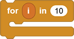
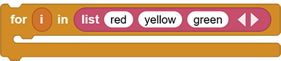
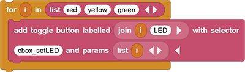
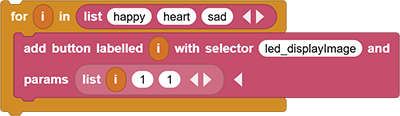
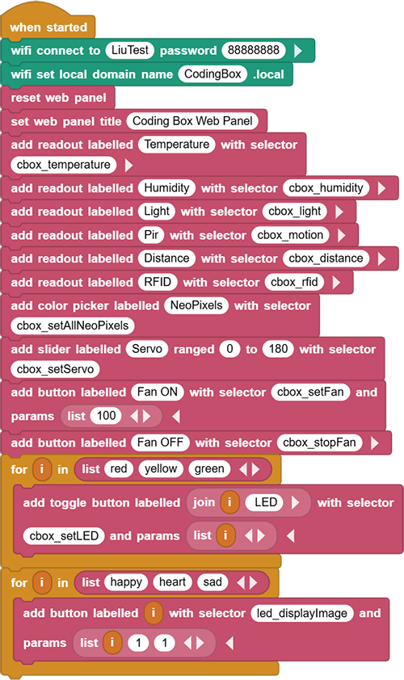
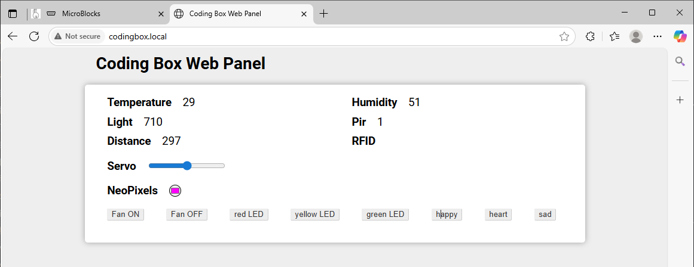

# 3.37 Smart Control Panel

## 3.37.1 Overview

Combined web buttons and wireless control, this control panel in this project is able to control modules and read module values as well. 

## 3.37.3 Test Code

You can manually build blocks, or directly open the code file we provide: `3-37-intelligent console.ubp`. If you have any questions about how to open code files or upload code, please back to `1.9 Upload Code`.

**Build code blocks:**

1. In , drag  to the script area.
2. Drag  and set the WIFI name to “LiuTest” and password to “88888888”.
3. Drag  and set the Web name to “CodingBox.local”.
4. Add  to refresh the data of each sensor on the Web page.
5. Add  and set the title to “Coding Box Web Panel”.
6. Use  to display temperature value on the Web page. Modify the blank behind the “with selector” into “cbox_temperature”.
7. Similarly, add humidity, photoresistor, PIR motion and RFID value in sequence.
8. Use  to add a component that controls the display color of WS2812, and modify the blank behind “with selector” to `cbox_setAllNeoPixels`.
9. Use  to add a slider that controls the servo. Remain the name as default and set the range to 0-180, and modify the blank behind “with selector” to `cbox_setServo`.
10. Use  to add a button that controls the fan on. Set name as “Fan ON”, and modify the blank behind “with selector” to `cbox_setFan`. Click  to add a “params” blank, and put  in it and set to “100”.
11. Use  to add a button that controls the fan off. Set name as “Fan OFF”, and modify the blank behind “with selector” to `cbox_stopFan`.
12. Use  , a loop block, to replace code block that repeatedly executes, such as LED control.
13. Put a  into the blank of  and click  to add “red”, “yellow” and “green”.

14. Put  in . Use  to bind the “i” value to “LED”, which is the name of button. And modify the blank behind “with selector” to `cbox_setLED`. Click  to add a “params” blank, and put  in it and set to variable “i”.

15. Similarly, we set the buttons for OLED display icons. They are “happy”, “heart” and “sad” respectively, of which variable “i” is also available. 

    In , find  and “copy callable name”, and paste to the blank behind the “with selector”: `led_displayImage`. Click  to add a “params” blank, put  in it, and click  of it twice so we get 3 blanks of list. Input variable “i” in the first one and “1” in the remaining two(The starting position of the icon display).

**Complete code:**

## 3.37.3 Test Result

Connect the coding box to the MicroBlocks via USB or Bluetooth. Click  to upload code. After connecting to wifi, you can see an IP address: . Now connect your control device (mobile phone, tablet, computer) to the same wifi and search `codingbox.local` on the browser to enter the Web page. 

