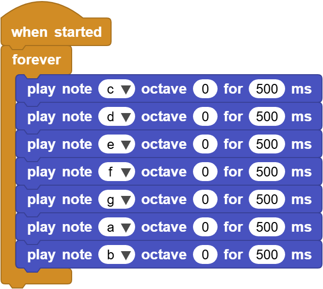

# 3.4 Power Amplifier

## 3.4.1 Overview

The 8002b power amplifier mainly consists of a speaker and an audio amplification chip. It can amplify small audio signals for about 8.5 times. These amplified sounds will be played through its speaker. Besides, it can also play some music or melodies. 

## 3.4.2 Schematic Diagram

## 3.4.3 Code Blocks

Blocks in :

1.  plays the given note at a given octave within a set milliseconds. The note name is AG (uppercase or lowercase), followed by a # to indicate a sharp sign.

2.  plays the notes specified by the key numbers (0-127) on the piano, where the center C is 60. This block performs mathematical conversions on music (for example, transposing to another key).

   MIDI, Musical Instrument Digital Interface, is the industry standard for controlling synthesizers, drum machines and other electronic music devices.

3.  plays the notes specified in Hertz (Hz). The central C is approximately 261 Hz, and the upper A is 440 Hz (the note tuned by the orchestra).

4.  starts playing the specified tone in Hertz (Hz) continuously.

5.  stops playing.

6.  sets the pin for playing the tone. Connect the piezoelectric buzzer or headphones to this pin. For a board with a built-in speaker, if this block is omitted, the built-in speaker will be used.

Blocks in :

1.  is a block included in coding box library. It controls the speaker in the coding box to emit a beep  sound and its duration can be set.

## 3.4.5 Test Code

You can manually build blocks, or directly open the code file we provide: `3-4-Speaker.ubp`. If you have any questions about how to open code files or upload code, please back to `1.9 Upload Code`.

**Build code blocks:**

1. In , drag  and  to the script area, and stack them together.

2. In , drag 7  and set “play note" to `c,d,e,f,g,a,b` reapectively.

**Complete code:**

## 3.4.6 Test Result

Connect the coding box to the MicroBlocks via USB or Bluetooth, and click  to upload the code to the coding box. The power amplifier plays Do, Re, Mi, Fa, Sol, La, Si, in a loop.