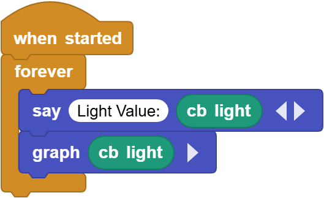
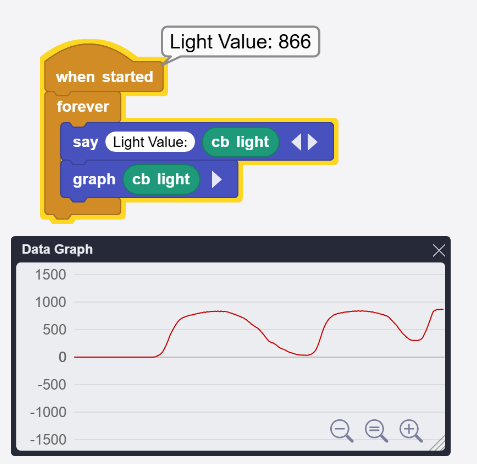

# 3.5 Photoresistor

## 3.5.1 Overview

Photoresistor is photoelectric device that works according to semiconductor photoconductivity. It can be used to sense the brightness of the current environment to output a corresponding analog value.

## 3.5.2 Schematic Diagram

Photoresistor takes advantage of the photoelectric effect of semiconductors. Its resistance varies with ambient light. 

In the light, the semiconductor material absorbs photon energy to produce electron-hole pairs, increasing the conductivity and reducing the resistance. The brighter the light is, the lower the resistance will be. From the changes of resistance, it can sense light intensity accurately. Therefore, it is widely used in automatic lighting, photoelectric control, real-time monitoring and regulation of light.

## 3.5.3 Code Blocks

Blocks in :

1.  is a block included in coding box library. It reads the analog value of the photoresistor in the coding box. The brighter the light is, the larger the analog value will be (Analog value range: 0-1023)

## 6.5.4 Test Code

You can manually build blocks, or directly open the code file we provide: `3-5-Light.ubp`. If you have any questions about how to open code files or upload code, please back to `1.9 Upload Code`.

**Build code blocks:**

1. In , drag  and  to the script area, and stack them together.

2. In , drag  and  block and put them in .
3. Tap  of the  to add an output blank. In the first blank, enter `light value:`

4. In , drag  and put it into both the second blank of   and .

**Complete code:**

## 3.5.5 Test Result

Connect the coding box to the MicroBlocks via USB or Bluetooth, and click  to upload the code to the coding box. Click  to check the graph. Cover the sensor with your hand, and you will see the value decreases.

