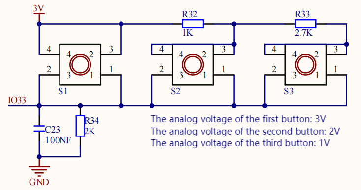
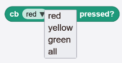
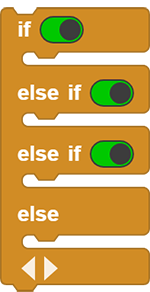
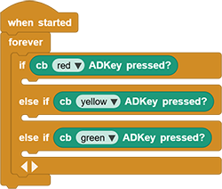
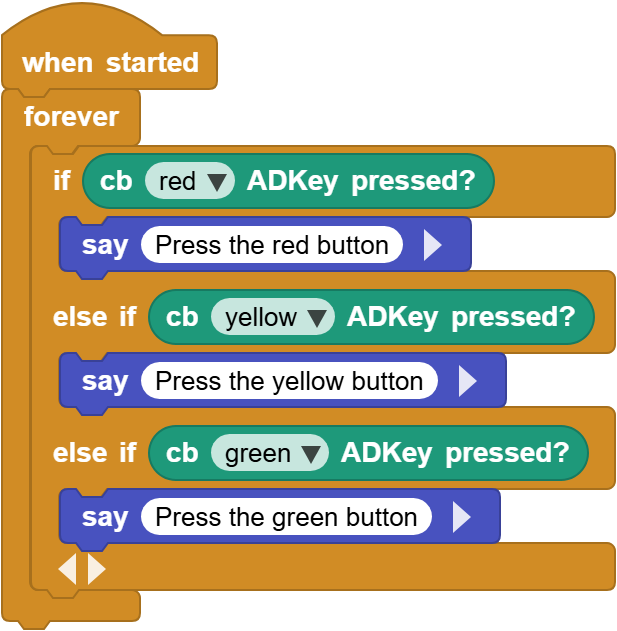

# 3.6 AD Button

## 3.6.1 Overview

The AD button requires only one analog pin to read multiple button states, which greatly saves IO ports. It adopts analog acquisition, and the output voltages vary from pressed buttons, so that different analog values can be obtained. We can determine which button is pressed according to these values.

## 3.6.2 Schematic Diagram

From the Schematic Diagram: 

When no button is pressed, the output at signal pin IO33 is pulled down by R34 (connected to GND. So the analog value of IO33 is 0, that is, low level 0V;

When button S1(the red button) is pressed, pin IO33 is connected to VCC. So the analog value of IO33 is 4095 (voltage = 3.3V).

When button S2(the yellow button) is pressed, the voltage of IO33 is that between R32 and R34: VCCxR34/(R32+R34) ≈ 2.2V, and the analog value is about 2432;

When button S3(the green button) is pressed, the voltage of IO33 is that between R32+R33 and R34: VCCxR34/(R32+R33+R34) ≈ 1.1V, and the analog value is about 1175.

## 3.6.3 Code Blocks

Blocks in :

1.  is a block included in coding box library. It reads the status value of the AD button in the coding box. Pressing is a high level (1), and releasing is a low level (0). Click on the  to switch buttons.

   

## 3.6.4 Test Code

You can manually build blocks, or directly open the code file we provide: `3-6-ADKey.ubp`. If you have any questions about how to open code files or upload code, please back to `1.9 Upload Code`.

**Build code blocks:**

1. In , drag  and  to the script area, and stack them together.

2. In , drag  block and put it into , and tap  to add some else-ifs as follows. 

2. In , drag 3  and put it on the  of . Set the first to red, the second to yellow and the third to green. Tap  to remove “else”.

3. In , drag three  blocks and put them in . Press the red button to output “Press the red button”, yellow: “Press the yellow button” and green: “Press the green button”.

**Complete code:**

## 3.6.5 Test Result

Connect the coding box to the MicroBlocks via USB or Bluetooth, and click  to upload the code to the coding box. Press the red button and it outputs `Press the red button`; Press the yellow button and it says `Press the yellow button`; Press the green button it outputs `Press the green button`.

