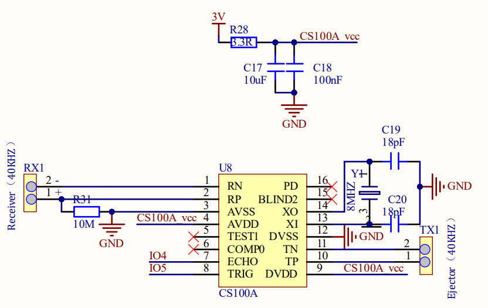
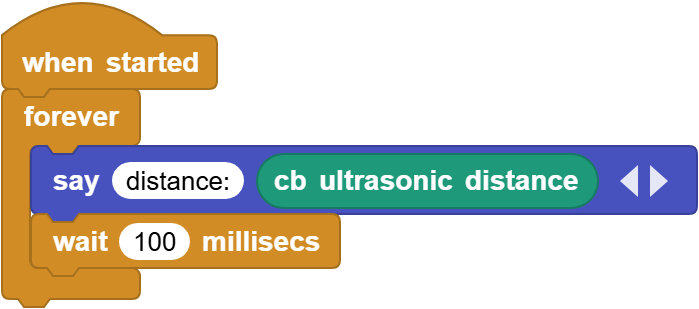

# 3.7 Ultrasonic Sensor

## 3.7.1 Overview

Ultrasonic sensor measures the distance of an object by sound waves. It boasts a transmitter and a receiver to emit sound waves and then measure the returned waves. The time difference between transmitting and receiving can be used to calculate the distance value. Beyond that, it is also used to detect the shape or presence of objects, build automatic doors, and measure flow rates and pressures.

## 3.7.2 Schematic Diagram

**Working principle:** Like bats, the ultrasonic sensor sends an ultrasonic signal with a high frequency that human cannot hear. If these signals encounter obstacles, they will immediately reflect back and be received by the sensor. After that, the distance between the sensor and the obstacle is calculated according to the time difference between signals transmitting and receiving. 

**Maximum detection distance:** 3M

**Minimum detection distance:** 4cm

**Detection angle:** no greater than 15 degrees

## 3.7.3 Code Blocks

Blocks in :

1.  is a block included in coding box library. It reads the distance values detected by the ultrasonic sensor in the coding box.

## 3.7.4 Test Code

You can manually build blocks, or directly open the code file we provide: `3-7-Ultrasonic.ubp`. If you have any questions about how to open code files or upload code, please back to `1.9 Upload Code`.

**Build code blocks:**

1. In , drag  and  to the script area, and stack them together.

2. In , drag  block and put it in .
3. Tap  of the  to add an output blank. In the first blank, enter `distance：`

4. In , drag  and place it in the second blank of .
5. In , drag  and put it under , and modify the delay to `100ms`.

**Complete code:**

## 3.7.5 Test Result

Connect the coding box to the MicroBlocks via USB or Bluetooth, and click  to upload the code to the coding box. If you wave you hand in front of the ultrasonic sensor or move back and forth, you can see the change in the printed distance values.

