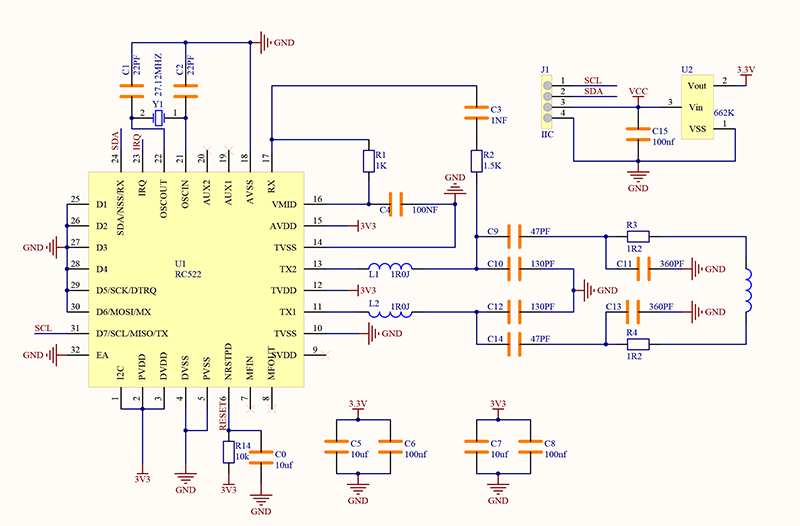
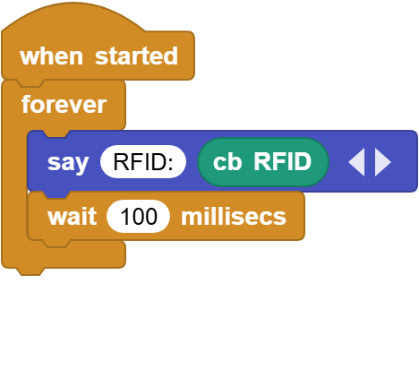
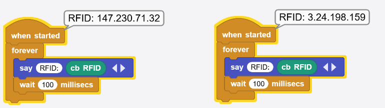

# 3.8 RFID Sensor

## 3.8.1 Overview

RFID-RC522 module adopts Phillips MFRC522 original chip in card reading circuit, which is easy to use and with low cost. It is suitable for equipment and reader development, advanced applications, RF card terminal design and producing.

## 3.8.2 Schematic Diagram

**RFID (Radio Frequency Identification)**: 

The card reader is composed of a frequency transmitter module and a high level magnetic field. The Tag transponder is a device to be sensed without a battery. It consists only of tiny integrated circuit chips, media for storing data, and antennas for receiving and transmitting signals. To read the data in the tag, it must be placed within the reading range of the reader. After that, the reader will generate a magnetic field. According to Lenz's law (magnetic energy generates electricity), the RFID Tag will be powered, thus activating the device.

NOTE: this module only recognize card working at 13.56MHz. It is recommended to use the provided card in the kit.

## 3.8.3 Code Blocks

Blocks in :

1.  is a block included in coding box library. It reads the card value sensed by the RFID in the coding box.

## 3.8.4 Test Code

You can manually build blocks, or directly open the code file we provide: `3-8-RFID.ubp`. If you have any questions about how to open code files or upload code, please back to `1.9 Upload Code`.

**Build code blocks:**

1. In , drag  and  to the script area, and stack them together.

2. In , drag  block and place in . 
3. Tap  of the  to add an output blank. In the first blank, enter `RFID：`

4. In , drag  and put it into the second blank of .
5. In , drag  and add it under  and set the delay to `100ms`.

**Complete code:**

## 3.8.5 Test Result

Connect the coding box to the MicroBlocks via USB or Bluetooth, and click  to upload the code to the coding box. Cover the RFID sensing area with the IC card, and you will see the ID numbers. Note that the ID number of each card is different. It shall be based on the one you read.

