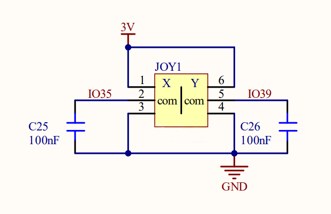
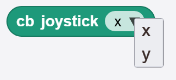
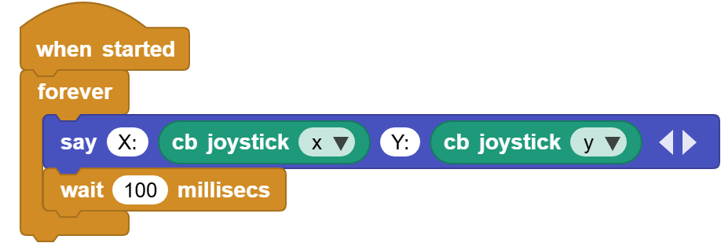
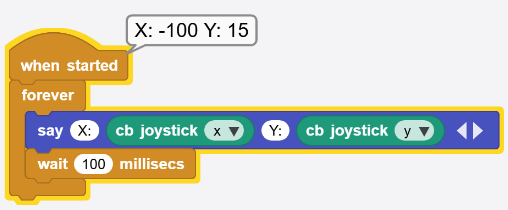

# 3.9 Axis-X&Y Joystick Module

## 3.9.1 Overview

Axis-X&Y Joystick is a high-precision input device for bidirectional control. Its X and Y axes are separated to control horizontal and vertical movements respectively. This module contains 10K resistance so that it ensures the stability and accuracy of signals. 

## 3.9.2 Schematic Diagram

ESP32 Axis-X&Y Joystick works based on a two-axis potentiometer that detects movements on two axes. When the joystick moves on axis X or Y, the resistance of the potentiometer changes, outputting analog voltage signals. After being received by ESP32 analog input pin (ADC), these signals will be read by ESP32 board and converted to digital values. Therefore, the joystick coordinate can be easily revealed during controlling. 

## 3.9.3 Code Blocks

Blocks in :

1.  is a block included in coding box library. It reads the X and Y values of the joystick in the coding box. Tap  to switch:

## 3.9.4 Test Code

You can manually build blocks, or directly open the code file we provide: `3-9-Joystick.ubp`. If you have any questions about how to open code files or upload code, please back to `1.9 Upload Code`.

**Build code blocks:**

1. In , drag  and  to the script area, and stack them together.

2. In , drag  block and place in . 
3. Click  of the  to set 4 output blanks in total. In the first blank, enter `X:`; in the third one enter `Y:`

4. In , drag  block and put it onto the second blank of .
5. In , drag  block and set to Y, and put it onto the fourth blank of .
6. In , drag  block and put it under . Set the delay to `100ms`.

**Complete code:**

## 3.9.5 Test Result

Connect the coding box to the MicroBlocks via USB or Bluetooth, and click  to upload the code to the coding box. Toggle the joystick, and the values on axis X and Y changes. 

