# 2.1 What Is MicroBlocks?

MicroBlocks is a free graphical programming language similar to Scratch, which supports many educational microcontroller main boards, such as micro:bit, ESP32/ESP8266, Raspberry PI Pico, etc. 

Welcome to use MicroBlocks to learn physical computing!

# 2.2 What Are Its Features?

**Real-Time Programming:** MicroBlocks is a real-time programming environment. Click a block, and it runs immediately on the board. Try out command blocks to view and plot sensor values in real time, with no waiting for code compilation or downloading.

**Autonomous Operation:** MicroBlocks downloads your code as you write it. Once programmed, it runs independently (offline). Create portable games, fitness apps, or glowing wearables as you wish.

**Parallel Tasks:** Want to control a motor while displaying an animation? No problem! MicroBlocks lets you write separate scripts for each task and run them simultaneously. Parallel coding becomes simpler and more intuitive.

**Cross-Platform Compatibility:** MicroBlocks runs on many different boards, “write once, run anywhere”. Blocks for buttons, sensors, and displays work across boards with compatible hardware. It even simulates the micro:bit 5x5 LED matrix on TFT displays.

**Program Portability:** With MicroBlocks, your board acts like a USB drive. No need to store files—just plug it in to reload your code. Share your board with friends, and they can explore your scripts or add new features directly!

While other block-based languages exist for microcontrollers, what truly sets MicroBlocks apart is its combination of real-time programming and autonomous operation. Other languages support only one of these features rather than both.

# 2.3 How MicroBlocks Works?

The MicroBlocks system has three components:

- **Blocks Editor**: Runs on a computer during development.
- **Virtual Machine**: Executes user code on the microcontroller.
- **Communication System**: Updates code on the board as scripts are edited.

The blocks editor lets users create and edit code while managing MicroBlocks libraries for added functionality. Some libraries support sensors or devices like servos and NeoPixels; others provide APIs for text, lists, and music. Libraries themselves are written in MicroBlocks, allowing users to explore, modify, and extend them.

Like MicroPython, MicroBlocks code is compiled into **bytecode** executed by a [virtual machine](https://wiki.microblocks.fun/virtual_machine) on the microcontroller. Bytecode is low-level, processor-agnostic instructions, making it easy to support diverse 32-bit microcontrollers. In fact, the MicroBlocks VM isn’t limited to microcontrollers—it also runs on Linux devices like Raspberry Pi.

To learn more about bytecode, visit the VM page on the wiki. If “Advanced Blocks” are enabled, right-click scripts to view their generated instructions and bytecode—a great way to explore how computers execute code.

The communication system sends bytecode to the VM and updates it incrementally as scripts are edited, enabling immediate execution for rapid testing and iteration. It also handles starting/stopping scripts and relays data from the microcontroller, allowing the editor to visualize events graphically.

**Sensor Insights Through Real-Time Feedback**
The key to understanding sensors is observing their live responses. For example, how does acceleration change when tossing a micro:bit? The communication system displays sensor values and results in small “Dialogue Bubbles” and supports real-time data plotting. Visualization turns abstract physical and electrical properties into intuitive, observable phenomena.

# 2.4 Coding Box Driver !

When installing the driver, connect the coding box to the computer! ! !

## 2.4.1 Windows

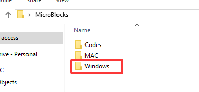

For windows 10 and higher versions, they have built-in drivers. If you are their users, connect the coding box to the computer, click on Computer → Properties → Device Manager. As shown in the figure, once the connection is successful, there is no need to install the driver again.

If here’s the case, the driver needs to be installed manually.

Right-click  to “Update driver”.

“Browse my computer for drivers”.

Find the downloaded driver file “usb_ch341_3.1.2009.06”:

After the driver is installed, click “Close”, and then the serial port number will appear.

In this way, the driver is installed. Click on Computer → Properties → Device Manager, and we can see:

## 2.4.2 MAC

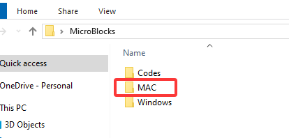

Step 1: Download the driver from the Website and extract the file to the local installation directory.

Step 2: For details about how to install the driver in pkg format by default, see Step 3. If OS X 11.0 or later does not support Rosetta, refer to Step 4 to install the dmg driver.

Before installation, please forward to “System Preferences” → “Security & Privacy” → “General” page, below the title “Allow apps downloaded from:” choose the choice 2 → “Mac App Store and identified developers”, then the driver will work normally.

Step 3: To install the driver in pkg format, tap the driver file → Continue → Install.

Then the installation will be successful.

To install the pkg format driver on OS X 11.0 and later: Open “LaunchPad” → “CH34xVCPDriver” → Install.

When using OS X 10.9 to OS X 10.15, click “Restart” to restart your computer, and perform the following steps after the restart.

Step 4: To install the dmg driver, tap the dmg file and drag “CH34xVCPDriver” to enter the application folder in the operating system.

Then open “LaunchPad” → “CH34xVCPDriver” → Install.

Then the installation will be successful.

When inserting the CH340 control board into the USB port, open System Report → Hardware → USB. On the right is USB Device Tree. If the USB device is working properly, you will find a device whose “Vendor ID” is [0x1a86].

Open “Terminal” program under Applications → Utilities folder and type the command “ls /dev/tty*”.

You should see the “tty.wchusbserialx” where “x” is the assigned device number similar to Windows COM port assignment.

# 2.5 Program on MicroBlocks

There are two programming methods for MicroBlocks.

## 2.5.1 Online on Browser (Recommended)

Click on the link: [MicroBlocks](https://microblocks.fun/run-pilot/)

MicroBlocks can be run in Chrome or Edge browsers without installing any software.

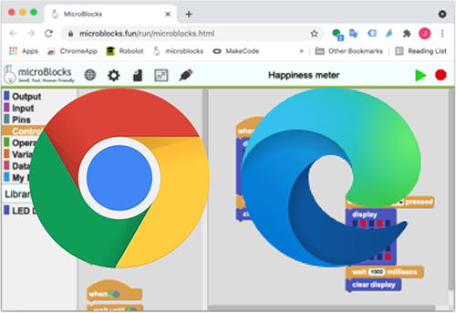

Neither traditional applications nor professional technicians are required when we run MicroBlocks in a browser.

MicroBlocks can also run in other browsers, but it can only connect to the main board when running in Chrome or Edge browsers on desktops, laptops, or Chromebook computers (non-mobile devices).

## 2.5.2 MicroBlocks Software

Note: The software version is currently in testing, please use '2.5.1 Online on Browser (Recommended)' first, and it is expected to be updated to the software in August. `

[Get Started - MicroBlocks](https://microblocks.fun/get-started#computer)

After entering the Download link, select your computer system. For example, choose the “Windows” system and then click “Download”.

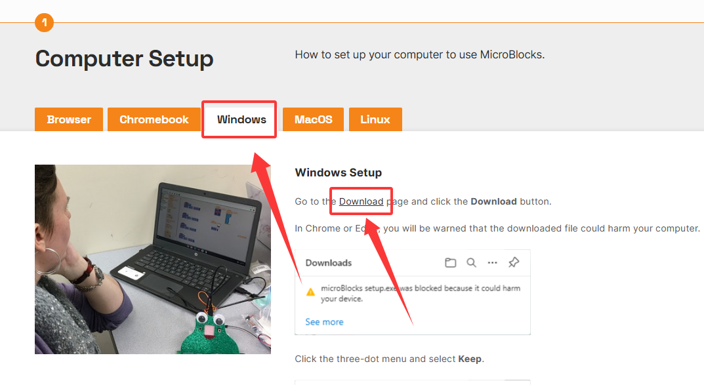

Click to download the MicroBlocks.

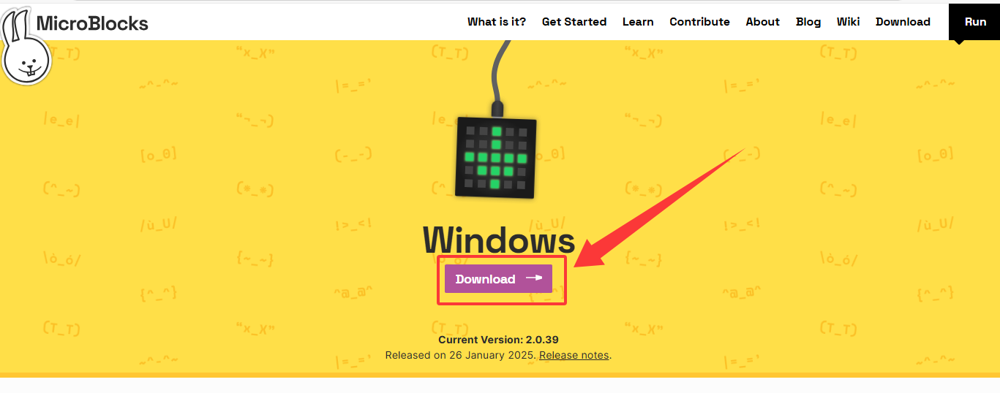

Download successful! Double-click to install.

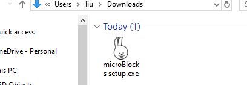

# 2.6 Main Board Firmware !

Here we demonstrate how to burn firmware on browsers, which can be a reference for MicroBlocks software users.

[MicroBlocks](https://microblocks.fun/run-pilot/)

Click on the link and open it in the browser to enter the programming page.

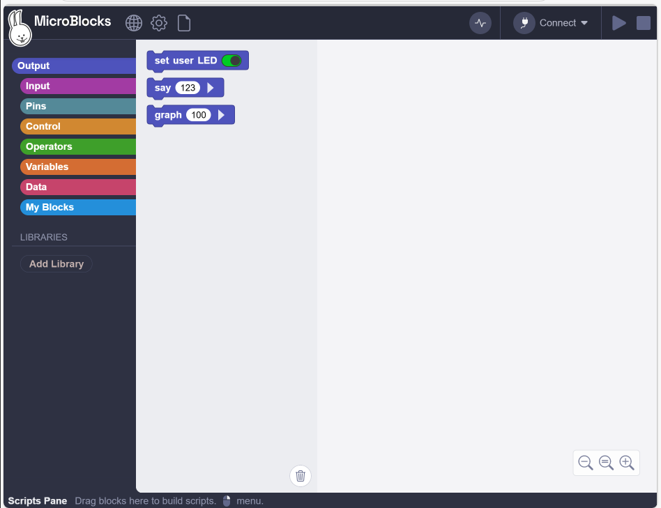

Click  to `update firmware on board` and choose the coding box.

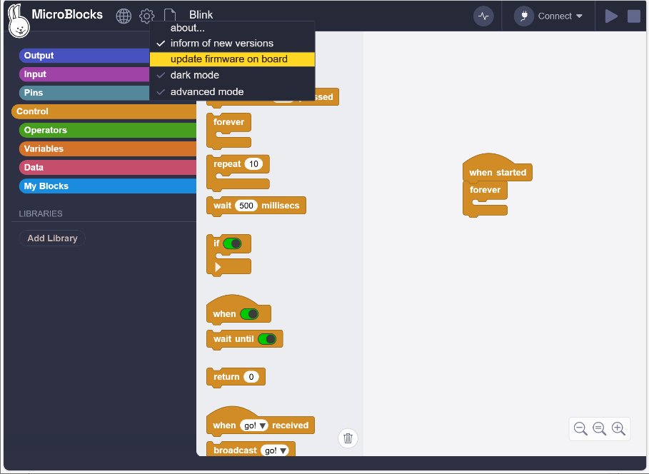

It includes a specified firmware `KidsBits` for the coding box, so we upload this firmware.

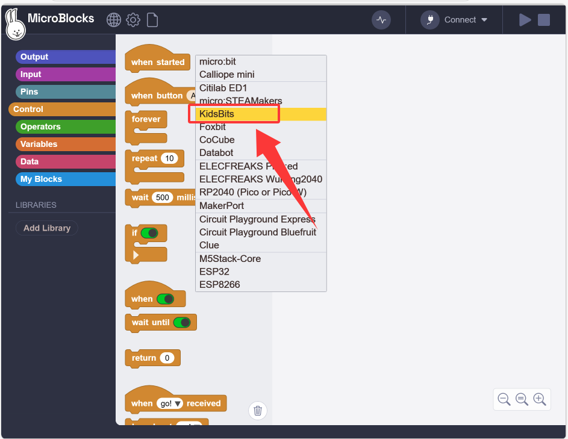

Choose the USB serial number and `connect`. If you have any further questions about this, please back to `2.4 Coding Box Driver !`.

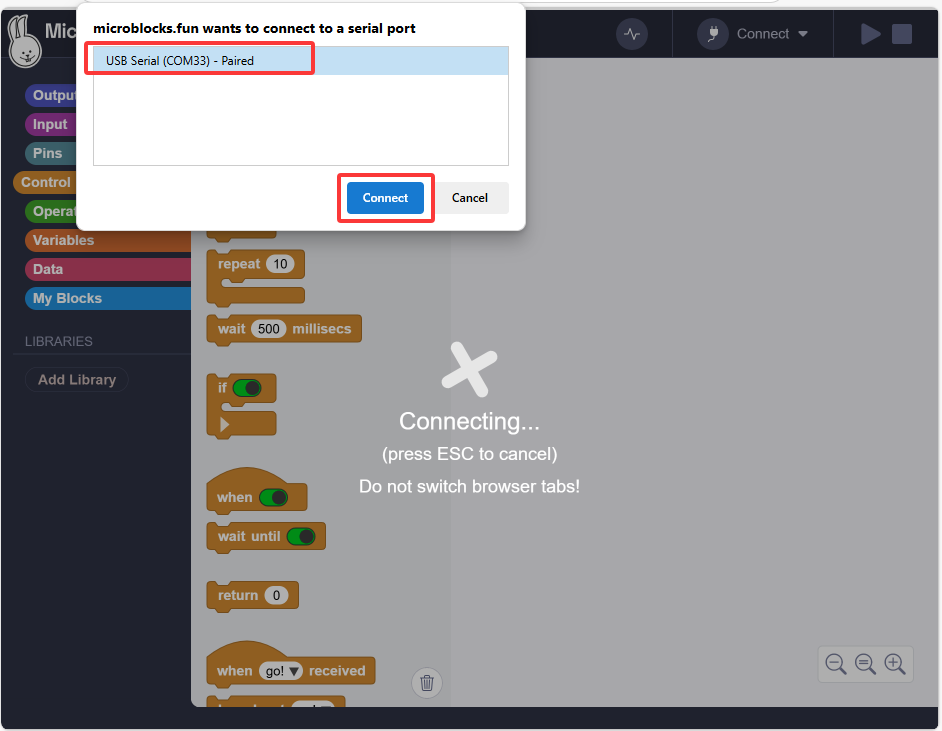

When the upload progress reaches 100%, the firmware upload is complete.

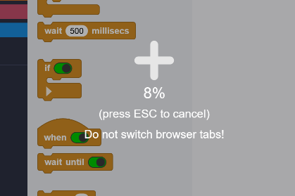

Click `OK`.

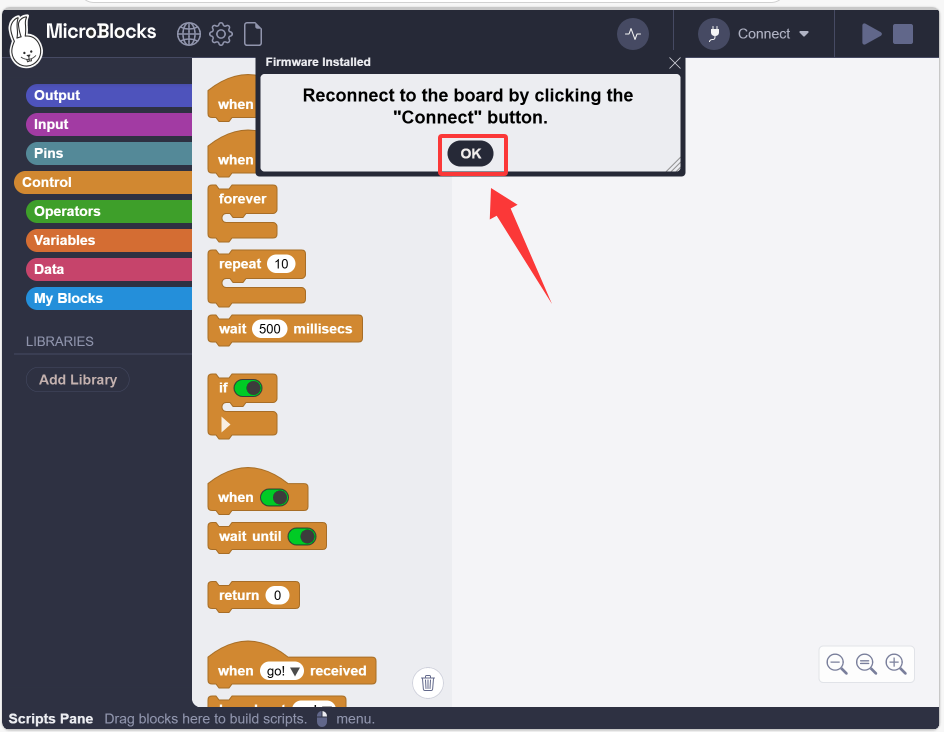

# 2.7 Programming Page

The following figure shows the main interface of the MicroBlocks editor.

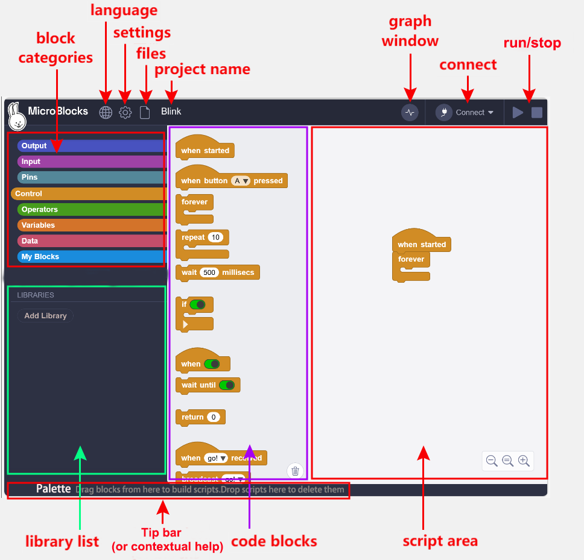

**Block Categories:**

This area contains all block categories used for MicroBlocks programming. They are divided into nine colors of groups. Choose a category and the blocks in it will be listed beside (like opening a drawer with building blocks placed inside).

 stores the code blocks used for outputting data.

 contains the code blocks used for reading the input data.

 stores the code blocks used for operating the input or output data of the pins.

 contains control code blocks.

 stores the code blocks for operations.

 is used to define variables.

 contains the code blocks for data processing.

 is used for customizing code blocks.

Official detailed introduction: [Blocks Reference | MicroBlocks Wiki](https://wiki.microblocks.fun/en/reference_manual)

**Menu Bar:**

Three system menus are provided, along with icon.

 sets the language displayed by the editor.

 is the settings. Click to set up the editor. The firmware of the coding box also needs to be selected here.

 is files that can be operated on, such as creating, saving, opening, etc.

 is the name of the code file.

 is a graph plotter to view the data changes.

 connects the boding box. Click it to select the way to connect to the coding box: USB or Bluetooth.

 is the run and stop buttons, through which the code can be controlled to run and stop running.

**Library List:**

The contents of this area reflects various libraries loaded according to the requirements of user scripts and microprocessors. The list can be empty (without any libraries) or multiple libraries can be introduced.

**Blocks Palette:**

After choosing a category, code blocks with such specific functions will be listed in this area beside the category. Here, these blocks can be dragged into the script area to write programs. If you need to delete a block in the script area, just drag it back to this area.

**Tip bar:**

Move your mouse over the blocks and IDE areas highlighted in yellow, and their types and brief description as well as functions of each area will be displayed in this area. Detailed block description can be obtained through right-click menu of each block.

**Working with Scripts:**

Since the script area is the most frequently used part in the editor, introducing the unique operations and usage conventions of this area can help you work with the editor better.

For more details, please visit [User Guide | MicroBlocks Wiki](https://wiki.microblocks.fun/en/ide).

# 2.8 Coding Box Connection

Click  to connect by USB or Bluetooth. After connection, we can directly upload code to the coding box. Here we choose USB connection.

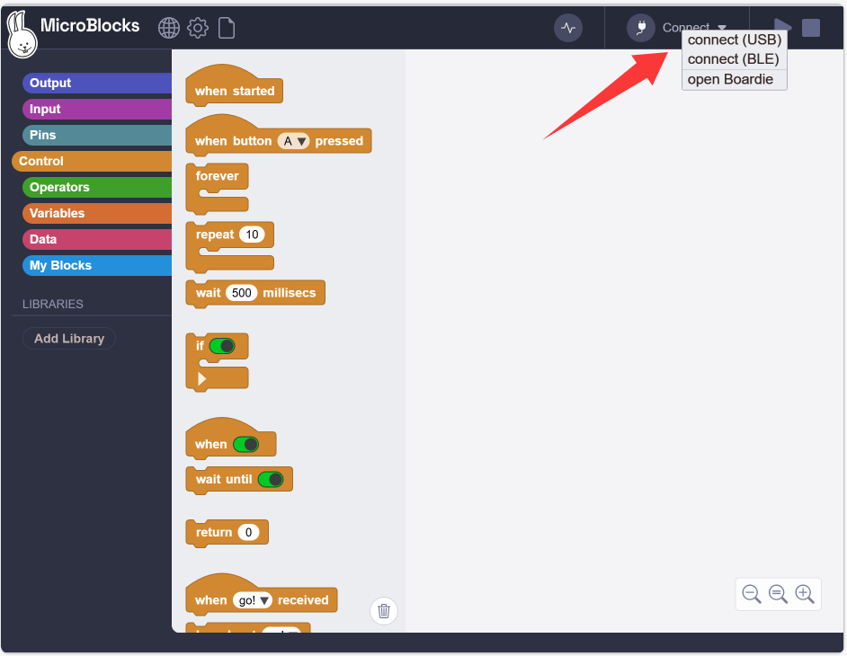

USB connection:

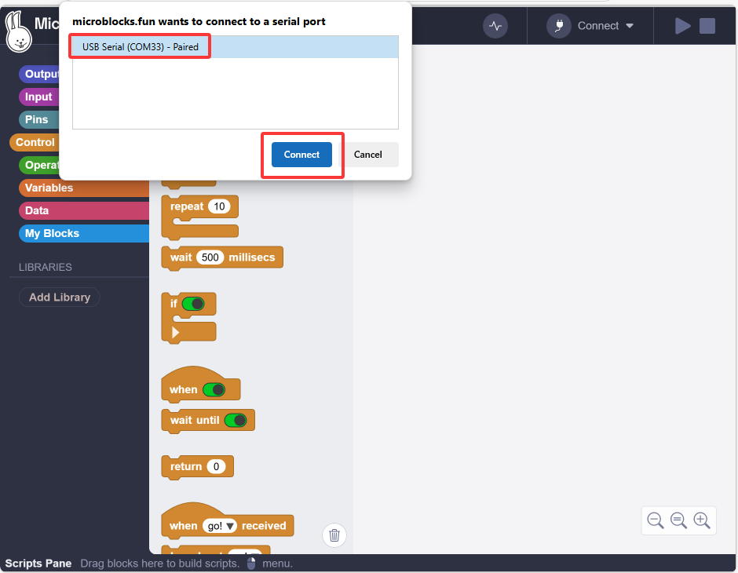

Bluetooth connection:

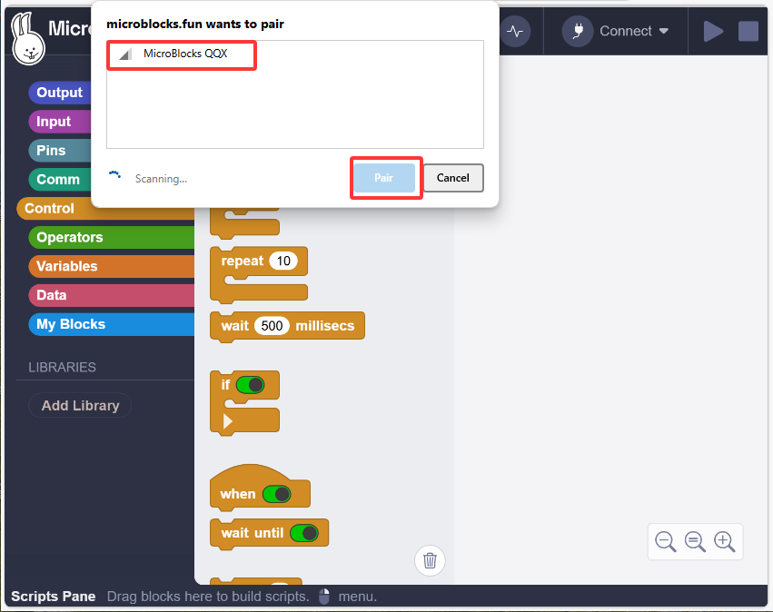

After connecting, it will load library files required by the coding box and show .

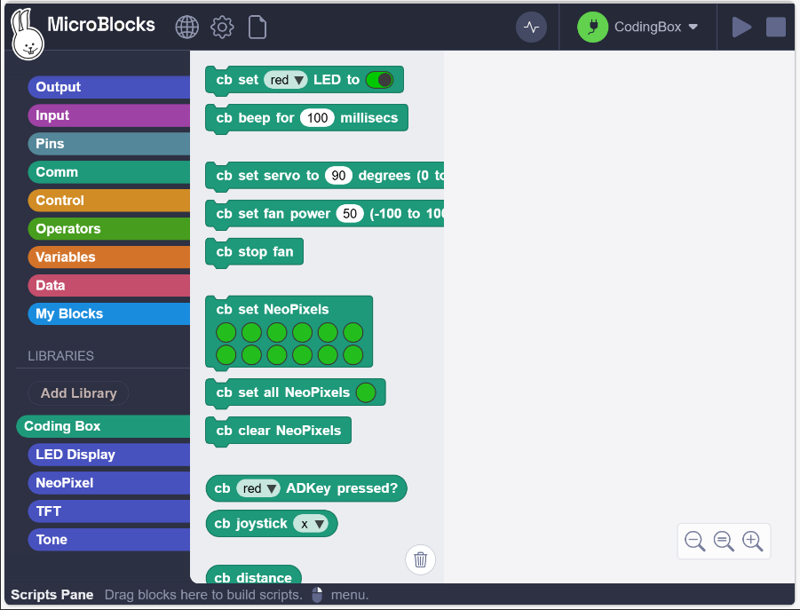

# 2.9 Upload Code

After connecting the coding box, upload the code. We can either build the code manually or open the provided code file.

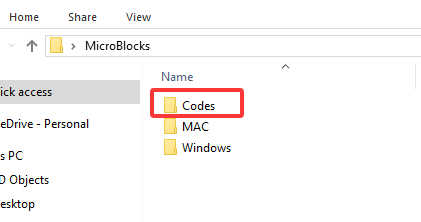

**Build the code blocks manually:**

When uploading code, since the MicroBlocks code is in real time, you only need to click to run the code to upload it to the coding box.

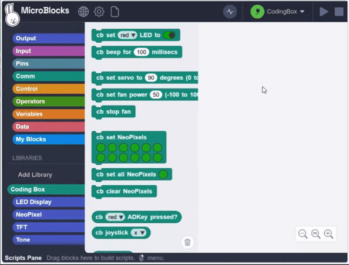

# 2.10 How to Open

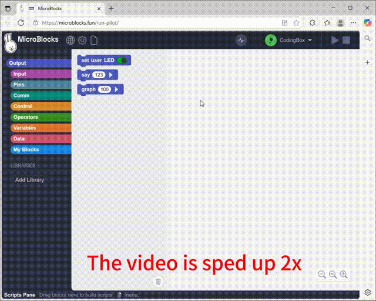

# 2.11 How to Upload

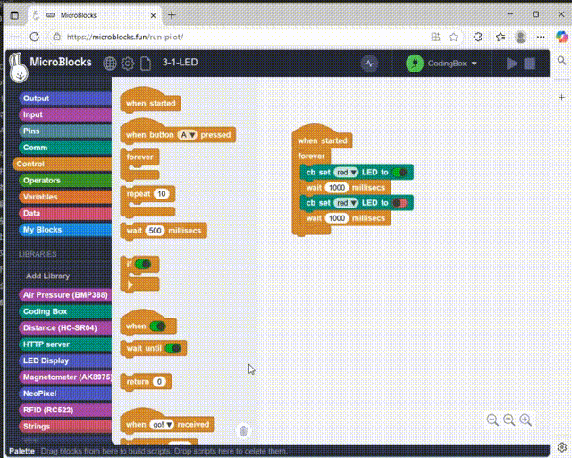

