# MicroPython Tutorial

MicroPython is a stripped-down version of Python 3 language, which includes a small portion of the Python standard library. It can run in microcontrollers and restricted environments after being optimized. Here are the main features of MicroPython:

1. **Compatibility**: MicroPython strives to be as compatible as possible with normal Python (CPython), which means that if you know Python, you already know the basics of MicroPython. 
2. **Hardware access**: In addition to core Python libraries, MicroPython includes modules such as "machines" for accessing low-level hardware, giving developers direct control over the hardware resources of the microcontroller. 
3. **Interactive prompt (REPL)**: MicroPython provides an interactive prompt (REPL) so that users execute commands directly from a desktop computer on an embedded platform. This is very useful for fast real-time testing and debugging of embedded systems. 
4. **Multi-threading support**: MicroPython firmware supports multi-threading, which enables a single microcontroller to handle multiple embedded tasks simultaneously, thus speeding up the executions.
5. **Open source project**: MicroPython is an open source project whose source code is available on Github. It follows the MIT license and is free to use for educational and commercial purposes. 
6. **Wide support**: MicroPython supports a variety of microcontroller boards and RTOS (real-time operating systems), such as ESP32, ESP8266, STM32, etc. In addition, it also provides rich libraries and modules to meet different development needs. 

## 1. Download Thonny

#### 1.1 Windows

**OS: Windows 10**

Download: [Thonny Official](https://thonny.org)

Move your mouse to “Windows” and you will see the optional versions.

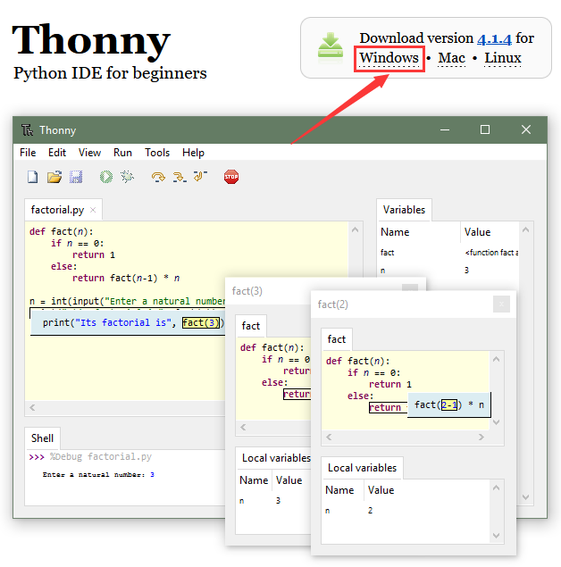

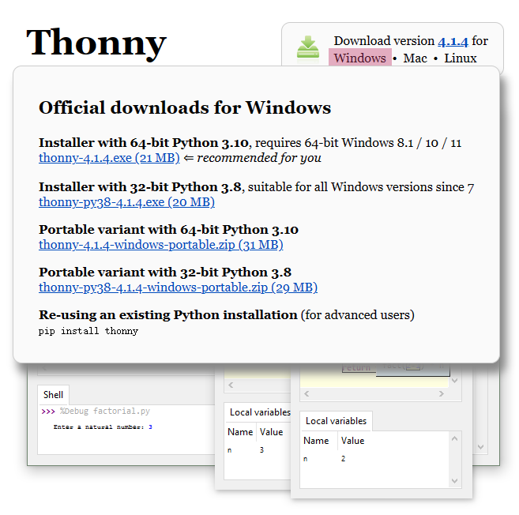

#### 1.2 MAC

Similar to Windows.


## 2. Install Thonny

Two methods:

- Install Thonny+Python package

	Recommended for beginners: When you install, the Python environment and Thonny will be packaged so both installed. There are also two ways to install the package:

	- Installer

		

	- Portable variant

		

- Install Thonny only

  Recommended for developers: When the user already has a python environment, `pip install thonny` comes in handy to install Thonny separately.

  

Please just install according to your needs.

#### 2.1 Installer

Here we demonstrate how to install `Installer with 64-bit Python 3.10` on <span style="background:#ff0;color:#000">64bit Windows 10</span>.

(1）After downloading, click  . And you will see **Select Setup Install Mode**, choose **Install for me only**.


（2）**Next** .


（3）Tick **I accept the agreement** and **Next**.


（4）The default path is Disk C, or you can click **Browse...** to modify the path. After that, click **Next**.

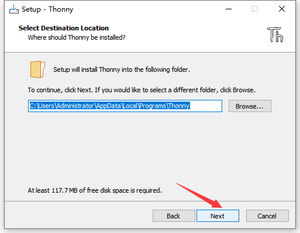

（5）Choose a path to create the program's shortcuts, and click **Next**.


（6）Tick **Create desktop icon** and click **Next**.


（7）Install.


（8）“**Finish**”


（9）Open Thonny and choose your language.


（10）Main interface:


#### 2.2 Portable Variant

Here we demonstrate how to install `Portable variant with 64-bit Python 3.10` on <span style="background:#ff0;color:#000">64bit Windows 10</span>.

(1）After downloading and being unzipped, click  to choose your language.


（2）Main interface:


（3）For convenience, please send it to Desktop(create shortcut).


Shortcut: 


## 3. Board Driver

During installing, please connect the coding box to the computer!

#### 3.1 Windows：

[Click here to download Windows CH340 driver.](./Windows.zip)


<p style="color:red;">NOTE: download and unzip the file to a path convenient to you. Desktop is recommended.</p>

windows 10 and later versions boasts their own drivers. If your computer is, connect the box and click Computer – attribute – Device Manager.

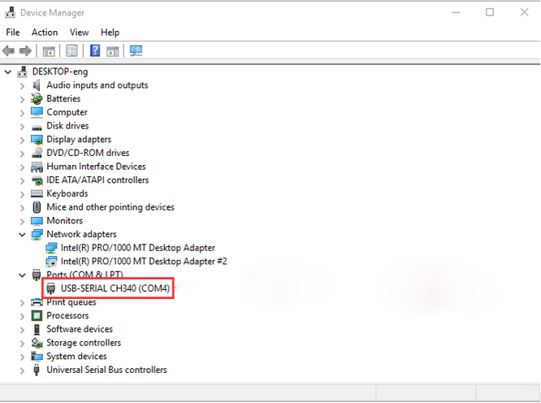

As follows, if you see a yellow exclamation mark, you need to install manually,


Click  to Upload driver. 


“Brose my computer for drivers”.


Find and open the driver file **usb_ch341_3.1.2009.06**.


Close the interface and wait for connection.


As follows:


#### 3.2 MAC：

[Click here to download MAC CH340 driver.](./MAC.zip)


<p style="color:red;">NOTE: download and unzip the file to a path convenient to you. Desktop is recommended.</p>

Step 1: Download the driver from the Website and extract the file to the local installation directory.


Step 2: For details about how to install the driver in pkg format by default, see Step 3. If OS X 11.0 or later does not support Rosetta, refer to Step 4 to install the dmg driver.

Before installation, please forward to “System Preferences”->“Security & Privacy”->“General” page, below the title “Allow apps downloaded from:” choose the choice 2->“Mac App Store and identified developers”, then the driver will work normally.


Step 3: To install the driver in pkg format, tap the driver file → Continue→ Install


Then the installation will be successful


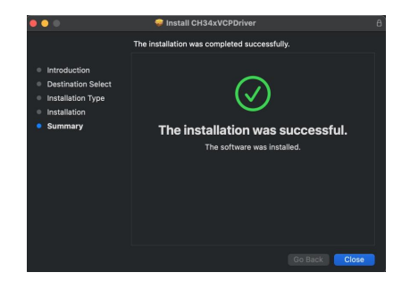

To install the pkg format driver on OS X 11.0 and later: Open “LaunchPad”→“CH34xVCPDriver”→Install


When using OS X 10.9 to OS X 10.15, click “Restart” to restart your computer, and perform the following steps after the restart.


Step 4: To install the dmg driver, tap the dmg file and drag “CH34xVCPDriver” to enter the application folder in the operating system.


Then open “LaunchPad”→“CH34xVCPDriver”→Install


Then the installation will be successful


When inserting the CH340 control board into the USB port, open System Report -> Hardware ->USB. On the right is USB Device Tree. If the USB device is working properly, you will find a device whose “Vendor ID” is [0x1a86].

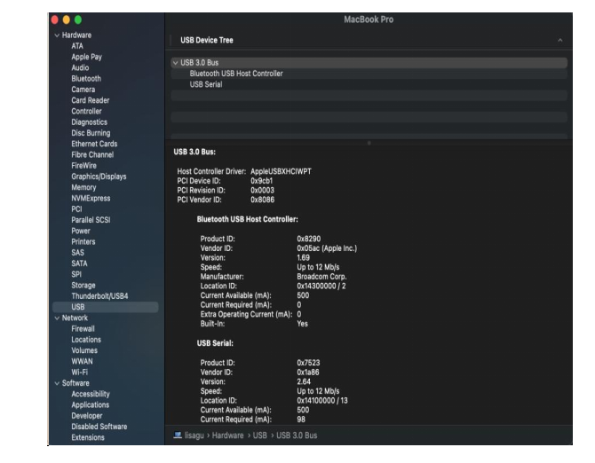

Open “Terminal” program under Applications-Utilities folder and type the command “ls /dev/tty*”.


You should see the “tty.wchusbserialx” where “x” is the assigned device number similar to Windows COM port assignment.

## 4. Burn FIRMWARE

MicroPython firmware is required to operate on ESP32.

[Click here to download firmware.](./Firmware.zip)


<p style="color:red;">NOTE: download and unzip the file to a path convenient to you. Desktop is recommended.</p>

A. Connect the coding box to computer after installing driver. USB port cannot be recognized if there is no driver.

B. Click `Run` and `Configure interpreter...`

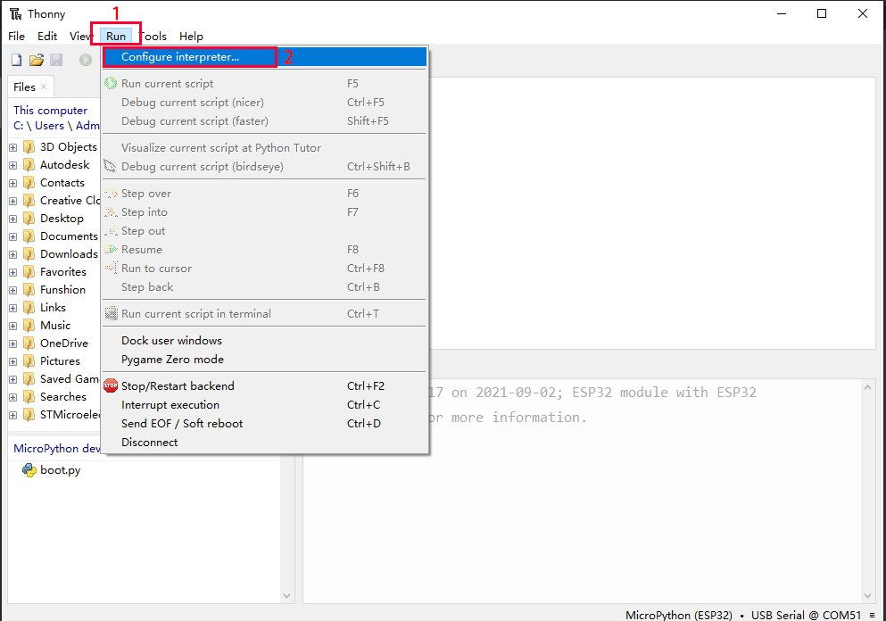

C. Set interpreter to `MicroPython(ESP32) `, check the port in Device Manager. Click `install or updare MicroPython(esptool)`

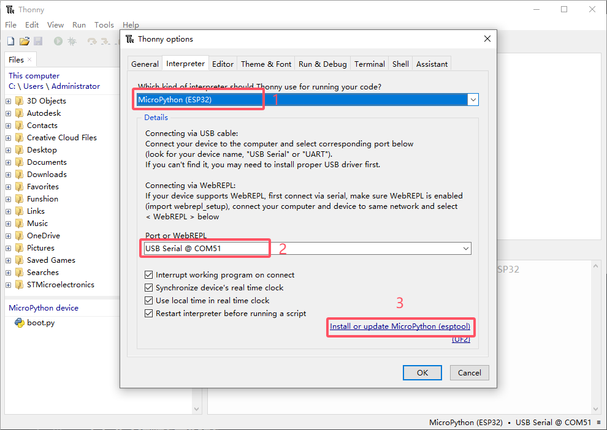

D. Click  to choose `Select local MicroPython image...`

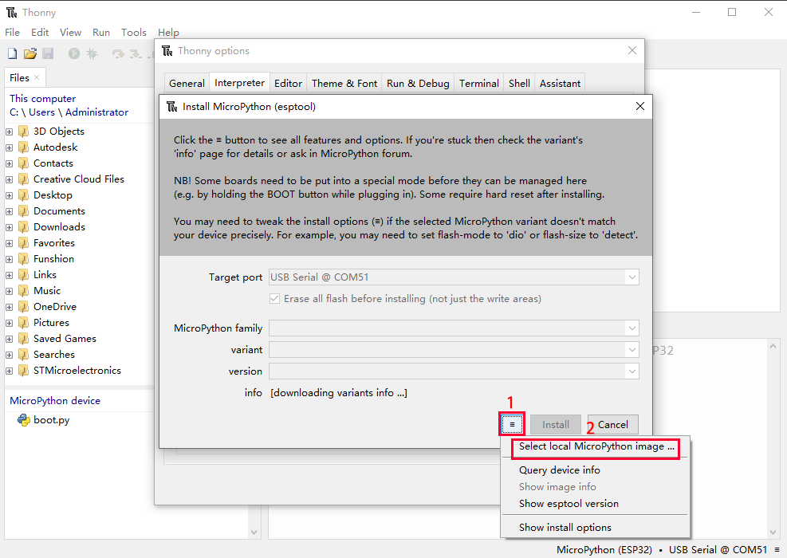

E. Open file `esp32-20210902-v1.17.bin`

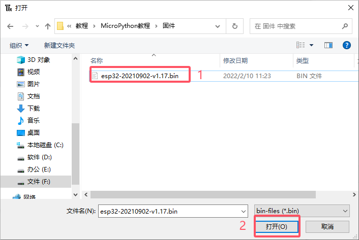

F. Click `install` and wait. 

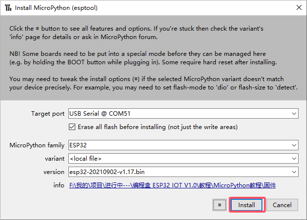

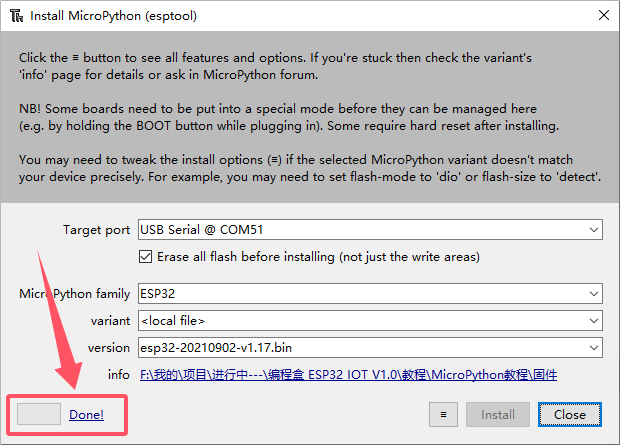

## 5 .Thonny

#### 5.1 Interface

Click **View** and tick **Files** to open the file path management.


#### 5.2 Toolbar

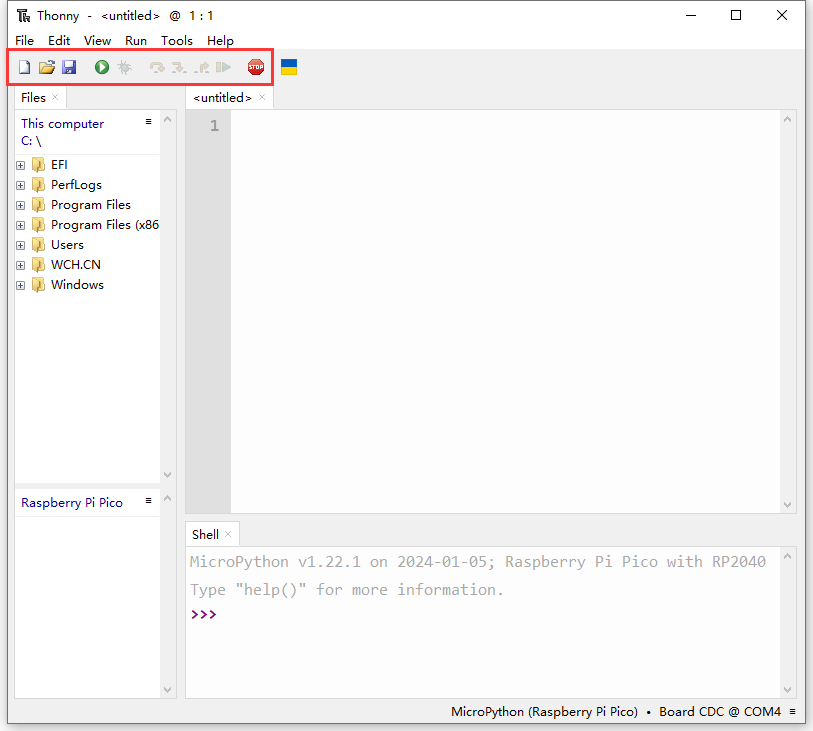

|            ICON             |            FUNCTION            |
| :-------------------------: | :----------------------------: |
|   |          New (Ctrl+N)          |
|   |        Open... (Ctrl+O)        |
|   |         Save (Ctrl+S)          |
|   |    Run current script (F5)     |
|   |      Debug current script      |
|   |         Step over (F6)         |
|  |         Step into (F7)         |
|  |            Step out            |
|  |          Resume (F8)           |
|  | Stop/Restart backend (Ctrl+F2) |


## 6. Code Download

Click to download the zip file of codes, including codes of projects for MicroPython and library. Decompress the file for direct use. 

 [Click here to download code package.](./Codes.zip) 

Download code . Here we save it on our desktop.

### 6.1 Test：

Click Files and you will see This computer . Copy and paste the file into `Codes`. 

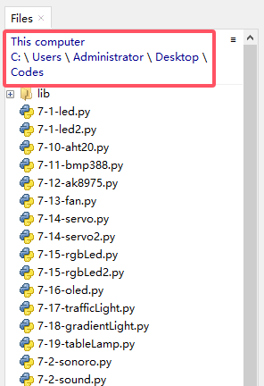

Connect to the coding box. If you cannot see the port, please install driver. If the code still cannot be uploaded after connecting to the port, please check whether the firmware is installed to the box. For how to download them, please refer to:

Driver: `3.Board Driver`; Firmware: `4.Burn FIRMWARE`

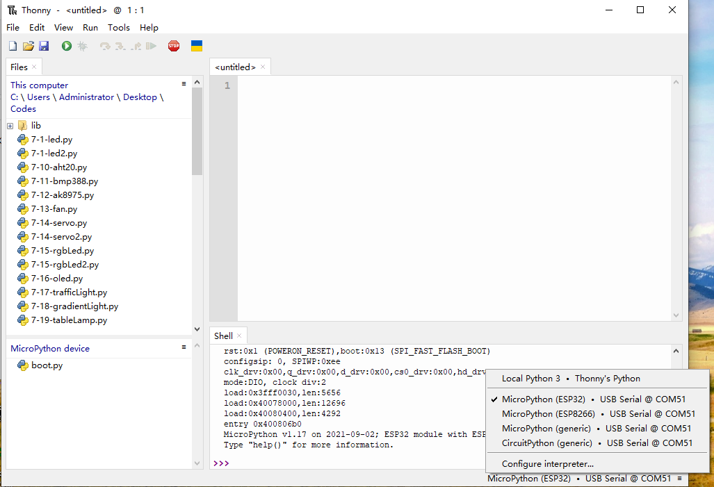

#### 6.1.1 Test Shell Command

Input the following code in Shell.

```python
print('hello world')
```


Press "Enter" and the Shell prints **hello world**.


#### 6.1.2 Test Online Running

Click to open code **7-1-led.py**.

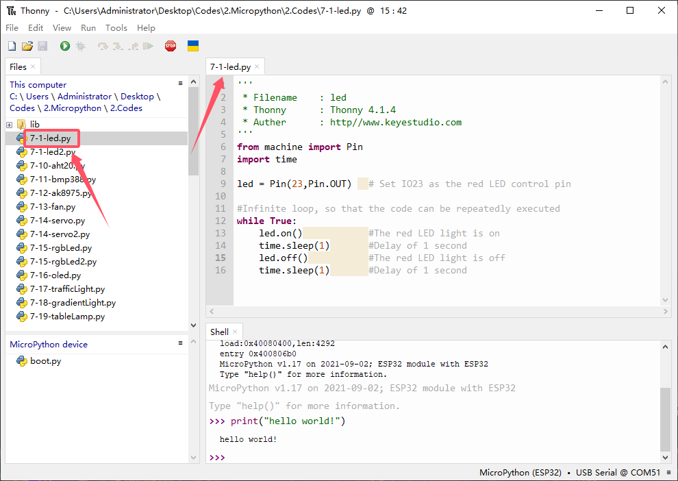

Click  to run the code, and the LED on the board will flashes: on for 1s and off for 1s.

#### 6.1.3 Test Offline Running

Click  to create a new script, copy and paste **7-1-led.py** in the editing area.

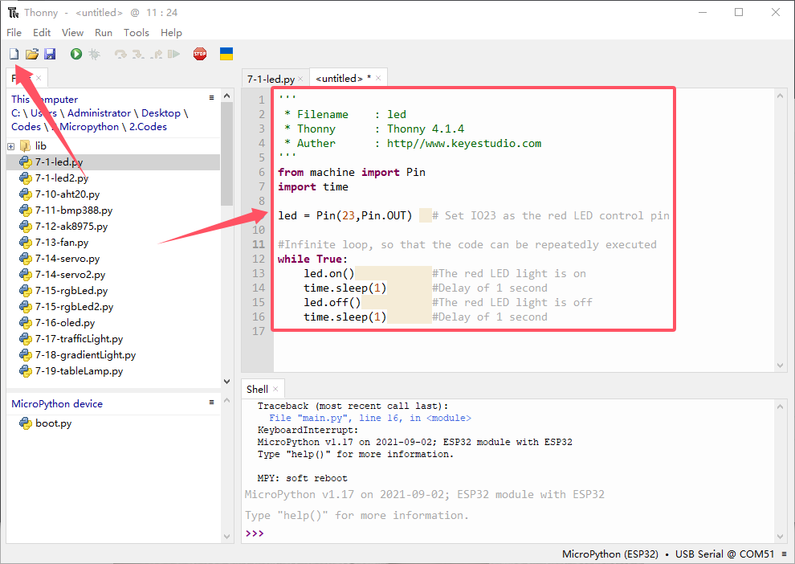

Click  to save it to MicroPython device.

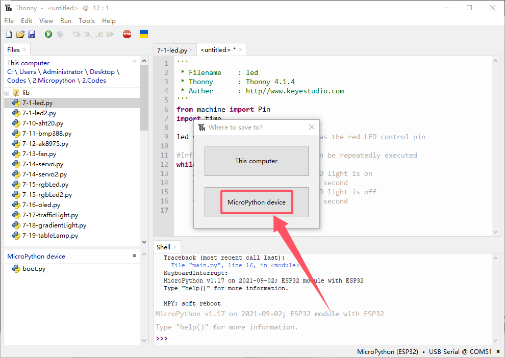

We name it as **main.py**.

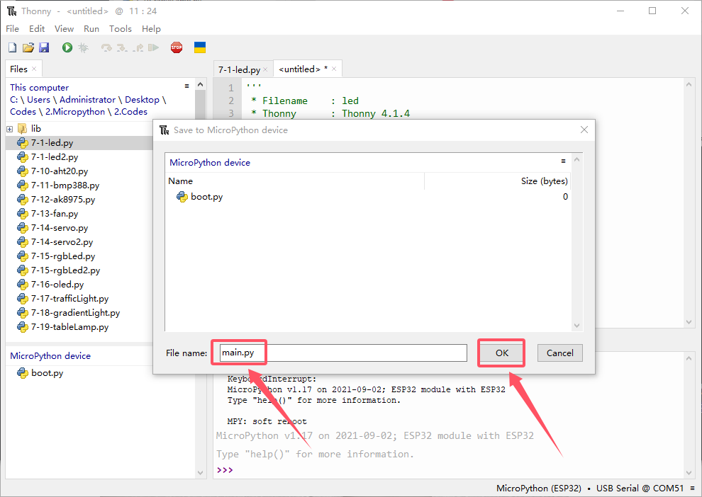

After saving, the main.py code will automatically execute as long as the coding box is powered on. You will see the red LED flashes per second. Note that it will not run after saving unless the reset button is pressed.

If you want to run a code offline, it must be loaded to the coding box with a name of `main.py`.


## 7. ESP32 Coding Box

### 7.1 LED Blink

#### 7.1.1 Overview

LED Blink is one of the simplest entry-level programming projects. It only needs an LED and then upload the code on the ESP32 Coding Box. This simple project helps beginners better master basic concepts.

#### 7.1.2 Schematic Diagram

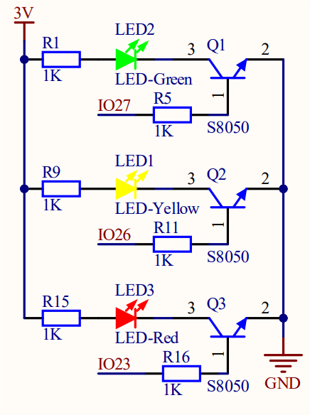

**LED lighting on:** The output current of the IO ports is limited, so the LED brightness may not be enough. Therefore, a NPN triode (Q2) is added to the circuit as a switch. We only need to add a high(low) level at the triode base pin 1 to light it up(out).

**Triode on/off:** To put it simple, when the base(pin 1) receives a high level, the collector(pin 3) and the transmitter(pin 2) are connected, so then VCC passes through the current-limiting resistor to the LED and then into the triode to GND, forming a loop. At this time, LED is on. When pin 1 receives a low level, pin 3 and 2 are disconnected so the current loop cannot be formed, resulting LED off.

#### 7.1.3 Test Code

**Code:**

Open Thonny. Connect the board to computer and choose the port. In Files, open **7-1-led.py** and click .

```python
'''
 * Filename    : 7-1-led
 * Thonny      : Thonny 4.1.4
 * Auther      : http//www.keyestudio.com
'''
from machine import Pin
import time

led = Pin(23,Pin.OUT) 	# Set IO23 as the red LED control pin，set pin to output

while True:
    led.on()			#red led on
    time.sleep(1)		#delay 1S
    led.off()			#red led off
    time.sleep(1)		#delay 1S

```

 **Result:**

After uploading the code, red LED will blink with an interval of 1 second.

#### 7.1.4  Extension

If you want the LED to blink more frequently, just modify the delay time to 200mS. Let’s have a try!

**Code:**

Open Thonny. Connect the board to computer and choose the port. In Files, open **7-1-led2.py** and click .

```python
'''
 * Filename    : 7-1-led2
 * Thonny      : Thonny 4.1.4
 * Auther      : http//www.keyestudio.com
'''
from machine import Pin
import time

led = Pin(23,Pin.OUT) 	# connect the led to pin IO23, set it to output

while True:
    led.on()				#red led on
    time.sleep_ms(200)		#delay 200mS
    led.off()				#red led off
    time.sleep_ms(200)		#delay 200mS


```

**Result:**

After uploading the code, the red LED will blink with an interval of 200mS. Compared to the previous experiment, it blinks more frequently.

#### 7.1.5 Code Explanation

1. `from machine import Pin`

   Import Pin from machine to enable its functions.

   **machine.Pin**

   ```python
   machine.Pin(id,mode,pull,value)
   ```

   id ：ESP32 GPIO pin number. For example, if you enable GPIO23, fill in with 23.

   mode ：pin mode can be one of the followings:

   ​	Pin.IN(0) - set pin to input

   ​	Pin.OUT(1) - set pin to (normal)output

   ​	Pin.OPEN_DRAIN(2) - set pin to open drain output

   pull ：specifies whether the pin is connected to a (weak-)pull resistor; it is valid only at input mode, and can be one of the followings:

   ​	None - no pull-up/down

   ​	Pin.PULL_UP(1) - enable pull-up resistor

   ​	Pin.PULL_DOWN(2) - enable pull-down resistor

   value ：only work at Pin.OUT and Pin.OPEN_DRAIN mode; assign the initial output pin value. Or else, the peripheral state of the pin stays still. 0 is low(off) while 1 is high(on).

   Pin.on() - set pin to high

   Pin.off() - set pin to low

2. `import time`

   Import **time** type so that its related functions can be adopted.

3. `led = Pin23, Pin.OUT)`

	connect LED to pin io23, set pin to output.

Q ：Why "output"?

A ：The code is written for the mainboard. For the board, pin io23 is outputting power levels (high or low) to the connected module.

4. `while True:`

   Statements in this function will execute in a loop.

   Formula of while loop function:

```python
while (condition)：
    (statements)……
```

5. `led.on()` and `led.off()`

   At pin io23 on the mainboard, respectively output high(1) and low(0); i.e., output high(1)/low(0) to LED module to make it on/off.

6. `time.sleep(1)` 

   Delay 1s.

   `time.sleep_ms`(1)

   Delay 1ms, this is more common.

   `time.sleep_us`(1)

   Delay 1us, this is a underlying code which is not commonly used.

   Conversion: 1s = 1000ms, 1ms = 1000us

   Q ：Why delay?

   A ：If you output a high level to LED, it will be always on. Yet, we add a delay of 1s, so it lights up for only 1s. Delay time is the ON/OFF time of LED.


### 7.2 Sound Sensor

#### 7.2.1 Overview

The sound sensor, with excellent sound reception, mainly contains a high sensitivity microphone and an LM358 operational amplifier. Weak sound signals are captured by the microphone and amplified by LM358, so the output is clear and recognizable, which can be effectively detected the sounds. 

This sensor features high sensitivity, fast response speed, so is widely used in sound detection and recognition, providing a stable and reliable voice input solution for various intelligent devices.

#### 7.2.2 Schematic Diagram


**Working principle:** If the built-in electret film vibrates after receiving sounds, its capacitance will change to produce a tiny voltage. The LM358 chip is adopted in circuits to amplify the sound signals detected by the high-sensitivity microphone.

#### 7.2.3 Test Code

In Files, open **7-2-sound.py** and click .

 **Code:**

```python
'''
 * Filename    : 7-2-sound
 * Thonny      : Thonny 4.1.4
 * Auther      : http//www.keyestudio.com
'''
# Import Pin, ADC and DAC modules.
from machine import ADC,Pin
import time

adc=ADC(Pin(34))			#set pin GPIO 34 as ADC input pin
adc.atten(ADC.ATTN_11DB)	#voltage range 0-3.3V
adc.width(ADC.WIDTH_12BIT)	#set ADC resolution

# Read ADC value once every 0.1seconds, convert ADC value to DAC value and output it, and print these data to “Shell”.
while True:	
        adcVal = adc.read()				#read the analog value of the sound sensor and assign it to variable to adcVal
        print("Sonoro ADC Val:",adcVal) #serial monitor prints adcVal value
        time.sleep_ms(50)					#delay 50mS

```

**Result:**

Click “Run current script” to run the code. “Shell” displays the ADC value of the sensor. Press “Ctrl+C” or click “Stop/Restart backend” to quit the execution.

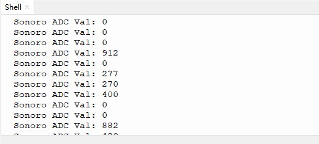

#### 7.2.4 Code Explanation

1. **`adc = ADC(Pin(34))`**:

   create an ADC object and set pin GPIO 34 to input. `Pin(34)` assigns a pin, `ADC(Pin(34))` means pin GPIO 34 is the input pin of ADC.

2. **`adc.atten(ADC.ATTN_11DB)`**:

   set the Attenuation class of ADC. Attenuation expands the voltage range of ADC. `ADC.ATTN_11DB` is an optional setting of ESP32, which expands the voltage range to 0-3.6V. ADC of ESP32 supports different attenuation settings:

   - `ADC.ATTN_0DB`：input voltage range 0-1V
   - `ADC.ATTN_2_5DB`：input voltage range 0-1.34V
   - `ADC.ATTN_6DB`：input voltage range 0-2V
   - `ADC.ATTN_11DB`：input voltage range 0-3.3V

   Setting attenuation helps you accurately read analog signals across different voltage ranges.

3. **`adc.width(ADC.WIDTH_12BIT)`**:

   Set ADC resolution to 12 bit. ADC of ESP32 can be configured different resolutions:

   - `ADC.WIDTH_9BIT`：resolution of 9 bit
   - `ADC.WIDTH_10BIT`：resolution of 10 bit
   - `ADC.WIDTH_11BIT`：resolution of 11 bit
   - `ADC.WIDTH_12BIT`：resolution of 12 bit

   The 12-bit resolution means that the ADC can subdivide the input voltage into 2^12^ = 4096 levels, which can provide finer measurements.

4. `print("Sonoro ADC Val:",adcVal)` prints characters in double quotes and the value of the variable adcVal. Line wrap after printing.


### 7.3 PIR Motion Sensor

#### 7.3.1 Overview

The PIR motion sensor adopts RE200B-P element. 

Based on pyroelectric effect, the sensor is able to detect the infrared ray emitted by human body or animal. With Fresnel lens, it can even detect farther and wider. When a nearby human or animal motion is detected, the sensor outputs a high level.

####  7.3.2 Schematic Diagram

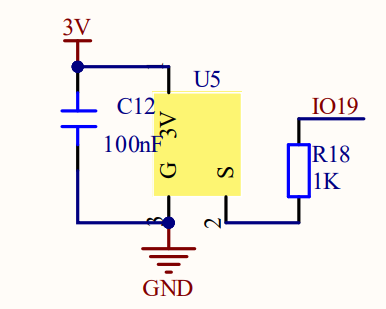

**Working principle:** The human body maintains at 37 degrees, so it will emit a specific wavelength of about 10μm infrared. The sensor captures 10μM infrared to determine whether there is a motion.

#### 7.3.3 Test Code

 **Code:**

In Files, open **7-3-pir.py** and click .

```python
'''
 * Filename    : 7-3-pir
 * Thonny      : Thonny 4.1.4
 * Auther      : http//www.keyestudio.com
'''
from machine import Pin
import time

PIR = Pin(19, Pin.IN)  # set pin IO19 to the pir input pin
while True:
    PIR_value = PIR.value()	#read Pir sensor value and assign it to variable value
    print(PIR_value, end = " ") #print PIR_value without wrapping
    if PIR_value == 1:		#determine whether PIR_value = 1
        print("Some body is in this area!")#if PIR_value = 1, execute the code
    else:	#or else
        print("No one!")
    time.sleep(0.1)	#delay 0.1S(100ms)

```

**Result:**

Click “Run current script” to run the code. “Shell” prints the corresponding value and characters. When a motion is detected, value = 1,  and “shell” shows “1 Somebody is in this area!” If no motion is detected, value = 0, “shell” prints “0 No one!”

Press “Ctrl+C” or click “Stop/Restart backend” to quit the execution.

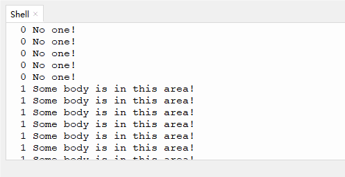

#### 7.3.4 Code Explanation

1. `if-else` determines PIR sensor state. Different contents will be printed according to its state.

- （if）`PIR_value == 1`: an object or a motion is detected, “Some body is in this area!” is printed.
- （else）`PIR_value` ≠ 1(PIR_value = 0): “No one!” is printed.

2. `print(PIR_value, end = " ")`：Print `PIR_value` without wrapping. `end=" "` means no wrap and ends with a space to continuously display changes in sensor status on the same line. 


### 7.4 Power Amplifier

#### 7.4.1 Overview

The 8002b power amplifier mainly consists of a speaker and an audio amplification chip. It can amplify small audio signals for about 8.5 times. These amplified sounds will be played through its speaker. Besides, it can also play some music or melodies. 

####  7.4.2 Schematic Diagram

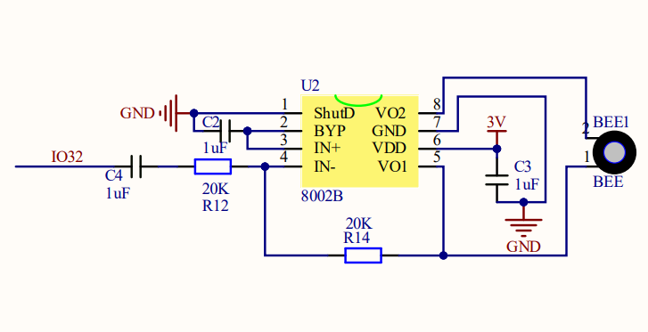

The power amplifier is enabled by square wave. The square wave can be changed by the duty cycle of PWM.

- The greater the duty cycle is, the louder the sound will be.

Or the tone can be adjusted via the frequency of PWM:

- The higher the frequency is, the higher the tone will be.

**What is PWM?**

PWM (Pulse width modulation) is a scheme that simulates the change of analog signals by digital signal.

Pulse width is the high level part in a complete square wave cycle. Therefore, PWM is a modulation of high level. Of course, in other words, the cycle is fixed, so it adjust the low level part as well. 

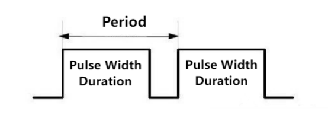

- **PWM frequency**

  Frequency is the number of times the signal goes from high to low level and back to high in 1 second (this is one cycle), that is, how many cycles there are in a second PWM.

  Unit: Hz

  Expression: 50Hz; 100Hz

- **PWM cycle**

  $ T= \frac {1}{f}$      $ Cycle = \frac {1}{Frequency}$

  When frequency is 50Hz, i.e., the cycle is 20ms, there are 50 PWM cycles within 1s.

- **PWM duty cycle**

  Duty cycle is the ratio of the time of the high level to the that of the whole cycle in a cycle.

  - Unit: % (1% ~ 100%)


  - **Cycle**: The time of a pulse signal. Frequency is the number cycles in 1s.
  - **Pulse width time**: high level time.

  

  <center>The Relationship between Duty Cycle and LED Brightness.gif<center>

The longer the high level is, the greater the duty cycle will be, and the brighter the LED will be.

  **The PWM frequency corresponding to the seventh note**

  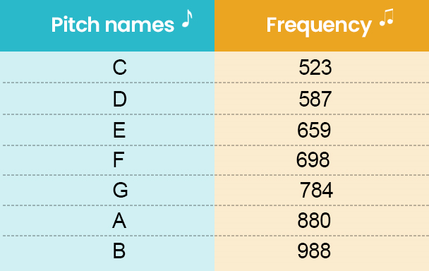

#### 7.4.3 Test Code

**Code:**

In Files, open **7-4-speaker.py** and click .

```python
'''
 * Filename    : 7-4-speaker
 * Thonny      : Thonny 4.1.4
 * Auther      : http//www.keyestudio.com

-----------------------------
| Pitch names |  Frequency  |
|---------------------------|
|    C(Do)    |     523     |
|    D(Re)    |     587     |
|    E(Mi)    |     659     |
|    F(Fa)    |     698     |
|    G(So)    |     784     |
|    A(La)    |     880     |
|    B(Si)    |     988     |
-----------------------------
'''
from machine import Pin, PWM
import time

#set pin IO32 to PWM output pin, frequency is 5000 Hz, duty cycle is 50% (The median value of 8-bit resolution is 128, the duty cycle ranges from 0-255)
trumpet = PWM(Pin(32), freq=5000, duty=128) 

a = [523,587,659,698,784,880,988] #define an array to store frequency

for i in a:				#for loop array "a", If there are n sets of data, cycle n times
    trumpet.duty(10)	#control PWM duty cycle （0-255）, sound volume is adjustable
    trumpet.freq(i)		#set frequency, emit sound by controlling frequency
    time.sleep(0.5)		#delay 0.5S
    trumpet.duty(0)		#set duty cycle to 0 to turn off the amplifier

```

 **Result:**

Click “Run current script” to run the code. The amplifier emits tones of Do, Re, Mi, Fa, So, La, Si.

#### 7.4.4 Code Explanation

1. `from machine import Pin, PWM`

   import PWM function.

    **machine.PWM**

   `machine.PWM(pin)`：PWM object constructor, it reinitializes the specified GPIO and sets to PWM output.

   ​	pin: GPIO object that needs to be set to PWM output.

   `PWM.freq（value）`：set PWM output frequency.

   ​	value : PWM output frequency. The value should conform to the PWM frequency calculation formula.

   `PWM.duty（value）`：set duty cycle. The corresponding value is calculated automatically through value.

   ​	value: set duty cycle ratio, within 

2. `trumpet = PWM(Pin(32) ,freq=5000, duty=128)` 

   `Pin(32)`：set pin GPIO32 to output PWM

   `freq=5000`：set PWM frequency to 5000 Hz

   `duty=128`：at 8 bit resolution, set PWM duty cycle to 128, corresponding to 50%. Duty cycle range: 0-255

3. `a = [523,587,659,698,784,880,988]`

   In python, [ ] means a list, elements in which are separated with comma.

   Create a list “a”, elements: 523, 587, 659, 698, 784, 880, 988, corresponds to tone C, D, E, F, G, A, B.

4. ```python
   for i in a:
   	trumpet.duty(10) #tone at duty cycle of 10, sound decrease
       trumpet.freq(i)
       time.sleep(0.5)
   ```

   **for statement** in Python: play tone at duty cycle of 10, each tone for 0.5s.

   In Python, for loop is an iteration statement, which is used for loop of a traversal list (including strings, lists, elements, dictionaries, collections) or executes a loop a specified number of times. 

   Grammatical structure of for loop:
   
   ```python
   for iterating_var in sequence:
      statements(s)
   ```

   Flow of for statement:

   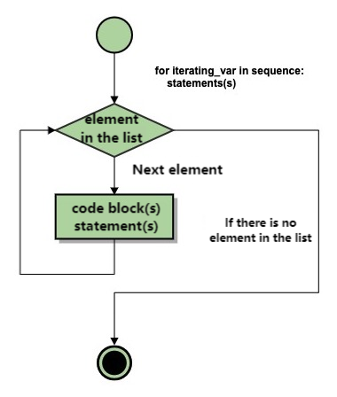

   traversal string:
   
   ```python
   # define string name
   hopy = "reaipaobu"
   # for loop processes string
   for x in hopy: 
          print(x)
   ```

   Results:
   
   ```
   r
   e
   a
   i
   p
   a
   o
   b
   u
   ```
   
   As you can see, for loop takes the contents of the string in turn. So it is also called traversal loop.


### 7.5 Photoresistor

#### 7.5.1 Overview

Photoresistor is photoelectric device that works according to semiconductor photoconductivity. It can be used to sense the brightness of the current environment to output a corresponding analog value.

####  7.5.2 Schematic Diagram

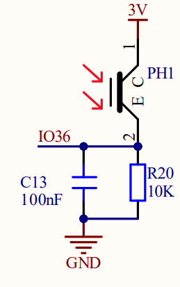

Photoresistor takes advantage of the photoelectric effect of semiconductors. Its resistance varies with ambient light. 

In the light, the semiconductor material absorbs photon energy to produce electron-hole pairs, increasing the conductivity and reducing the resistance. The brighter the light is, the lower the resistance will be. From the changes of resistance, it can sense light intensity accurately. Therefore, it is widely used in automatic lighting, photoelectric control, real-time monitoring and regulation of light.

#### 7.5.4 Test Code

In Files, open **7-5-light.py** and click .

**Code:**

```python
'''
 * Filename    : 7-5-light
 * Thonny      : Thonny 4.1.4
 * Auther      : http//www.keyestudio.com
'''
# Import Pin, ADC and DAC modules.
from machine import ADC,Pin,DAC
import time

adc=ADC(Pin(36))			#set pin GPIO 36 to ADC input pin
adc.atten(ADC.ATTN_11DB)	#set voltage range to 0-3.3V
adc.width(ADC.WIDTH_12BIT)	#set ADC resolution

while True:			
    adcVal=adc.read()	#read the sensor value and assign it to variable adcVal
    print("ADC Val:",adcVal)	#print the adcVal value
    time.sleep(0.5)				#delay 0.5s

```

**Result:**

Click “Run current script” to run the code. “Shell” displays the ADC value of photoresistor. Press “Ctrl+C” or click “Stop/Restart backend” to quit the execution.

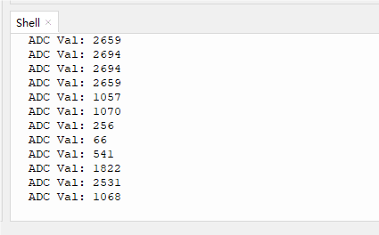


### 7.6 AD Button

#### 7.6.1 Overview

The AD button requires only one analog pin to read multiple button states, which greatly saves IO ports. It adopts analog acquisition, and the output voltages vary from pressed buttons, so that different analog values can be obtained. We can determine which button is pressed according to these values.

####  7.6.2 Schematic Diagram

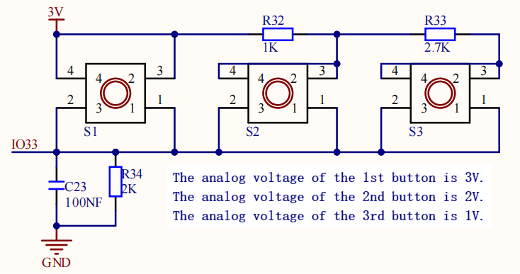

From the Schematic Diagram: 

When no button is pressed, the output at signal pin IO33 is pulled down by R34 (connected to GND. So the analog value of IO33 is 0, that is, low level 0V;

When button S1(the red button) is pressed, pin IO33 is connected to VCC. So the analog value of IO33 is 4095 (voltage = 3.3V).

When button S2(the yellow button) is pressed, the voltage of IO33 is that between R32 and R34: VCCxR34/(R32+R34) ≈ 2.2V, and the analog value is about 2432;

When button S3(the green button) is pressed, the voltage of IO33 is that between R32+R33 and R34: VCCxR34/(R32+R33+R34) ≈ 1.1V, and the analog value is about 1175.

#### 7.6.4 Test Code

In Files, open **7-6-adKey.py** and click .

**Code:**

```python
'''
 * Filename    : 7-6-adKey
 * Thonny      : Thonny 4.1.4
 * Auther      : http//www.keyestudio.com
'''
# Import Pin and ADC modules.
from machine import ADC,Pin
import time 

adc=ADC(Pin(33))			#set pin GPIO 33 to ADC input pin
adc.atten(ADC.ATTN_11DB)	#set voltage range to 0-3.3V
adc.width(ADC.WIDTH_12BIT)	#set ADC resolution

while True:				
    adcVal = adc.read() 	#read AD button value and assign it to adcVal
    print("adcVal:",adcVal)	#print the adcVal value
    time.sleep(0.3)			#delay 0.3S

```

**Result:**

Click “Run current script” to run the code. “Shell” displays the ADC value of AD button. Press “Ctrl+C” or click “Stop/Restart backend” to quit the execution.

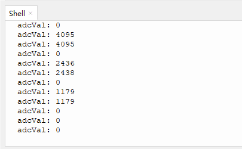

####  7.6.5 Extension

**AD button logic table:**

|      button       | the analog value of button being pressed | the analog value of button being released |
| :---------------: | :--------------------------------------: | :---------------------------------------: |
|  the red button   |                   4095                   |                     0                     |
| the green button  |                about 2432                |                     0                     |
| the yellow button |                about 1175                |                     0                     |

**AD button logic table:**

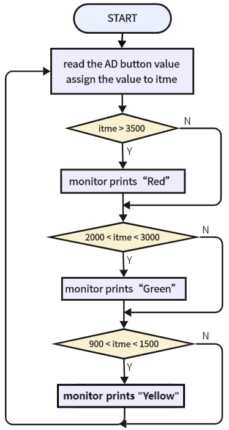

**Code:**

We add a condition statement to determine the read analog value of AD button module so that we can tell which button is pressed.

In Files, open **7-6-adKey2.py** and click .

```python
'''
 * Filename    : 7-6-adKey2
 * Thonny      : Thonny 4.1.4
 * Auther      : http//www.keyestudio.com
'''
# Import Pin and ADC modules.
from machine import ADC,Pin
import time 

adc=ADC(Pin(33))			#set pin GPIO 33 to ADC input pin
adc.atten(ADC.ATTN_11DB)	#set voltage range to 0-3.3V
adc.width(ADC.WIDTH_12BIT)	#set ADC resolution

while True:			
    itme = adc.read() 	#read analog value of AD button and assign it to item
    if itme > 3500:	#determine whether itme > 3500, if yes, print “Red”
        print("Red")
    elif (itme > 2000) and (itme < 3000):	#determine whether 2000<itme<3000, if yes, print “Yellow”
        print("Yellow")
    elif itme > 900 and itme < 1500:	#determine whether 900<itme<1500, if yes, print “Green”
        print("Green")
    time.sleep(0.3)		#delay 0.3S


```

 **Result:**

After uploading the code, Shell will print the colors of the buttons. If one of the buttons is pressed, its color will be displayed: “Red”, “Green” or “Yellow”.

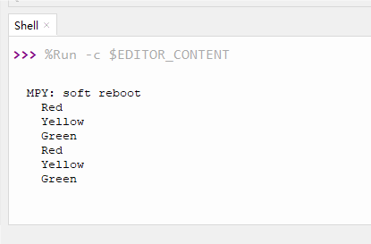


### 7.7 Ultrasonic Sensor

#### 7.7.1 Overview

Ultrasonic sensor measures the distance of an object by sound waves. It boasts a transmitter and a receiver to emit sound waves and then measure the returned waves. The time difference between transmitting and receiving can be used to calculate the distance value. Beyond that, it is also used to detect the shape or presence of objects, build automatic doors, and measure flow rates and pressures.

####  7.7.2 Schematic Diagram


**Working principle:** Like bats, the ultrasonic sensor sends an ultrasonic signal with a high frequency that human cannot hear. If these signals encounter obstacles, they will immediately reflect back and be received by the sensor. After that, the distance between the sensor and the obstacle is calculated according to the time difference between signals transmitting and receiving. 

**Maximum detection distance:** 3M

**Minimum detection distance:** 4cm

**Detection angle:** no greater than 15 degrees

#### 7.7.4 Test Code

In Files, open **7-7-ultrasonic.py** and click .

**Code:**

```python
'''
 * Filename    : 7-7-ultrasonic
 * Thonny      : Thonny 4.1.4
 * Auther      : http//www.keyestudio.com
'''
from machine import Pin
import time

# define the control pin of the ultrasonic sensor
Trig = Pin(5, Pin.OUT) 
Echo = Pin(4, Pin.IN)

distance = 0 # define the initial value to 0
soundVelocity = 340 #Set the speed of sound.

# getDistance() measures the distance, Echo.value() reads the status of Echo pin. Use the timestamp function of the time module to calculate the high level of the Echo's duration pin, and calculate the measured distance based on the time and return the value.
def getDistance():
    # Trig pin maintains high level for 10us to enable to the ultrasonic sensor
    Trig.value(1)
    time.sleep_us(10)
    Trig.value(0)
    #start counting, the initial time of ultrasonic wave propagation in the air
    while Echo.value() == 0:
        Start = time.ticks_us()
    #The time of receiving the reflected ultrasonic wave
    while Echo.value() == 1:
        Stop = time.ticks_us()
    #The received time minus the initial time is the total time
    Time = time.ticks_diff(Stop,Start)
    #Calculate the distance according to the formula in meters.
    #Divide by 1000 to convert to centimeters.
    distance =  Time * soundVelocity //2 // 10000
    #Return the result of the calculation
    return distance

# Print the ultrasonic sensor value every 500 milliseconds
while True:    
    print('Distance: ', getDistance(), 'cm')
    time.sleep_ms(500)
```

**Result:**

After uploading the code, Shell prints the distance values and refreshes them per second. The distance can be viewed when you cover the sensor with your hand.

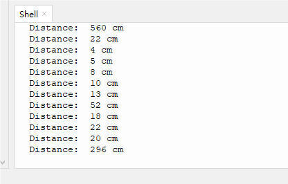

#### 7.7.5 Code Explanation

1. `def getDistance():`

   Create a function that drives the ultrasonic sensor to measure distance. Returns the measured result.

2. `print("Distance: ", getDistance(), "cm")`

   Print the measured distance.

   Use commas to separate the content to be printed, and print the content inside the single quotation marks directly.


### 7.8 NFC Sensor

#### 7.8.1 Overview

RFID-RC522 module adopts Phillips MFRC522 original chip in card reading circuit, which is easy to use and with low cost. It is suitable for equipment and reader development, advanced applications, RF card terminal design and producing.

####  7.8.2 Schematic Diagram


**RFID (Radio Frequency Identification)**: 

The card reader is composed of a frequency transmitter module and a high level magnetic field. The Tag transponder is a device to be sensed without a battery. It consists only of tiny integrated circuit chips, media for storing data, and antennas for receiving and transmitting signals. To read the data in the tag, it must be placed within the reading range of the reader. After that, the reader will generate a magnetic field. According to Lenz's law (magnetic energy generates electricity), the RFID Tag will be powered, thus activating the device.

<p style="color:red;">NOTE: this module only recognize card working at 13.56MHz. It is recommended to use the provided card in the kit.</p>

#### 7.8.3 Test Code

Open **rfid.py**.

Before uploading code, library is required. In lib file, open **mfrc522_config.py**, **mfrc522_i2c.py** and **soft_iic.py**, and choose *Upload to /*.

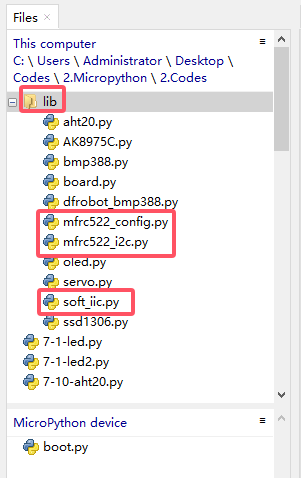

Successfully loaded: 

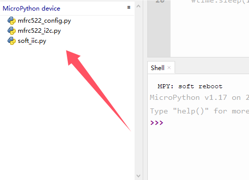

**Code:**

```python
'''
 * Filename    : 7-8-rfid
 * Thonny      : Thonny 4.1.4
 * Auther      : http//www.keyestudio.com
'''
import machine
import time
#import mfrc522 from mfrc522_i2c
from mfrc522_i2c import mfrc522

#i2c config
addr = 0x28		#rfid IIC communication address
scl = 22		#IIC SCL pin
sda = 21		#IIC SDA pin

#create an MFRC522 object, I2C SCL and SDA pin and device address
rc522 = mfrc522(scl, sda, addr)
#initialize MFRC522 module, this is essential to ensure working state
rc522.PCD_Init()
#show MFRC522 reader information, used to debug and ensure working state
rc522.ShowReaderDetails()        

while True:
    #detect whether there is an RFID card within the sensing area
    if rc522.PICC_IsNewCardPresent():
        #try to read the card ID. If the ID can be successfully read, return True.
        if rc522.PICC_ReadCardSerial() == True:
            #print “Card UID:” and complete UID
            print("Card UID:",rc522.uid.uidByte[0 : rc522.uid.size])

```

**Result:** 

After uploading the code, cover the RFID sensing area with the IC card or the key in the kit, and you will see the serial monitor prints the ID numbers. 

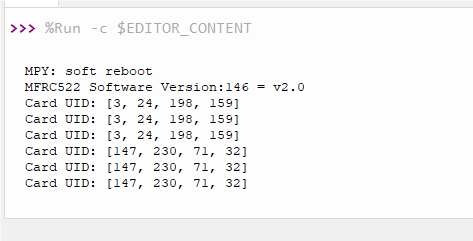


### 7.9 Axis-X&Y Joystick Module

#### 7.9.1 Overview

Axis-X&Y Joystick is a high-precision input device for bidirectional control. Its X and Y axes are separated to control horizontal and vertical movements respectively. This module contains 10K resistance so that it ensures the stability and accuracy of signals. 

####  7.9.2 Schematic Diagram


ESP32 Axis-X&Y Joystick works based on a two-axis potentiometer that detects movements on two axes. When the joystick moves on axis X or Y, the resistance of the potentiometer changes, outputting analog voltage signals. After being received by ESP32 analog input pin (ADC), these signals will be read by ESP32 board and converted to digital values. Therefore, the joystick coordinate can be easily revealed during controlling. 

#### 7.9.3 Test Code

In Files, open **7-9-joystick.py** and click .

**Code:**

```python
'''
 * Filename    : 7-9-joystick
 * Thonny      : Thonny 4.1.4
 * Auther      : http//www.keyestudio.com
'''
from machine import Pin, ADC
import time
# Initialize the joystick module (ADC function)
rocker_x=ADC(Pin(35))	#set pin IO39 to joystick axis X input
rocker_y=ADC(Pin(39))	#set pin IO35 to joystick axis Y input

# Set the acquisition range of voltage of the two ADC channels to 0-3.3V,
# and the acquisition width of data to 0-4095.
rocker_x.atten(ADC.ATTN_11DB)
rocker_y.atten(ADC.ATTN_11DB)
rocker_x.width(ADC.WIDTH_12BIT)
rocker_y.width(ADC.WIDTH_12BIT)
 
# In the code, configure Z_Pin to pull-up input mode.
# In loop(), use Read () to read the value of axes X and Y 
# and use value() to read the value of axis Z, and then display them.
while True:
    print("X,Y,Z:",rocker_x.read(),",",rocker_y.read())
    time.sleep(0.5)

```

**Result:**

After uploading the code, Shell prints the values on axis X and Y. Toggle the joystick, and these value changes. 

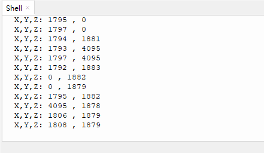


### 7.10 Temperature and Humidity Sensor

#### 7.10.1 Overview

AHT20 temperature and humidity sensor adopts I2C interface and 20Bit ADC, and its operating voltage is 2V-5V. It features small volume, stable performance and high precision (accuracy: temperature ±0.3℃, humidity ±2%RH). So it is widely used in smart home, consumer electronics, medical and automotive. The sensor is stable and can work in harsh environments.

####  7.10.2 Schematic Diagram


ATH20 temperature and humidity sensor transmits data via I2C interface, and it works according to resistive and capacitive technology. It detects the temperature because the material's conductivity changes with temperature, and it reflects humidity through the change in the capacitance value. The temperature measurement range is -40 ° C to +85 ° C with accuracy of ±0.3 ° C, and the humidity range is 0% ~ 100%RH ±2%RH. Besides, it features high accuracy, high reliability and long-term stability. With I2C protocol, ATH20 provides real-time and accurate temperature and humidity data under a variety of environmental conditions.

#### 7.10.3 Test Code

Open **7-10-aht20.py**.

Before uploading code, library is required. In lib file, open **aht20.py**, and choose *Upload to /* .

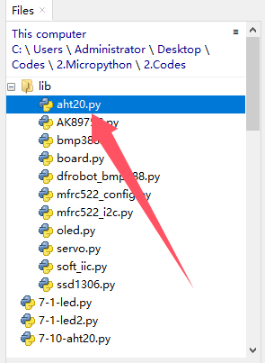

Successfully loaded:

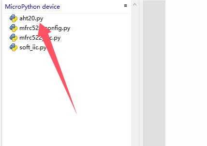

**Code:**

```python
'''
 * Filename    : 7-10-aht20
 * Thonny      : Thonny 4.1.4
 * Auther      : http//www.keyestudio.com
'''
#import I2C and Pin from machine
from machine import I2C, Pin
#import AHT20 from aht20 library
from aht20 import AHT20
import time
#create an I2C object and define SDA and SCL pin
i2c = I2C(scl=Pin(22), sda=Pin(21))
#create an AHT20 object, initialize I2C object to communicate through I2C bus and AHT20 sensor
sensor = AHT20(i2c)

while True:	
    try:
        #Store the values of temperature and humidity in the temperature and humidity variables
        temperature, humidity = sensor.read_temperature_humidity()
        #Formatted output variable value of temperature and humidity, keep two decimal places
        print("Temperature: {:.2f} C, Humidity: {:.2f} %".format(temperature, humidity))
    #Read the detect value, if there is an error, print “Failed to read from sensor:”
    except RuntimeError as e:
        print("Failed to read from sensor: ", e)
    time.sleep(1)	#delay 1S

```

**Result:**

After uploading the code, Shell prints temperature and humidity values and refreshes the results per second.

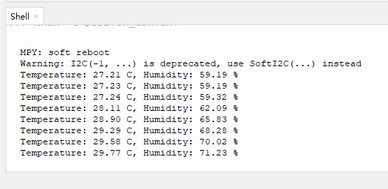


### 7.11 Pressure Sensor

#### 7.11.1 Overview

BMP388 pressure sensor is a pneumatic MEMS sensor a very compact package, featuring small size, low power consumption but high performance. In brief, it is a combination of the temperature and pressure sensor, which is perfect for mobile applications. 

This module adopts proven piezoresistive pressure sensing technology with high accuracy and linearity, as well as long-term stability and high EMC stability. Besides, it maximize flexibility in multi-device working, and is ideal for altitude tracking in consumer electronics drones, wearables, smart homes, etc. 

As for improvement, we can optimize the device in terms of power consumption, resolution and filtering performance.

####  7.11.2 Schematic Diagram


Based on piezoelectric pressure sensing technology, the BMP388 pressure sensor accurately measures pressure and temperature. It is capable of measuring air pressure in the 300 ~ 1250 hPa range without consuming much power (consuming only 3.4 µA at 1 Hz operating frequency). In addition, the built-in infinite impulse response filter can effectively reduce effects from external interference.

#### 7.11.3 Test Code

Open **7-11-bmp388.py**.

Before uploading code, library is required. In lib file, open **bmp388.py**, and choose *Upload to /* .

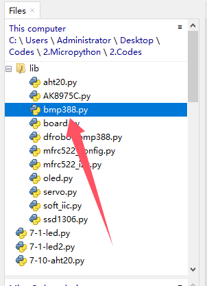

Successfully loaded:

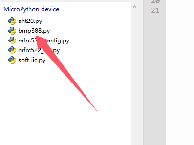

**Code:**

```python
'''
 * Filename    : 7-11-bmp388
 * Thonny      : Thonny 4.1.4
 * Auther      : http//www.keyestudio.com
'''
import machine
#import BMP388 from BMP388 library
from bmp388 import BMP388 
import time

# create BMP388 object and set SDA and SCL pin, set IIC frequency to 100KHz
i2c = machine.SoftI2C(scl=machine.Pin(22), sda=machine.Pin(21), freq=100000)

# create a BMP388 object, pass the previously created i2c object to it, and communicate with the BMP388 sensor via the I2C bus, set BMP388 IIC address to 0x76
bmp = BMP388(i2c, i2c_addr=0x76)

while True:
    # read the temperature value
    temperature = bmp.read_temperature()
    # read the pressure value
    pressure = bmp.read_pressure()
    # print the read value
    print("Temperature:", temperature, "C "," Pressure:", pressure, "Pa")
    time.sleep(1)


```

**Result:**

After uploading code, the shell prints the values read by BMP388 sensor.

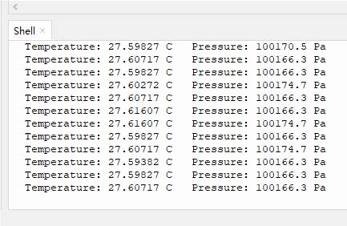


### 7.12 (Direction Recognition) Geomagnetic Sensor

#### 7.12.1 Overview

AK8975C geomagnetic sensor is a three-axis electronic compass IC with high sensitivity. It can output 13-bit data and accurately detect X, Y, Z axes geomagnetic values. Thus, it is suitable for portable devices with navigation function such as mobile phones and tablets.

####  7.12.2 Schematic Diagram


The AK8975C geomagnetic sensor works in the principle of electromagnetic induction. It takes the Earth's magnetic field as a measurement benchmark to sense changes in the magnetic field through its internal magnetic material and coils. Specifically, when the magnetic material is affected by geomagnetic field, a directional constrained electron spin deflection will happen due to the field force, which in turn forms a magnetic field. This field induces potential signals in the coil.

This sensor amplifies and processes the induced potential signals, which are then transmitted to the system for further calculation, analysis and processing. So it measures geomagnetic magnetic field in the axis X, Y, and Z to determine the direction.

#### 7.12.3 Test Code

Open **7-12-ak8975.py**.

Before uploading code, library is required. In lib file, open **AK8975C.py**, and choose *Upload to /* .

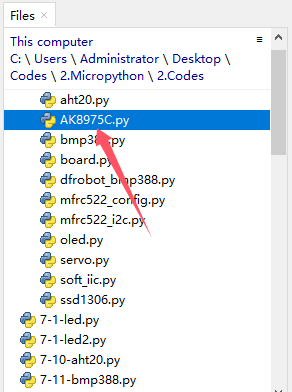

Successfully loaded:

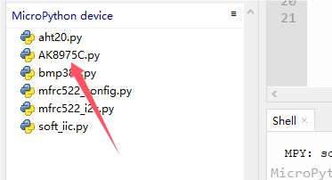

**Code:**

```python
'''
 * Filename    : 7-12-ak8975
 * Thonny      : Thonny 4.1.4
 * Auther      : http//www.keyestudio.com
'''
from machine import Pin
#import ak8975c from AK8975C
from AK8975C import ak8975c
import time

scl = Pin(22)
sda = Pin(21)
#create an ak8975c object, initialize I2C bus and SCL and SDA pin
Triaxial = ak8975c(scl, sda)

while True:
    Triaxial.measure()  # measure values
    print('x:',Triaxial.X,'y:',Triaxial.Y,'z:',Triaxial.Z)  # Print the geomagnetic strength of the XYZ axis
    if Triaxial.AK8975_GET_AZIMUTH(Triaxial.X, Triaxial.Y) == True:  # Print the value of the course Angle only if the Angle can be calculated
        print('degree:', Triaxial.angle_val,'°')

```

**Result:**

After uploading code, the shell prints the sensor values. Move the coding box to see the changes of these values.

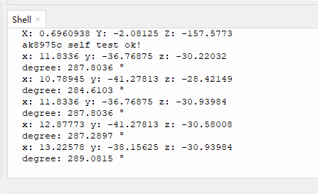


### 7.13 Fan/Motor Module

#### 7.13.1 Overview

The motor adopts HR1124S motor control chip that is a single channel H-bridge driver chip used in DC motors. The H-bridge drive uses PMOS and NMOS power tubes with low on-resistance, ensuring lower power loss and longer safe working time. In addition, its standby and static working current are both low, so it is commonly used in toys.

####  7.13.2 Schematic Diagram


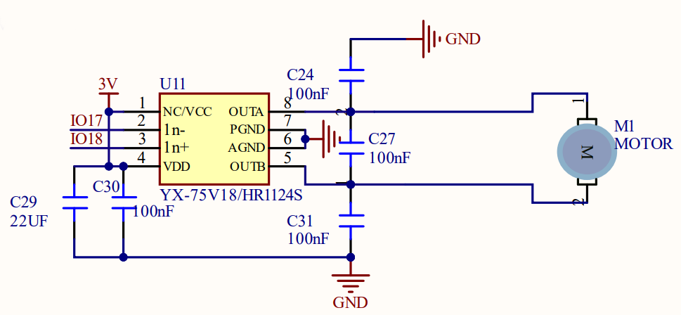

**Motor control logic table:**

| IO18 | IO17 |      motor state      |
| :--: | :--: | :-------------------: |
| HIGH | LOW  |    forward rotate     |
| LOW  | HIGH |    reverse rotate     |
| HIGH | HIGH | stop (a gradual stop) |
| LOW  | LOW  | brake (a brake stop)  |

#### 7.13.3 Test Code

In Files, open **7-13-fan.py** and click .

**Code:**

```python
'''
 * Filename    : 7-13-fan
 * Thonny      : Thonny 4.1.4
 * Auther      : http//www.keyestudio.com
---------------------------------------------
motor rotation logic table:
---------------------------------------------
  IO18(MA) 	| IO17(MB)  |     motor state		|
---------------------------------------------
  HIGH 		|   LOW   	|       forward rotate 		|
---------------------------------------------
   LOW 		|  HIGH  	|       reverse rotate 		|
---------------------------------------------
  HIGH 		|  HIGH  	|   stop (a gradual stop) |
---------------------------------------------
   LOW 		|   LOW   	|   brake (a brake stop)	|
---------------------------------------------
'''

from machine import Pin
import time

#set motor control pin A to IO18
MA = Pin(18,Pin.OUT)
#set motor control pin B to IO17
MB = Pin(17,Pin.OUT)

while True:
    #forward rotate
    MA.on()
    MB.off()
    time.sleep(2)
    #reverse rotate
    MA.off()
    MB.on()
    time.sleep(2)
    #stop
    MA.off()
    MB.off()
    time.sleep(2)

```

**Result:**

After uploading code, you will see the fan forward rotates for 2s and then reverses for another 2s. Then it stops. These actions repeat.


### 7.14 Servo

#### 7.14.1 Overview

The 9g servo features small size but high performance and precision and is with good torque and accuracy, so it is perfect for small machines. With up to 180 degrees rotation angle, it enables extremely precise rotation and control and can be started fast with low noise.

####  7.14.2 Schematic Diagram

**Angle range:** 180°(there are 360°, 180° and 90°)

**Drive voltage:** 3.3V / 5V

Usually three wires:


**GND:** grounded, in brown

**VCC:** connect to +5v (3.3V) power, in red

**S:** signal pin to control PWM signal, in orange

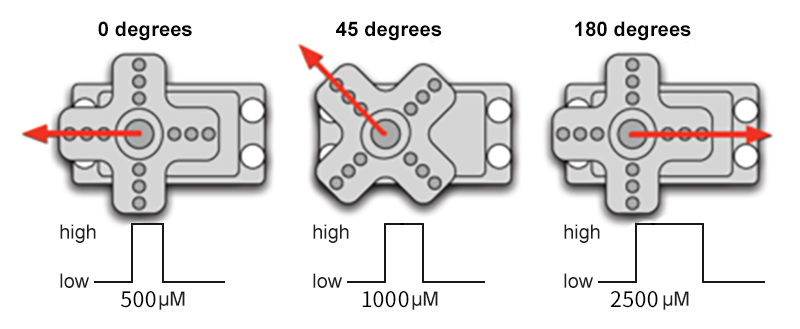

**Control principle**: The rotation Angle of the servo is controlled by adjusting the duty cycle of the PWM (pulse width modulation) signals. Theoretically, the period of the standard PWM signal is fixed at 20ms (50Hz), so the pulse width should be 1ms ~ 2ms. But in fact, it is 0.5ms ~ 2.5ms, corresponding to the servo angle of  0° ~ 180°. Note that the angle for the same signal varies from servo brands.

#### 7.14.4 Test Code

Open **7-14-servo.py** 

Before uploading code, library is required. In lib file, open **servo.py**, and choose *Upload to /*.

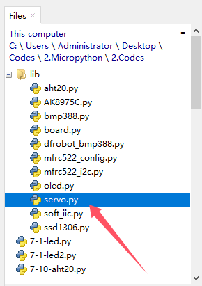

Successfully loaded:

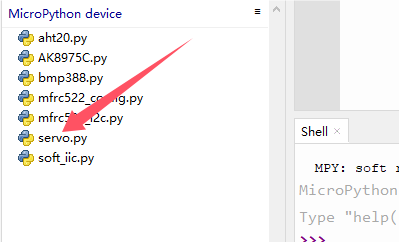

**Code:**

```python
'''
 * Filename    : 7-14-servo
 * Thonny      : Thonny 4.1.4
 * Auther      : http//www.keyestudio.com
'''
import machine
import time
#import Servo from servo library
from servo import Servo

servo = Servo(pin=25)  # connect servo to pin

while True:
    # Set angle
    servo.set_angle(0)  # rotate servo to 0 degree
    time.sleep(1)
    servo.set_angle(90)  # rotate servo to 90 degree
    time.sleep(1)
    servo.set_angle(180)  # rotate servo to 180 degree
    time.sleep(1)


```

**Result:**

After uploading code, the servo rotates to 0 degree, 90 degree and 180 degree accordingly, with each position staying for 1 second, and then it back to 0 degree. It repeats these rotations.

#### 7.14.5 Extension

In Files, open **7-14-servo2.py** and click .

**Code:**

```python
'''
 * Filename    : 7-14-servo2
 * Thonny      : Thonny 4.1.4
 * Auther      : http//www.keyestudio.com
'''
import machine
import time
#import Servo from servo library
from servo import Servo

servo = Servo(pin=25)  # connect servo to pin

while True:
    #rotate servo from 0 degree to 180 degree
    for angle in range(0,180):
        servo.set_angle(angle)  # rotate servo to 180 degree
        time.sleep_ms(10)		# delay 10ms
    #rotate servo from 180 degree to 0 degree
    for angle in range(180,-1,-1):
        servo.set_angle(angle)  # rotate servo to 0 degree
        time.sleep_ms(10)


```

**Result:**

After uploading code, the servo repeatedly and gradually rotates from 0 degree to 180 degree and then gradually back to 0 degree.

#### 7.14.6 Code Explanation

1. `for angle in range(0,180):`

   This `for` loop traverses all integers from 0 to 179,

   `range(0,180)` generates a sequence containing 0 but not 180.

2. `for angle in range(180,-1,-1):`

	This `for` loop is similar to the above one but in reverse order, i.e., all integers from 180 to 0. 

	In `range(180,-1,-1)`, -1 means step = -1. So this loop traverses elements from large to small.


### 7.15 WS2818 RGB LED

#### 7.15.1 Overview

WS2812 RGB LED is an external control LED integrating control circuit and light emitting circuit. It adopts single-line return-to-zero code communication, and supports 256 gray levels to display full-colors. The integrated chip inside each pixels efficiently stabilizes color output. So it is widely used in lighting, display and decoration.

####  7.15.2 Schematic Diagram


From the Schematic Diagram, ws2812 connects and transmits data over a single wire, which is the communication method named single-bus return-to-zero code (single NZR). The data enters in serial through the DIN port, and each pixel receives and processes 24 bits data (R, G, B color channels with 8 bits each). 

For detailed information of transmission mode, please refer the specification of ws2812.

#### 7.15.3 Test Code

In Files, open **7-15-rgbLed.py** and click .

 **Code:**

```python
'''
 * Filename    : 7-15-rgbLed
 * Thonny      : Thonny 4.1.4
 * Auther      : http//www.keyestudio.com
'''
#Import Pin, neopiexl and time modules.
from machine import Pin
import neopixel
import time

pin = Pin(16, Pin.OUT)	#define SK6812 control pin to IO16
num_pixels = 12			#set the number of SK6812 beads to 12
#initialize SK6812 beads
np = neopixel.NeoPixel(pin, num_pixels)

red = [255,0,0]	#set display color to red

while True:
    np[0] = red		#the first bead lights up in red. 12 beads: number from 0-11
    np.write()		#refresh to display the set color
    

```

 **Result:**

After uploading code, the first bead of ws2812 module will light up in red.

####  7.15.4 Extension

Light up all LED circulating red, green, and blue.

In Files, open **7-15-rgbLed2.py** and click .

 **Code:**

```python
'''
 * Filename    : 7-15-rgbLed2
 * Thonny      : Thonny 4.1.4
 * Auther      : http//www.keyestudio.com
 ----------------------------------------
    color = [red,green,blue]
    color stores the color values.
    red.green,blue corespond to RGB values, ranging from 0-255
    Red [255,0,0]
    set the color you want to display according to RGB color table
'''
#Import Pin, neopiexl and time modules.
from machine import Pin
import neopixel
import time

pin = Pin(16, Pin.OUT)	#define SK6812 control pin to IO16
num_pixels = 12			#set SK6812 beads to 12
#initialize SK6812
np = neopixel.NeoPixel(pin, num_pixels)
red = [255,0,0]	#red
green = [0,255,0]#green
blue = [0,0,255]	#blue

while True:
    for i in range(num_pixels):		#for loop: add i from 0 to 11
        np[i] = red		#show red at i
        np.write()		#refresh to display the set color
        time.sleep_ms(50)	#delay 50ms to change the color of the ring gradually
    time.sleep(1)	#Pause 1 second after all display
    for i in range(num_pixels):
        np[i] = green		#show green at i
        np.write()	
        time.sleep_ms(50)
    time.sleep(1)
    for i in range(num_pixels):	
        np[i] = blue		#show blue at i
        np.write()
        time.sleep_ms(50)
    time.sleep(1)

```

**Result:** 

After uploading code, ws2812 repeatedly lights up in red, green and blue with 1s each color.


### 7.16 OLED Display

#### 7.16.1 Overview

OLED display is also called organic light-emitting diode or organic dot laser display. This display is self-luminous. It adopts a very thin coating of organic materials and glass substrate which will light up if current passes through. Therefore, it does not require a back-light. Note that it will not light up when just powering on; programing and wiring are also needed.

Besides, it features large viewing Angle, low power consumption, high contrast, thin display, fast response, simple structure, and can work on flexion boards within a wide temperature range.

####  7.16.2 Schematic Diagram

Communication mode: I2C communication

Internal driver chip: SSD1306

Resolution: 128 x 64

#### 7.16.3 Test Code

Open **7-16-oled.py**.

Before uploading code, library is required. In lib file, open **oled.py** and **ssH1106**, and choose *Upload to /*.

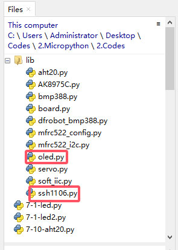

Successfully loaded:

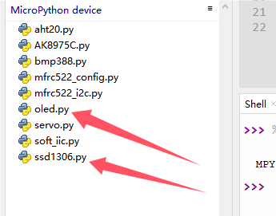

**Code:** 

```python
'''
 * Filename    : 7-16-oled
 * Thonny      : Thonny 4.1.4
 * Auther      : http//www.keyestudio.com
-----------------------------------------
oled.clear()
clear display. If you want to display new content, you have to clear the last display; or the two content will be overlapped

oled.oled.show()
refresh to display the new content on OLED

oled.show_text("******", X,Y)
set code. input content to be displayed in the double quotation marks,
and set value of X，Y to control the starting position of the display.
'''
import machine
from oled import OLED

# Initialize I2C interface
i2c = machine.SoftI2C(scl=machine.Pin(22), sda=machine.Pin(21))

# create OLED example
oled = OLED(i2c)

# clear display
oled.clear()

# show text
oled.show_text("KEYESTUTDIO", 20, 0)

# show text
oled.show_text("Hello World!", 20, 10)
oled.show_text("MicroPython", 20, 20)

# show
oled.oled.show()

```

**Result:**

After uploading code, you will see the OLED shows the text you set. On the first line, "KEYESTUTDIO" is displayed; "Hello World!" shows on the second line and "MicroPython" is on the third.


### 7.17 Traffic Light

#### 7.17.1 Overview

The traffic light module limits the pedestrian and vehicular thoroughfare. It includes a red, a yellow and a green light, which imply different instructions.

**Red for Stop:** Pedestrians and vehicles stop proceeding.

**Yellow for Caution:** Pedestrians and vehicles are ready for stopping. If the drive is already in process, the speed should be slow.

**Green for Proceed:** Pedestrians and vehicles keep going with the abidance of traffic regulations.

In this project, you can program on ESP32 Coding Boxto control a mini traffic light. For instance, set the duration of each lights and the interval time among them. Besides, you may also add a timer to alter light colors to schedule.

#### 7.17.2 Test Code

**Code Flow:**

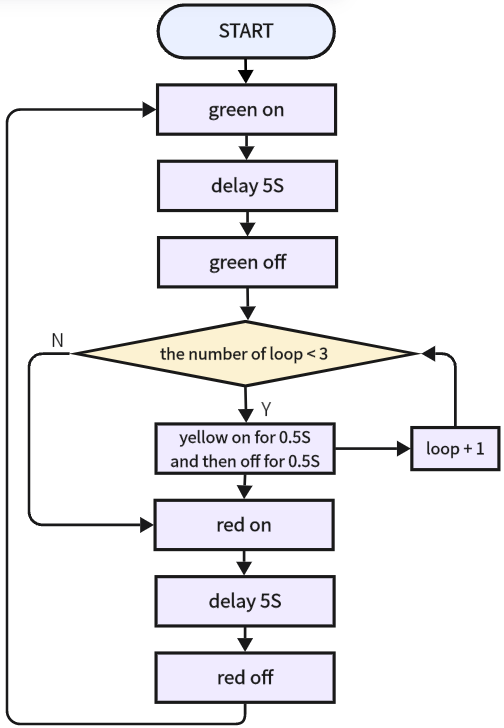

**Code:**

In Files, open **7-17-trafficLight.py** and click .

```python
'''
 * Filename    : 7-17-trafficLight
 * Thonny      : Thonny 4.1.4
 * Auther      : http//www.keyestudio.com
'''
from machine import Pin
import time

redLED = Pin(23,Pin.OUT)	#set red LED to IO23
greenLED = Pin(27,Pin.OUT)	#set green LED to IO27
yellowLED = Pin(26,Pin.OUT)	#set yellow LED to IO26

#turn off three led
redLED.off()
greenLED.off()
yellowLED.off()

#green led on for 5S; yellow led blink for 3; red led on for 5S; in a loop
while True:
    greenLED.on()
    time.sleep(5)
    greenLED.off()
    for i in range(0,3):
        yellowLED.on()
        time.sleep(0.5)
        yellowLED.off()
        time.sleep(0.5)
    redLED.on()
    time.sleep(5)
    redLED.off()

```

**Result:**

After uploading code, the green LED lights up for 5s and goes off. Immediately, the yellow LED blinks for three times. After that, the red LED lights up for 5s and goes off. These actions are exactly a model of traffic light and will repeat. 


### 7.18 Breathing LED

#### 7.18.1 Overview

PWM breathing LED utilizes on-board programmable PWM to output analog waveform. After powering on, LED brightness can be adjusted through duty cycle of the waveform to eventually realize a breathing light.

In this way, ambient light can be simulated by changing LED brightness along with time. Also, breathing LED can form a colorful mini light show to construct a tranquil and warm environment.

#### 7.18.2 Working Principle

PWM controls analog output via digital means, which are able to adjust the duty cycle of the wave (a signal circularly shifting between high level and low level).

digital ports of voltage output are LOW and HIGH, which respectively correspond to 0V and 5V. Generally, we define LOW as 0 and HIGH as 1. will output 500 signals of 0 or 1 within 1s. If they are 500 “1”s, 5V will be output. Oppositely, if they are all 0s, the output will be 0V. Or if they are 010101010101…, the average output will be 2.5V. In other words, output ratio of 0 and 1 affects the voltage value. 

Honestly, it differs from real continuous output, yet the more 0 and 1 signals are output per unit time, the more accurate the control will be.


#### 7.18.3 Test Code

In Files, open **7-18-gradientLight.py** and click .

 **Code:**

```python
'''
 * Filename    : 7-18-gradientLight
 * Thonny      : Thonny 4.1.4
 * Auther      : http//www.keyestudio.com
'''
from machine import Pin, PWM  
import time  
  
# set PWM pin and frequency  
pwm_pin = Pin(23, Pin.OUT)  
pwm = PWM(pwm_pin, freq=1000)  # set frequency to 1000Hz  
  
# breathing LED  
while True:  
    for duty in range(0, 1024, 5):  # gradually light up
        pwm.duty(duty)  
        time.sleep_ms(10)  # add a delay for better observing  
    for duty in range(1023, -1, -5):  # gradually dim out
        pwm.duty(duty)  
        time.sleep_ms(10)

```

 **Result:**

After uploading code, the red LED gradually lights on and dims out, in a circulation. It “breathes” evenly.


### 7.19 Button Control LED

#### 7.19.1 Overview

In this project, we control the ON/OFF of the LED via an AD button. The LED will light up if we press the button and it goes off when we press the button again.

#### 7.19.2 Test Code

In Files, open **7-19-tableLamp.py** and click .

**Code:**

```python
'''
 * Filename    : 7-19-tableLamp
 * Thonny      : Thonny 4.1.4
 * Auther      : http//www.keyestudio.com
'''
from machine import Pin,ADC
import time

led = Pin(23,Pin.OUT)
key = ADC(Pin(33))			#set ADC input pin to GPIO 33
key.atten(ADC.ATTN_11DB)	#set voltage range to 0-3.3V
key.width(ADC.WIDTH_12BIT)	#set ADC resolution
#define a variable to shift the state of led
ledState = False

while True:
    keyVal = key.read()	#read the analog value of button
    if keyVal > 3500:	#if value > 3500: red button is pressed
        #reverse the value of ledState: if False（1）, it changes to True（0）; True becomes False
        ledState = not ledState
        time.sleep_ms(500)
    #led.value() is different from led.on() / led.off(), in led.value(), 0(led off) or 1(led on) need to be filled in.
    led.value(ledState)

```

**Result:**

After uploading the code, press the red button and the red LED lights up; press it again and the LED goes off.


### 7.20 Intrusion Alarm

#### 7.20.1 Overview

Intrusion alarm is a device alerting illegal intrusion into a prevention area. It plays an important role in security. We can see it everywhere: families, stores, warehouses, supermarkets and so on. 

All in all, it protects our personal and property safety.

#### 7.20.2 Test Code

**Code Flow:**


**Code:**

In Files, open **7-20-lntrusionAlarm.py** and click .

```python
'''
 * Filename    : 7-20-lntrusionAlarm
 * Thonny      : Thonny 4.1.4
 * Auther      : http//www.keyestudio.com
'''
from machine import Pin,PWM
import time

#set PWM output pin to IO32, frequency to 5000 Hz, duty cycle to 50% (8-bit resolution middle value is 128, duty cycle ranges from 0-255)
spk = PWM(Pin(32), freq=5000, duty=128)

redLED = Pin(23,Pin.OUT)
greenLED = Pin(27,Pin.OUT)
pir = Pin(19,Pin.IN)

while True:
    #read pir sensor value and assign it to variable PIR
    PIR = pir.value()
    print("pir:",PIR)	#print PIR value
    if PIR == 1:		#determine whether PIR = 1
        greenLED.off()	#green off
        redLED.on()		#red on
        spk.duty(50)	#set the PWM duty cycle of the speaker
        spk.freq(880)	#set the frequency of the speaker
    else:
        redLED.off()	#red off
        greenLED.on()	#green on
        spk.duty(0)		#set the duty cycle of the speaker to 0, stop emitting sound
    time.sleep(0.1)

```

**Result:**

After uploading the code, when the sensor detects a motion around, the speaker alarms, the red LED turns on and the green one is off. If no intrusion is detected, the red LED will go off and the green will be on; at the same time, the speaker stays quiet. 


### 7.21 Window Close In Dark

#### 7.21.1 Overview

In this project, we program to make the window automatically close when getting dark. So the photoresistor is required to sense the ambient light. We set a threshold for the resistor. When ambient light value is lower than the threshold, the servo closes the window. 

#### 7.21.2 Test Code

**Code Flow:**

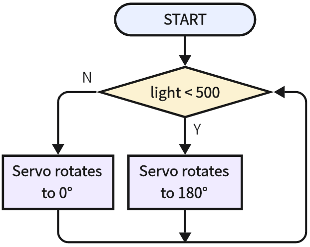

**Code:**

In Files, open **7-21-automaticWindow.py** and click .

```python
'''
 * Filename    : 7-21-automaticWindow
 * Thonny      : Thonny 4.1.4
 * Auther      : http//www.keyestudio.com
'''
from machine import ADC,Pin
import time
#import Servo from servo library
from servo import Servo

servo = Servo(pin=25)  #set control pin to IO25

adc=ADC(Pin(36))			#set ADC input pin to GPIO 36
adc.atten(ADC.ATTN_11DB)	#set voltage range to 0-3.3V
adc.width(ADC.WIDTH_12BIT)	#set ADC resolution

while True:
    light = adc.read()
    if light < 500:	#determine whether light < 500
        servo.set_angle(180)  # set angle to 180 degree
    else:
        servo.set_angle(0)  # set angle to 0 degree
    time.sleep_ms(300)

```

**Result:**

After uploading the code, cover the photoresistor with something (or your hand), and the servo will rotate to 180 degree. Remove the cover, and the analog value exceeds 500, so the servo rotates to 0 degree.


### 7.22 Voice Control Light

#### 7.22.1 Overview

Voice-control-light device mainly consists of a sound sensor, a photoresistor and an LED. The photoresistor is adopted to avoid LED lighting up during daytime. The sound sensor measures sound volume to determine whether it is reached the set threshold. If yes, the LED will light up for a few seconds. 

#### 7.22.2 Test Code

**Code Flow:**


**Code:**

In Files, open **7-22-hallwayLight.py** and click .

```python
'''
 * Filename    : 7-22-hallwayLight
 * Thonny      : Thonny 4.1.4
 * Auther      : http//www.keyestudio.com
'''
from machine import Pin,ADC
import time

light = ADC(Pin(36))
light.atten(ADC.ATTN_11DB)	#set voltage range to 0-3.3V
light.width(ADC.WIDTH_12BIT)	#set ADC resolution

sound = ADC(Pin(34))
sound.atten(ADC.ATTN_11DB)	#set voltage range to 0-3.3V
sound.width(ADC.WIDTH_12BIT)	#set ADC resolution

led = Pin(23,Pin.OUT)

while True:
    #read light sensor value and determine whether it is less than 500. If not, exit the loop
    while light.read() < 500:
        #read the sound sensor value and determine whether it is greater than 200. If yes, turn on led for 5s
        if sound.read() > 200:
            led.on()
            time.sleep(5)
            led.off()

```

**Result:**

After uploading code, the LED never lights up no matter how loud the noise you make. Cover the photoresistor, and make some sounds, and you will see the LED light up for 5 seconds. 


### 7.23 Human Body Piano

#### 7.23.1 Overview

The analog piano mainly includes an ultrasonic sensor to detect the distance of your position. It plays different tones according to distance values. If there is an open space, you may place it on ground to play musics.

#### 7.23.2 Test Code

**Code Flow:**

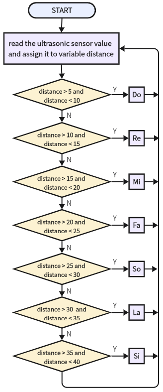

**Code:**

In Files, open **7-23-separatedPiano.py**, and click .

```python
'''
 * Filename    : 7-23-separatedPiano
 * Thonny      : Thonny 4.1.4
 * Author      : http://www.keyestudio.com
'''

from machine import Pin, PWM
import time

# set PWM output pin to IO32, frequency to 5000 Hz, duty cycle to 0
trumpet = PWM(Pin(32), freq=5000, duty=0)

# define an array to store frequency
a = [523, 587, 659, 698, 784, 880, 988]

# set the control pins of ultrasonic sensor
Trig = Pin(5, Pin.OUT)
Echo = Pin(4, Pin.IN)

distance = 0  # initial distance value = 0
soundVelocity = 340  # sound velocity = 340 m/s

def getDistance():
    """
    enable the ultrasonic sensor to detect the distance
    :return: detected distance（unit：cm）
    """
    # maintain Trig pin at high for 10us to enable the ultrasonic sensor
    Trig.value(1)
    time.sleep_us(10)
    Trig.value(0)
    
    # wait Echo pin to high, record the starting time
    while Echo.value() == 0:
        Start = time.ticks_us()
        
    # wait Echo pin to low, record the ending time
    while Echo.value() == 1:
        Stop = time.ticks_us()
    
    # calculate Echo pin high level time
    Time = time.ticks_diff(Stop, Start)
    # calculate the distance according to time, unit: cm
    distanceVal = Time * soundVelocity // 2 // 10000
    return distanceVal

def play_tone(index):
    """
    Play the specified scale
    :param index: Scale index
    """
    trumpet.duty(10)  # control PWM duty cycle（0-255） to adjust the sound volume
    trumpet.freq(a[index])  # set PWM frequency to correspond to tone frequency
    time.sleep_ms(300)  # play tone for 300ms
    trumpet.duty(0)  # stop tone 

while True:
    distance = getDistance()  # attain distance value 
    # play corresponding tone according to the detected distance
    if 5 < distance < 10:
        print("Do")
        play_tone(0)
    elif 10 < distance < 15:
        print("Re")
        play_tone(1)
    elif 15 < distance < 20:
        print("Mi")
        play_tone(2)
    elif 20 < distance < 25:
        print("Fa")
        play_tone(3)
    elif 25 < distance < 30:
        print("So")
        play_tone(4)
    elif 30 < distance < 35:
        print("La")
        play_tone(5)
    elif 35 < distance < 40:
        print("Si")
        play_tone(6)
    
    time.sleep_ms(100)  # delay 1s after each measurement


```

**Result:**

After uploading code, put your hand in front of the ultrasonic sensor and the speaker will emit sound. You can control the tone by moving your hand in front of the sensor.


### 7.24 Button Control Fan

#### 7.24.1 Overview

In this experiment, we program to control the fan by a button.

#### 7.24.2 Test Code

**Code Flow:**

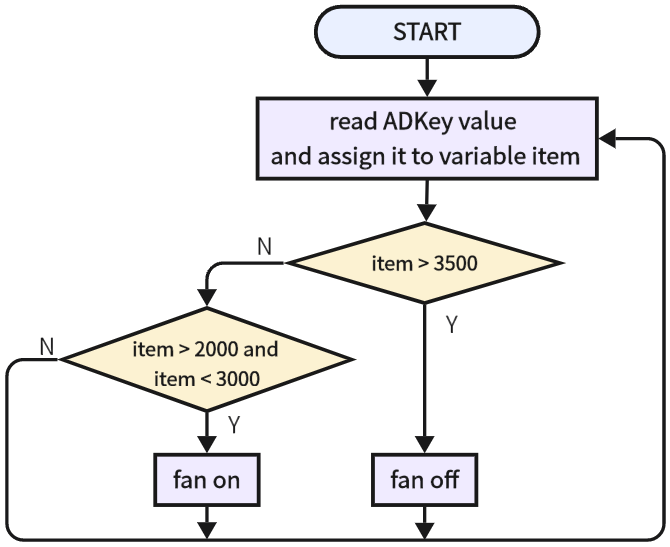

**Code:**

In Files, open **7-24-electricFan.py** and click .

```python
'''
 * Filename    : 7-24-electricFan
 * Thonny      : Thonny 4.1.4
 * Author      : http://www.keyestudio.com
'''
from machine import Pin,ADC
import time

key = ADC(Pin(33))			#set ADC input pin to GPIO 33
key.atten(ADC.ATTN_11DB)	#set voltage range to 0-3.3V
key.width(ADC.WIDTH_12BIT)	#set ADC resolution

#set motor control pin A to IO18
MA = Pin(18,Pin.OUT)
#set motor control pin B to IO17
MB = Pin(17,Pin.OUT)

while True:
    item = key.read()	#read the analog value of button
    if item > 3500:	#determine whether the red button is pressed. If yes, motor stops
        MA.off()
        MB.off()
    elif item > 2000 and item < 3000:	#determine whether the yellow button is pressed. If yes, motor rotates
        MA.on()
        MB.off()
    time.sleep_ms(300)


```

**Result:**

After uploading code, when we press the yellow button, the fan will turn on. When we press the red button, the fan stops working. 


### 7.25 Auto-door

#### 7.25.1 Overview

Many shopping malls open their doors when someone approaches and close them when no one is detected. Herein, we adopt a PIR motion sensor to simulate this kind of auto-door. The door opens when someone is detected and closes when no one is present.

#### 7.25.2 Test Code

**Code Flow:**

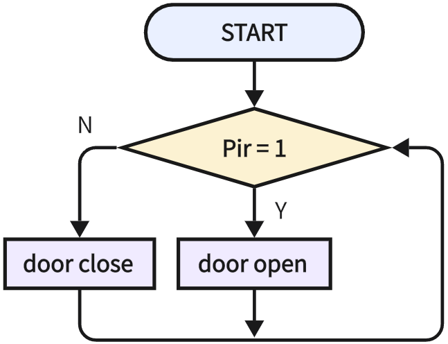

**Code:**

In Files, open **7-25-lnductionDoor.py** and click .

```python
'''
 * Filename    : 7-25-lnductionDoor
 * Thonny      : Thonny 4.1.4
 * Author      : http://www.keyestudio.com
'''
from machine import Pin
import time
from servo import Servo

pir = Pin(19,Pin.IN)
servo = Servo(pin=25)

while True:
    Pir = pir.value()
    if Pir == 1:
        servo.set_angle(0)  # rotate servo to 0 degree
    else:
        servo.set_angle(180)  # rotate servo to 180 degree
    time.sleep_ms(300)
    

```

**Result:**

After uploading the code, wave your hand over the PIR motion sensor, and the servo will rotate to 180 degree (door open). After a while, it will back to 0 degree (door close) if nothing is detected.


### 7.26 Access Card

#### 7.26.1 Overview

A common access card is a  magnetic card or a key chain. So in this experiment, we make a simple access device through servo, a magnetic card and an RFID module.

#### 7.26.2 Test Code

**Code Flow:** 

<p style="color:red;">ATTENTION: IC card code in the experiment is unique. You need to replace it with yours (details please see in chapter 7.8).</p>

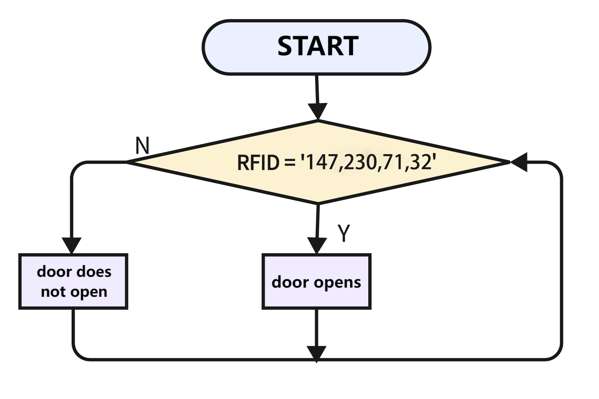

**Code:**

In Files, open **7-26-accessControl.py** and click .

```python
'''
 * Filename    : 7-26-accessControl
 * Thonny      : Thonny 4.1.4
 * Author      : http://www.keyestudio.com
'''
import machine
import time
#import mfrc522 from mfrc522_i2c library
from mfrc522_i2c import mfrc522

from servo import Servo

servo = Servo(pin=25) 

#i2c config
addr = 0x28		#rfid IIC communication address
scl = 22		#IIC SCL pin
sda = 21		#IIC SDA pin

#create an MFRC522 object, send it to I2C SCL and SDA pin and device address
rc522 = mfrc522(scl, sda, addr)
#Initialize MFRC522. This is essential and ensures the working state of the module
rc522.PCD_Init()
#display the detailed information of MFRC522 reader, used to debug and ensure the device to normally work
rc522.ShowReaderDetails()

while True:
    #check whether there is an RFID card in the sensing area
    if rc522.PICC_IsNewCardPresent():
        #Try to read the serial number of the card. Return True if the card's serial number was successfully read.
        if rc522.PICC_ReadCardSerial() == True:
            rc522UID = rc522.uid.uidByte[0 : rc522.uid.size]
            #print “Card UID:” and UID value
            print("Card UID:",rc522UID)
            if rc522UID == [147, 230, 71, 32]:
                servo.set_angle(0)  # rotate servo to 0 degree
                time.sleep(2)		#delay 2S
                servo.set_angle(180)  # rotate servo to 180 degree


```

**Result:**

After uploading the code, put your card at the sensing area of the RFID module, and the servo will rotate to 180 degree for 3s and then come back. If the card code is not correct, the servo will stay still.


### 7.27 Auto-fan

#### 7.27.1 Overview

The weather is getting hotter in summer, so some public places will be equipped with some auto-fans that sense the ambient temperature value. When the temperature reaches a set value, he fan turns on. We add a PIR motion sensor to lower energy consumption. Thus, the fan will turn on only when the temperature reaches the value and someone is sensed nearby. 

Now let's do it!

#### 7.27.2 Test Code

**Code Flow:**

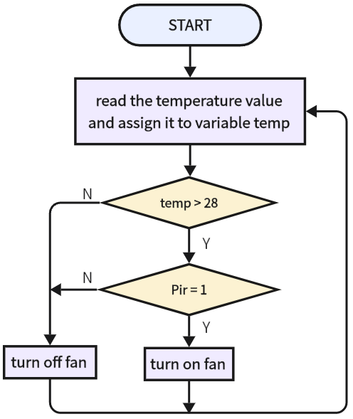

**Code:**

In Files, open **7-27-autimaticFan.py** and click .

```python
'''
 * Filename    : 7-27-autimaticFan
 * Thonny      : Thonny 4.1.4
 * Author      : http://www.keyestudio.com
'''
#import I2C and Pin from machine module
from machine import I2C, Pin
#import AHT20 from aht20 library
from aht20 import AHT20
import time
#create an I2C object and add SDA and SCL pins
i2c = I2C(scl=Pin(22), sda=Pin(21))
#create an AHT20 object, initialize I2C object to communication with AHT20 sensor via I2C bus
sensor = AHT20(i2c)

pir = Pin(19,Pin.IN)
#set the motor pin A to IO18
MA = Pin(18,Pin.OUT)
#set the motor pin B to IO17
MB = Pin(17,Pin.OUT)

while True:	
    try:
        #store the temperature and humidity to variable temperature and humidity
        temperature, humidity = sensor.read_temperature_humidity()
        Pir = pir.value()
        #Determine whether the PIR detects persons and temperature are greater than 28 degrees. If yes, the motor rotates; if not, the motor will not rotate
        if Pir == 1 and temperature > 28:
            MA.on()
            MB.off()
        else:
            MA.off()
            MB.off()
    # detect and read value, print “Failed to read from sensor:” if an error occurs
    except RuntimeError as e:
        print("Failed to read from sensor: ", e)
    time.sleep(1)	#delay 1S

```

 **Result:**

After uploading the code, when the temperature value is higher than 28 and the PIR motion sensor detects someone, the fan turns on. If one of the two conditions are not satisfied, the fan will not rotate.


### 7.28 Environment Monitoring

#### 7.28.1 Overview

In this project, we use an OLED display to reveal the values of temperature, humidity, air pressure and altitude in the environment. It can be regarded as a mini environmental monitoring device. 

#### 7.28.2 Test Code

**Code:**

In Files, open **7-28-environmentalMonitoring.py** and click .

```python
'''
 * Filename    : 7-28-environmentalMonitoring
 * Thonny      : Thonny 4.1.4
 * Author      : http://www.keyestudio.com
'''
import machine
#import I2C and Pin from machine module
from machine import I2C, Pin
#import AHT20 from aht20 library
from aht20 import AHT20
#import BMP388 from BMP388 library
from bmp388 import BMP388
from oled import OLED
import time

#create an I2C object and add SDA and SCL pins
i2c = I2C(scl=Pin(22), sda=Pin(21))
#create an AHT20 object and initialize I2C object to communicate with AHT20 sensor via I2C bus
sensor = AHT20(i2c)

# create a BMP388 object and set SDA and SCL pins, set IIC frequency to 100KHz
i2c = machine.SoftI2C(scl=machine.Pin(22), sda=machine.Pin(21), freq=100000)

# create a BMP388 object and send i2c object to it to communicate with the BMP388 sensor via the I2C bus, set the BMP388 IIC address to 0x76
bmp = BMP388(i2c, i2c_addr=0x76)

# create an OLED example
oled = OLED(i2c)
# clear oled
oled.clear()
'''
str() function converts a variable of type string from a variable of another type
int() function converts a variable of another type to a variable of type int. The reason for this conversion is that there is no data display after the decimal
pressure unit conversion：1 hPa = 1 × 100 Pa = 100 Pa

'''

while True:	
    try:
        #Store the values of temperature and humidity in the temperature and humidity variables
        temperature, humidity = sensor.read_temperature_humidity()
        # read the pressure
        pressure = bmp.read_pressure() // 100 #Convert Pa to hPa by dividing the pressure by 100        
        # clear display
        oled.clear()
        # show pressure
        oled.show_text("Pressure:", 0, 0)
        oled.show_text(str(int(pressure)), 70, 0)
        oled.show_text("hPa", 105, 0)
        # show temperature
        oled.show_text("Temperature:", 0, 15)
        oled.show_text(str(int(temperature)), 100, 15)
        oled.show_text("C", 120, 15)
        # show humidity
        oled.show_text("Humidity:", 0, 30)
        oled.show_text(str(int(humidity)), 75, 30)
        oled.show_text("%", 105, 30)

        # show oled
        oled.oled.show()
    # detect and read value, print “Failed to read from sensor:” if an error occurs
    except RuntimeError as e:
        print("Failed to read from sensor: ", e)
    time.sleep(1)	#delay 1S


```

**Result:**

After uploading code, you will see the values of temperature, humidity and air pressure on the OLED display.


### 7.29 Car Backing Radar

#### 7.29.1 Overview

When a car is in reverse, it will alarm the distance of the obstacles behind the parking space. In this project, we build a mini car backing radar with an ultrasonic sensor for distance detection, a speaker to alarm, and a traffic light module as an indicator.

#### 7.29.2 Test Code

**Code Flow:**


**Code:**

In Files, open **7-29-parkingSensor.py** and click .

```python
'''
 * Filename    : 7-29-parkingSensor
 * Thonny      : Thonny 4.1.4
 * Auther      : http//www.keyestudio.com
'''
from machine import Pin,PWM
import time

#set PWM output pin to IO32, frequency to 5000 Hz, duty cycle to 50% (the middle value of 8 bit resolution is 128, duty cycle ranges from 0-255)
spk = PWM(Pin(32), freq=5000, duty=128)
redLED = Pin(23,Pin.OUT)
greenLED = Pin(27,Pin.OUT)

# Define the control pins of the ultrasonic sensor
Trig = Pin(5, Pin.OUT) 
Echo = Pin(4, Pin.IN)

distance = 0 # set initial value to 0
soundVelocity = 340 #Set the speed of sound.

# getDistance() Function is used to drive the ultrasonic module to measure distance,
# Echo.value() is used to read the status of the Echo pin of the ultrasonic module,
# The timestamp function of the time module calculates the high level of the Echo's duration pin, calculate the measured distance based on the time and returns a value.
def getDistance():
    # maintain Trig pin at a high level of 10us to enable the ultrasonic sensor
    Trig.value(1)
    time.sleep_us(10)
    Trig.value(0)
    #Start timing, the initial time of ultrasonic propagation in the air
    while Echo.value() == 0:
        Start = time.ticks_us()
    #The time of receiving the reflected ultrasonic wave
    while Echo.value() == 1:
        Stop = time.ticks_us()
    #The received time minus the initial time is the total time
    Time = time.ticks_diff(Stop,Start)
    #Calculate the distance according to the formula gives the result in meters.
    #Divide by 1000 to convert to centimeters.
    distance =  Time * soundVelocity //2 // 10000
    #return the calculated value
    return distance

# print the ultrasonic sensor value every 500ms
while True:    
    distance = getDistance()
    print('Distance: ',distance, 'cm')
    if distance > 40:	#determine whether the distance > 40. If yes, green led is on, speaker does not emit sound; If not, red led is on and speaker emits sound
        redLED.off()
        greenLED.on()
        spk.duty(0)	#speaker does not emit sound
    else:
        redLED.on()
        greenLED.off()
        spk.duty(50)	#set speaker PWM duty cycle
        spk.freq(880)	#set speaker frequency
    time.sleep_ms(300)


```

**Result:**

After uploading code, when the the detected distance value is greater than 40cm, the green LED is on and the amplifier does not emit sound. If the value is less than 40cm, the red LED will light up and the amplifier will alarm.


### 7.30 RGB Ring Clock

#### 7.30.1 Overview

In this project, we build an informal clock with an RGB ring, whose three colors represent hour, minute and second respectively. Since the ring only boasts 12 beads, each bead is 5 seconds/minutes (60/12=5).

#### 7.30.2 Test Code

 **Code Flow:**

As shown in the flowchart, we use red for hour, green for minutes, blue for seconds. When second = 60, minute adds 1, and when minute = 60, hour adds 1. 

Note that here we adopt 60/5=12 rather than 59/5=11.8, this is because the variable type is integer and the value should be divided by 5. And 60 can be perfectly divided into 12 parts.

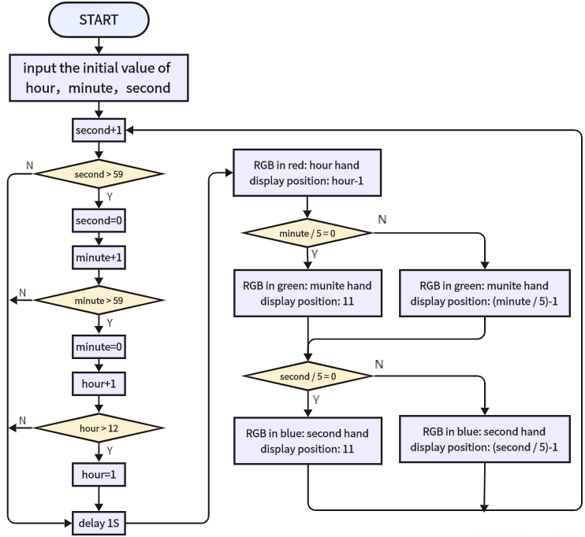

**Code:**

In Files, open **7-30-rgbClock.py** and click .

```python
'''
 * Filename    : 7-30-rgbClock
 * Thonny      : Thonny 4.1.4
 * Auther      : http//www.keyestudio.com
'''
from machine import Pin
import neopixel
import time  
  
hour = 10 	#set hour
minute = 30 #set minute
second = 40	#set second

pin = Pin(16, Pin.OUT)	#set SK6812 control pin to IO16
num_pixels = 12			#set SK6812灯 pixels to 12
#initialize SK6812
np = neopixel.NeoPixel(pin, num_pixels)

red = [255,0,0]	#red-hour
green = [0,255,0]#green-minute
blue = [0,0,255]	#blue-second
  
def setClock():  
    global hour, minute, second  # Use the global keyword to modify global variables
    second += 1  
    if second > 59:  
        second = 0  
        minute += 1  
        if minute > 59:  
            minute = 0  
            hour += 1  
            if hour > 12:  
                hour = 1  
    print(f"{hour:02d}:{minute:02d}:{second:02d}")  # Print time, format output  
    time.sleep(1)  
  
while True:  
    setClock() 
    if second // 5 == 0:
        for i in range(0,11):	#clear second
            np[i] = 0,0,0
        np[11] = blue
        np.write()		#refresh display
    else:
        np[int(second // 5 - 1)] = blue
        np.write()		#refresh display
    if minute // 5 == 0:
        np[11] = green
        np.write()		#refresh display
    else:
        np[int(minute // 5 - 1)] = green
        np.write()		#refresh display
    np[(hour-1)] = red
    np.write()		#refresh display

```

 **Result:**

Before uploading code, you need to input an initial time in the following blocks of variables hour, minute, second. Herein, we set to 10: 30: 40.

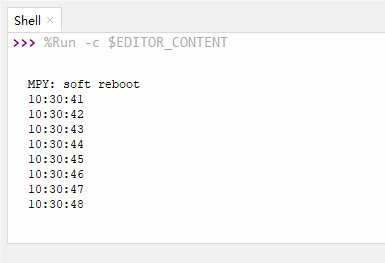

After uploading code, you will see the RGB ring shows the time: red for hour, green for minute, blue for second. A minute passes as blue runs a circle. 

Only one color will be displayed when they are overlapped. Blue will not cover green while green will not cover red. 

<p style="color:red;">Note that this is an informal clock without a clock chip. So its errors begin to accumulate over time.</p>


### 7.31 Joystick Control Servo

#### 7.31.1 Overview

We control the servo via the axis X of the joystick. This model is widely applied to mechanical ON/OFF of lights and doors.

#### 7.31.2 Test Code

**Code Flow:**


**Code:**

In Files, open **7-31-remoteControlServo.py** and click .

```python
'''
 * Filename    : 7-31-remoteControlServo
 * Thonny      : Thonny 4.1.4
 * Auther      : http//www.keyestudio.com
'''
from machine import Pin,ADC
import machine 
import time
#import Servo from servo library
from servo import Servo

servo = Servo(pin=25)  # set servo pins

rocker_x=ADC(Pin(35))	#set joystick axis x input to IO35
rocker_x.atten(ADC.ATTN_11DB)
rocker_x.width(ADC.WIDTH_12BIT)

while True:
    val = rocker_x.read()
    print(val)
    if val > 3500:
        servo.set_angle(0)
    elif val < 500:
        servo.set_angle(180)
    time.sleep(1)

```

 **Result:**

After uploading code, push the joystick to the left and the servo rotates to 180 degree. Push it to the right and the servo rotates to 0 degree.


### 7.32 Ultrasonic Ranger

#### 7.32.1 Overview

In this project, we combine the ultrasonic sensor and the OLED module to build a distance meter, whose detection range is 4-300CM.

#### 7.32.2 Test Code

In Files, open **7-32-rangeFinder.py** and click .

**Code:**

```python
'''
 * Filename    : 7-32-rangeFinder
 * Thonny      : Thonny 4.1.4
 * Auther      : http//www.keyestudio.com
'''
import machine
from machine import Pin,PWM
from oled import OLED
import time

# initialize I2C interface
i2c = machine.SoftI2C(scl=machine.Pin(22), sda=machine.Pin(21))

# create OLED example
oled = OLED(i2c)


# define the control pins of the ultrasonic sensor
Trig = Pin(5, Pin.OUT) 
Echo = Pin(4, Pin.IN)

distance = 0 # set initial value to 0
soundVelocity = 340 #Set the speed of sound.

def getDistance():
    # maintain Trig pin at high for 10us to enable the ultrasonic sensor
    Trig.value(1)
    time.sleep_us(10)
    Trig.value(0)
    #start counting, The initial time of ultrasonic wave propagation in the air
    while Echo.value() == 0:
        Start = time.ticks_us()
    #The time of receiving the reflected ultrasonic wave
    while Echo.value() == 1:
        Stop = time.ticks_us()
    #The received time minus the initial time is the total time
    Time = time.ticks_diff(Stop,Start)
    #Calculate the distance according to the formula gives the result in meters.
    #Divide by 1000 to convert to centimeters.
    distance =  Time * soundVelocity //2 // 10000
    #Return the result of the calculation
    return distance

while True:
    #Assign the measured distance value to the variable distance
    distance = getDistance()
    # clear display
    oled.clear()
    #show distance
    oled.show_text("Distance:", 0, 0)
    #Use str() to turn the value of the variable distance into a string
    oled.show_text(str(distance), 0, 10)
    oled.show_text("CM", 30, 10)
    oled.oled.show()
    time.sleep(1)


```

**Result:**

After uploading code, “Distance:” will be displayed on the first line. What followed is the distance value in “CM” in the second line.


### 7.33 Compass

#### 7.33.1 Overview

The AK8975 module is adopted to read direction values. According to these values, the OLED displays different arrows.

#### 7.33.2 Test Code

 **Code Flow:**

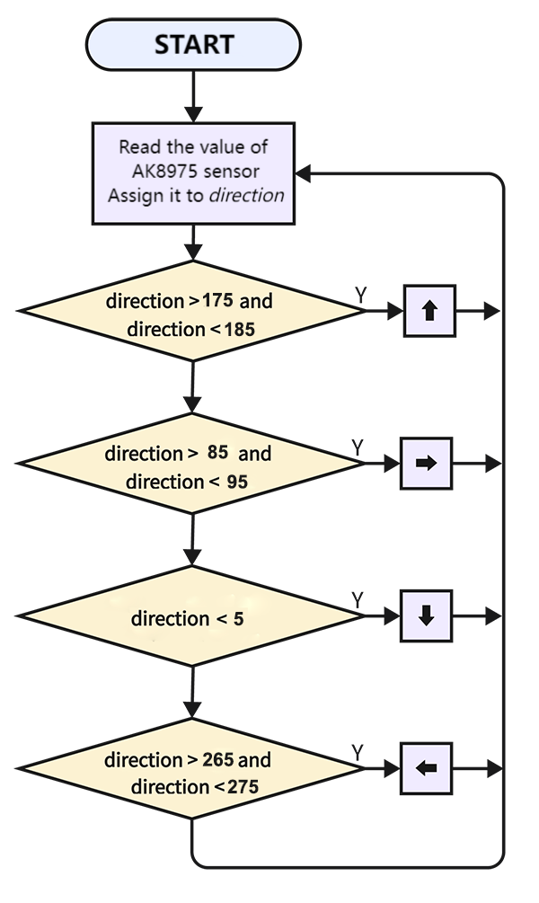

**Code:**

In Files, open **7-33-compass.py** and click .

```python
'''
 * Filename    : 7-33-compass
 * Thonny      : Thonny 4.1.4
 * Auther      : http//www.keyestudio.com
-----------------------------------------
The relationship between direction and Angle:
    0° : Due north
    90° : Due east
    180° : Due south
    270° : Due west
'''
import machine
import time
from machine import Pin
#import ak8975c from AK8975C library
from AK8975C import ak8975c
from oled import OLED

scl = Pin(22)
sda = Pin(21)
# initialize I2C interface
i2c = machine.SoftI2C(scl, sda)
# create OLED example
oled = OLED(i2c)
#create ak8975c object, initialize I2C bus number and SCL and SDA pins
Triaxial = ak8975c(scl, sda)

while True:
    Triaxial.measure()  # measure the value
    if Triaxial.AK8975_GET_AZIMUTH(Triaxial.X, Triaxial.Y) == True:  # Print the value of the course Angle only if the Angle can be calculated
        direction = Triaxial.angle_val
        print('degree:', direction,'°')
        # clear display
    oled.clear()
    if	direction >= 175 and direction <= 185:	#determine the direction by the Angle value
        oled.show_arrow_up()			#up arrow
    elif direction >= 265 and direction <= 275:
        oled.show_arrow_left()			#left arrow
    elif  direction <= 5:
        oled.show_arrow_down()			#down arrow
    elif direction >= 85 and direction <= 95:
        oled.show_arrow_right()			#right arrow
    oled.oled.show()
    time.sleep(0.3)
    
```

**Result:**

After uploading code, the arrow on the OLED will nearly point to the South. Move the coding box and you will see the direction changes. 


### 7.34 WiFi

#### 7.34.1 Overview

ESP32 boasts a built-in Wi-Fi and Bluetooth nodule that is widely used in Internet of Things (IoT). With this function, it can remotely control the data transmission through the wireless network. 

In applications, ESP32 can be used as a client to connect to a Wi-Fi network, or as a hotspot to create its own network. Through these connections, ESP32 receives commands to control external devices, such as turning on/off lights and adjusting temperature. In the code, protocols like HTTP and MQTT are used to communicate with the server to achieve data sending and receiving, so as to remotely control and monitoring.

#### 7.34.2 ESP32 WiFi Introduction

ESP32 development board comes with built-in Wi-Fi (2.4G) and Bluetooth (4.2), which enable it to easily connect to Wi-Fi network and communicate with other devices in the network. You can display web pages in your browser via ESP32.


- Base station mode (STA / Wi-Fi Client mode): ESP32 is connected to Wi-Fi hotspot (AP).
- AP mode (Soft-AP / Wi-Fi hotspot mode): Wi-Fi device(s) is(are) connected to ESP32.
- AP-STA mode: ESP32 is both Wi-Fi hotspot and a Wi-Fi device connected to another Wi-Fi.
- These modes supports multiple security modes, including WPA, WPA2 and WEP.
- It is able to scan Wi-Fi hotspot (active or passive)
- It support promiscuous mode monitoring IEEE802.11 Wi-Fi packets.

------

For more wifi reference, please visit https://docs.espressif.com/projects/esp-idf/en/latest/esp32/api-reference/network/esp_wifi.html

espressif official: https://www.espressif.com.cn/en/home


####  7.34.3 Test Code

In Files, open **7-34-wifi.py** and click .

**Code:**

```python
'''
 * Filename    : 7-34-wifi
 * Thonny      : Thonny 4.1.4
 * Auther      : http//www.keyestudio.com
'''
import network
import socket
import time
import machine

# WiFi connection
SSID = 'your WiFi name'  # your WiFi name
PASSWORD = 'your WiFi password'  # your WiFi password

# connect to WiFi
def connect_wifi(ssid, password):
    wlan = network.WLAN(network.STA_IF)  # Create WLAN objects using STA mode (client mode)
    wlan.active(True)  # activate WLAN interface
    wlan.connect(ssid, password)  # Connect to the specified WiFi network

    timeout = 10  # Connect timeout duration in seconds
    while not wlan.isconnected() and timeout > 0:  # If the connection fails and the timeout period does not expire, check the connection status again
        print("Connecting to WiFi...")
        time.sleep(1)
        timeout -= 1

    if not wlan.isconnected():  # If the connection is not successful after timeout, an exception is thrown
        raise Exception("Could not connect to WiFi")
    
    print('Network config:', wlan.ifconfig())  # Output network configuration (IP address, subnet mask, gateway, and DNS)
    print('Connected to WiFi, IP address:', wlan.ifconfig()[0])  # output the IP address of the successful connection
    return wlan

# create HTML page
def web_page():
    html = """<html>
    <head>
        <title>ESP32 Web Server</title>
    </head>
    <body>
        <h1>Hello World</h1>
    </body>
    </html>"""
    return html  # Return a simple HTML page with "Hello World"

# Start the Web server
def start_server():
    wlan = connect_wifi(SSID, PASSWORD)  # connect to WiFi
    addr = socket.getaddrinfo('0.0.0.0', 80)[0][-1]  # Obtain the local IP address and port 80
    s = socket.socket()  # Create a socket object
    s.bind(addr)  # Bind sockets to addresses and ports
    s.listen(5)  # Start listening for incoming connections. The maximum number of connections is 5
    print('Listening on', addr)  # Print the address and port on which the server is listening

    while True:
        cl, addr = s.accept()  # Accept a client connection
        print('Client connected from', addr)  # Print the address of the client
        request = cl.recv(1024)  # Receive client requests, up to 1024 bytes
        request = str(request)  # Convert the request to a string
        print('Content = %s' % request)  # Print request content
        
        response = web_page()  # Generate HTML response
        cl.send('HTTP/1.1 200 OK\n')  # Send the HTTP response header
        cl.send('Content-Type: text/html\n')  # Specify the content type as HTML
        cl.send('Connection: close\n\n')  # Close connection
        cl.sendall(response)  # Send HTML page content
        cl.close()  # Close the client connection

# Run server
try:
    start_server()  # Try starting the Web server
except Exception as e:
    print('Failed to start server:', e)  # If the startup fails, an error message is displayed
    machine.reset()  # Restart the device to try to reconnect

```

**Result:**

After uploading code, the Shell will display the IP address. Connect your computer/mobile phone and ESP32 to the same wifi, and access the IP address and you will see “Hello world”.

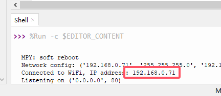

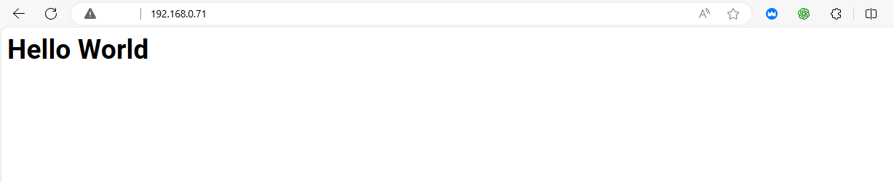


### 7.35 WiFi Real-time Display

#### 7.35.1 Overview

In this project, we display the values of temperature and humidity sensor, pressure sensor, photoresistor, sound sensor, PIR motion sensor and ultrasonic sensor on the web page. 

#### 7.35.2 Test Code

In Files, open **7-35-wifiWebpageDisplay.py** and click .

**Code:**

```python
'''
 * Filename    : 7-35-wifiWebpageDisplay
 * Thonny      : Thonny 4.1.4
 * Auther      : http//www.keyestudio.com
'''
import network
import socket
import time
import json
import machine
from machine import Pin, ADC, I2C,SoftI2C,PWM
import aht20

# WiFi connection information
# SSID = 'your WiFi name'  # your WiFi name
# PASSWORD = 'your WiFi password'  # your WiFi password
SSID = 'ChinaNet_2.4G'  # your WiFi name
PASSWORD = 'ChinaNet@233'  # your WiFi password

# initialize sensor
# photoresistor
light_sensor = ADC(Pin(36))
light_sensor.atten(ADC.ATTN_11DB)

# ultrasonic sensor
# define the control pins of ultrasonic sensor
Trig = Pin(5, Pin.OUT) 
Echo = Pin(4, Pin.IN)

distance = 0 # set initial distance value to 0
soundVelocity = 340 #Set the speed of sound.

# PIR sensor
pir_sensor = Pin(19, Pin.IN)

# AHT20 sensor
i2c = SoftI2C(scl=Pin(22), sda=Pin(21))
aht20Sensor = aht20.AHT20(i2c)

def getDistance():
    # maintain Trig pin at high for 10us to enable ultrasonic sensor
    Trig.value(1)
    time.sleep_us(10)
    Trig.value(0)
    #Start timing, the initial time of ultrasonic propagation in the air
    while Echo.value() == 0:
        Start = time.ticks_us()
    #The time of receiving the reflected ultrasonic wave
    while Echo.value() == 1:
        Stop = time.ticks_us()
    #The received time minus the initial time is the total time
    Time = time.ticks_diff(Stop,Start)
    #Calculate the distance according to the formula gives the result in meters.
    #Divide by 1000 to convert to centimeters.
    distance =  Time * soundVelocity //2 // 10000
    #return the calculated result
    return distance

# connect to WiFi
def connect_wifi(ssid, password):
    wlan = network.WLAN(network.STA_IF)  # Create WLAN objects using STA mode (client mode)
    wlan.active(True)  # activate WLAN interface
    wlan.connect(ssid, password)  # Connect to the specified WiFi network

    timeout = 10  # Connect timeout duration, in seconds
    while not wlan.isconnected() and timeout > 0:  # If the connection fails and the timeout period does not expire, check the connection status again
        print("Connecting to WiFi...")
        time.sleep(1)
        timeout -= 1

    if not wlan.isconnected():  # If the connection is not successful after timeout, an exception is thrown
        raise Exception("Could not connect to WiFi")
    
    print('Network config:', wlan.ifconfig())  # Output network configuration (IP address, subnet mask, gateway, and DNS)
    print('Connected to WiFi, IP address:', wlan.ifconfig()[0])  # output the IP address of the successful connection
    return wlan

# create HTML page
def web_page():
    html = """<html>
    <head>
        <title>ESP32 Sensor Data</title>
        <style>
            body { font-family: Arial, sans-serif; text-align: center; }
            .sensor { font-size: 24px; margin-top: 20px; }
        </style>
        <script>
            function updateData() {
                fetch('/sensor_data').then(function(response) {
                    return response.json();
                }).then(function(data) {
                    document.getElementById('light').innerText = data.light;
                    document.getElementById('distance').innerText = data.distance;
                    document.getElementById('pir').innerText = data.pir ? "Motion Detected" : "No Motion";
                    document.getElementById('temperature').innerText = data.temperature;
                    document.getElementById('humidity').innerText = data.humidity;
                });
            }
            setInterval(updateData, 1000);
        </script>
    </head>
    <body>
        <h1>ESP32 Sensor Data</h1>
        <div class="sensor">Light Sensor Value: <span id="light"></span></div>
        <div class="sensor">Distance: <span id="distance"></span> cm</div>
        <div class="sensor">PIR Sensor: <span id="pir"></span></div>
        <div class="sensor">Temperature: <span id="temperature"></span> C</div>
        <div class="sensor">Humidity: <span id="humidity"></span> %</div>
    </body>
    </html>"""
    return html  # Return the HTML page that contains the sensor data

# Start the Web server
def start_server():
    wlan = connect_wifi(SSID, PASSWORD)  # Connect to WiFi
    addr = socket.getaddrinfo('0.0.0.0', 80)[0][-1]  # Obtain the local IP address and port 80
    s = socket.socket()  # Create a socket object
    s.bind(addr)  # Bind sockets to addresses and ports
    s.listen(5)  # Start listening for incoming connections. The maximum number of connections is 5
    print('Listening on', addr)  # Print the address and port on which the server is listening

    while True:
        cl, addr = s.accept()  # Accept a client connection
        print('Client connected from', addr)  # Print the address of the client
        request = cl.recv(1024)  # Receive client requests, up to 1024 bytes
        request = str(request)  # Convert the request to a string
        print('Content = %s' % request)  # Print request content
        
        if 'GET /sensor_data' in request:
            light_value = light_sensor.read()
            distance = getDistance()
            pir_value = pir_sensor.value()
            temperature, humidity = aht20Sensor.read_temperature_humidity()

            sensor_data = {
                'light': light_value,
                'distance': distance,
                'pir': pir_value,
                'temperature': temperature,
                'humidity': humidity
            }

            response = 'HTTP/1.1 200 OK\nContent-Type: application/json\n\n'
            response += json.dumps(sensor_data)
            cl.send(response)
        else:
            response = web_page()
            cl.send('HTTP/1.1 200 OK\n')
            cl.send('Content-Type: text/html\n')
            cl.send('Connection: close\n\n')
            cl.sendall(response)
        cl.close()

# Run server
try:
    start_server()  # Try starting the Web server
except Exception as e:
    print('Failed to start server:', e)  # If the startup fails, an error message is displayed
    machine.reset()  # Restart the device to try to reconnect

```

**Result:**

Upload the code, and the Shell shows the IP address after connecting to wifi. 

Connect your computer/mobile phone and ESP32 to the same wifi, and you can access the IP address to see the values through your device. 

If you are using a mobile phone hotspot, you can directly access the IP via the phone.

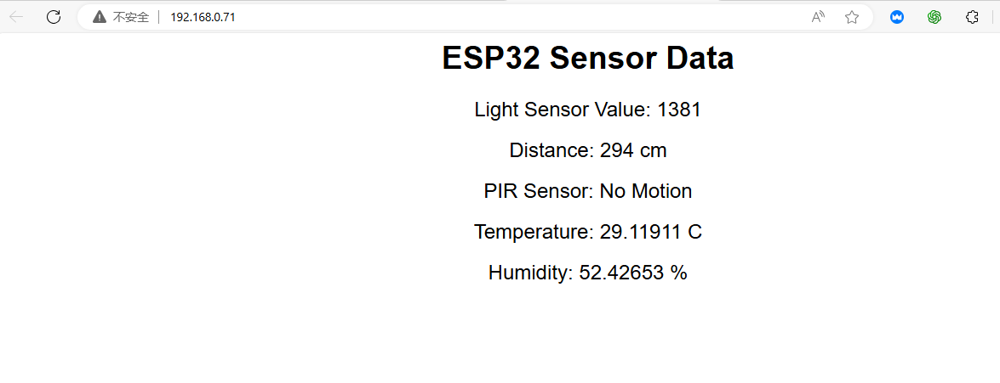


### 7.36 WiFi Control

#### 7.36.1 Overview

We control LED, servo and the fan on the web page button wirelessly. 

#### 7.36.2 Test Code

In Files, open **7-36-wifi-WebpageControl.py** and click .

**Code:**

```python
'''
 * Filename    : 7-36-wifi-WebpageControl
 * Thonny      : Thonny 4.1.4
 * Auther      : http//www.keyestudio.com
'''
import network
import socket
import time
import machine
from machine import Pin, PWM
from servo import Servo

# WiFi connection information
SSID = 'test1'  # your WiFi name
PASSWORD = '88888888'  # your WiFi password

# initialize executer
ledRed = Pin(23, Pin.OUT)
ledYellow = Pin(26, Pin.OUT)
ledGreen = Pin(27, Pin.OUT)

servo = Servo(pin=25)

MA = Pin(18, Pin.OUT)
MB = Pin(17, Pin.OUT)

# connect to WiFi
def connect_wifi(ssid, password):
    wlan = network.WLAN(network.STA_IF)
    wlan.active(True)
    wlan.connect(ssid, password)
    
    timeout = 10
    while not wlan.isconnected() and timeout > 0:
        print("Connecting to WiFi...")
        time.sleep(1)
        timeout -= 1
    
    if not wlan.isconnected():
        raise Exception("Could not connect to WiFi")
    
    print('Network config:', wlan.ifconfig())
    print('Connected to WiFi, IP address:', wlan.ifconfig()[0])
    return wlan

# create HTML page
def web_page():
    html = """<html>
    <head>
        <title>ESP32 Control</title>
        <style>
            body { font-family: Arial, sans-serif; text-align: center; }
            button { padding: 10px 20px; font-size: 16px; margin: 10px; }
        </style>
        <script>
            function sendRequest(action) {
                var xhr = new XMLHttpRequest();
                xhr.open("GET", "/" + action, true);
                xhr.send();
            }
        </script>
    </head>
    <body>
        <h1>ESP32 Control</h1>
        <button onclick="sendRequest('ledRed_on')">LED Red ON</button>
        <button onclick="sendRequest('ledRed_off')">LED Red OFF</button><br>
        <button onclick="sendRequest('ledYellow_on')">LED Yellow ON</button>
        <button onclick="sendRequest('ledYellow_off')">LED Yellow OFF</button><br>
        <button onclick="sendRequest('ledGreen_on')">LED Green ON</button>
        <button onclick="sendRequest('ledGreen_off')">LED Green OFF</button><br>
        <button onclick="sendRequest('servo_left')">Servo 0</button>
        <button onclick="sendRequest('servo_right')">Servo 180</button><br>
        <button onclick="sendRequest('fan_on')">Fan ON</button>
        <button onclick="sendRequest('fan_off')">Fan OFF</button>
    </body>
    </html>"""
    return html

# Control actuator
def handle_request(request):
    if 'ledRed_on' in request:
        ledRed.value(1)
    elif 'ledRed_off' in request:
        ledRed.value(0)
    elif 'ledYellow_on' in request:
        ledYellow.value(1)
    elif 'ledYellow_off' in request:
        ledYellow.value(0)
    elif 'ledGreen_on' in request:
        ledGreen.value(1)
    elif 'ledGreen_off' in request:
        ledGreen.value(0)
    elif 'servo_left' in request:
        servo.set_angle(0)  # rotate to left
    elif 'servo_right' in request:
        servo.set_angle(180)  # rotate to right
    elif 'fan_on' in request:
        MA.value(1)
        MB.value(0)
    elif 'fan_off' in request:
        MA.value(0)
        MB.value(0)

# Start the Web server
def start_server():
    wlan = connect_wifi(SSID, PASSWORD)
    addr = socket.getaddrinfo('0.0.0.0', 80)[0][-1]
    s = socket.socket()
    s.bind(addr)
    s.listen(5)
    print('Listening on', addr)

    while True:
        cl, addr = s.accept()
        print('Client connected from', addr)
        request = cl.recv(1024)
        request = str(request)
        print('Content = %s' % request)
        
        handle_request(request)
        
        response = web_page()
        cl.send('HTTP/1.1 200 OK\n')
        cl.send('Content-Type: text/html\n')
        cl.send('Connection: close\n\n')
        cl.sendall(response)
        cl.close()

# run server
try:
    start_server()
except Exception as e:
    print('Failed to start server:', e)
    machine.reset()


```

**Result:**

Upload the code, and the Shell shows the IP address after connecting to wifi. 

Connect your computer/mobile phone and ESP32 to the same wifi, and you can access the IP address to see the control page through your device. 

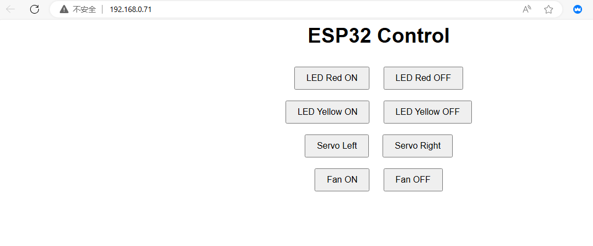


### 7.37 WiFi Piano

#### 7.37.1 Overview

In this project, we set seven buttons to control the speaker to play tones of Do, Re, Mi, Fa, So, La, Si.

#### 7.37.2 Test Code

In Files, open **7-37-wifiWebPiano.py** and click .

**Code:**

```python
'''
 * Filename    : 7-37-wifiWebPiano
 * Thonny      : Thonny 4.1.4
 * Auther      : http//www.keyestudio.com
'''
import network
import socket
import machine
import time

# WiFi connection information
SSID = 'your WiFi name'  # your WiFi name
PASSWORD = 'your WiFi password'  # your WiFi password

# connect to WiFi
def connect_wifi(ssid, password):
    wlan = network.WLAN(network.STA_IF)  # Create WLAN objects using STA mode (client mode)
    wlan.active(True)  # activate WLAN interface
    wlan.connect(ssid, password)  # Connect to the specified WiFi network

    timeout = 10  # Connect timeout duration, in seconds
    while not wlan.isconnected() and timeout > 0:  # If the connection fails and the timeout period does not expire, check the connection status again
        print("Connecting to WiFi...")
        time.sleep(1)
        timeout -= 1

    if not wlan.isconnected():  # If the connection is not successful after timeout, an exception is thrown
        raise Exception("Could not connect to WiFi")
    
    print('Network config:', wlan.ifconfig())  # Output network configuration (IP address, subnet mask, gateway, and DNS)
    print('Connected to WiFi, IP address:', wlan.ifconfig()[0])  # The IP address of the successful connection is displayed
    return wlan

# create HTML page
def web_page():
    html = """<html>
    <head>
        <title>ESP32 Web Server</title>
        <style>
            body { font-family: Arial, sans-serif; text-align: center; }
            button { padding: 10px 20px; font-size: 16px; margin: 10px; }
        </style>
        <script>
            function playTone(tone) {
                var xhr = new XMLHttpRequest();
                xhr.open("GET", "/play_" + tone, true);
                xhr.send();
            }
        </script>
    </head>
    <body>
        <h1>ESP32 Tone Player</h1>
        <button onclick="playTone('do')">Do</button>
        <button onclick="playTone('re')">Re</button>
        <button onclick="playTone('mi')">Mi</button>
        <button onclick="playTone('fa')">Fa</button>
        <button onclick="playTone('sol')">Sol</button>
        <button onclick="playTone('la')">La</button>
        <button onclick="playTone('si')">Si</button>
    </body>
    </html>"""
    return html  # Return an HTML page with seven keys, one for each note

# Start the Web server
def start_server():
    wlan = connect_wifi(SSID, PASSWORD)  # connect to WiFi
    addr = socket.getaddrinfo('0.0.0.0', 80)[0][-1]  # Obtain the local IP address and port 80
    s = socket.socket()  # Create a socket object
    s.bind(addr)  # Bind sockets to addresses and ports
    s.listen(5)  # Start listening for incoming connections. The maximum number of connections is 5
    print('Listening on', addr)  # Print the address and port on which the server is listening

    while True:
        cl, addr = s.accept()  # Accept a client connection
        print('Client connected from', addr)  # Print the address of the client
        request = cl.recv(1024)  # Receive client requests, up to 1024 bytes
        request = str(request)  # Convert the request to a string
        print('Content = %s' % request)  # Print request content
        
        response = web_page()  # Generate HTML response

        # Check the request path and play the corresponding note
        if '/play_do' in request:
            play_tone('do')
        elif '/play_re' in request:
            play_tone('re')
        elif '/play_mi' in request:
            play_tone('mi')
        elif '/play_fa' in request:
            play_tone('fa')
        elif '/play_sol' in request:
            play_tone('sol')
        elif '/play_la' in request:
            play_tone('la')
        elif '/play_si' in request:
            play_tone('si')

        cl.send('HTTP/1.1 200 OK\n')
        cl.send('Content-Type: text/html\n')
        cl.send('Connection: close\n\n')
        cl.sendall(response)
        cl.close()  # Close the client connection

# play tone
def play_tone(tone):
    tones = {
        'do': 261.63,
        're': 293.66,
        'mi': 329.63,
        'fa': 349.23,
        'sol': 392.00,
        'la': 440.00,
        'si': 493.88
    }
    frequency = tones.get(tone, 0)
    if frequency > 0:
        pwm = machine.PWM(machine.Pin(32))  # Output PWM signal using GPIO32 pin
        pwm.freq(int(frequency))
        pwm.duty(512)  # Set the duty cycle to 50%
        time.sleep_ms(200)  # play tone to 1s
        pwm.deinit()  # turn off PWM

# run server
try:
    start_server()  # Try starting the Web server
except Exception as e:
    print('Failed to start server:', e)  # If the startup fails, an error message is displayed
    machine.reset()  # Restart the device to try to reconnect

```

**Result:**

Upload the code, and the OLED shows the IP address after connecting to wifi. 

Connect your computer/mobile phone and ESP32 to the same wifi, and you can access the IP address to see the control page through your device. 

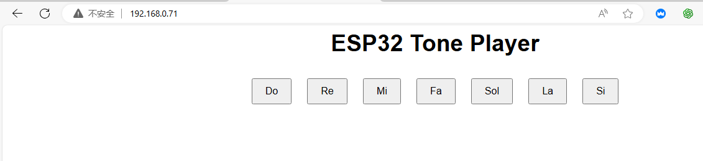


### 7.38 Smart Control Panel

#### 7.38.1 Overview

Combined web buttons and wireless control, this control panel in this project is able to control modules and read module values as well. 

#### 7.38.2 Test Code

In Files, open **7-38-intelligentConsole.py** and click .

**Code:**

```python
'''
 * Filename    : 7-38-intelligentConsole
 * Thonny      : Thonny 4.1.4
 * Auther      : http//www.keyestudio.com
'''
import network
import socket
import time
import machine
import json
from machine import Pin, PWM, ADC, SoftI2C
import aht20

# WiFi connection information
SSID = 'ChinaNet_2.4G'  # your WiFi name
PASSWORD = 'ChinaNet@233'  # your WiFi password

# Initialize executer
ledRed = Pin(23, Pin.OUT)
ledYellow = Pin(26, Pin.OUT)
ledGreen = Pin(27, Pin.OUT)

servo = PWM(Pin(25), freq=50)

MA = Pin(18, Pin.OUT)
MB = Pin(17, Pin.OUT)

# Initialize sensor
light_sensor = ADC(Pin(36))
light_sensor.atten(ADC.ATTN_11DB)

i2c = SoftI2C(scl=Pin(22), sda=Pin(21))
aht20Sensor = aht20.AHT20(i2c)
# Connect to WiFi
def connect_wifi(ssid, password):
    wlan = network.WLAN(network.STA_IF)
    wlan.active(True)
    wlan.connect(ssid, password)
    
    timeout = 10
    while not wlan.isconnected() and timeout > 0:
        print("Connecting to WiFi...")
        time.sleep(1)
        timeout -= 1
    
    if not wlan.isconnected():
        raise Exception("Could not connect to WiFi")
    
    print('Network config:', wlan.ifconfig())
    print('Connected to WiFi, IP address:', wlan.ifconfig()[0])
    return wlan

# Create HTML page
def web_page(light, temp, hum):
    html = f"""<html>
    <head>
        <title>ESP32 Control</title>
        <style>
            body {{ font-family: Arial, sans-serif; text-align: center; }}
            button {{ padding: 10px 20px; font-size: 16px; margin: 10px; }}
        </style>
        <script>
            function sendRequest(action) {{
                var xhr = new XMLHttpRequest();
                xhr.open("GET", "/" + action, true);
                xhr.send();
            }}
            function updateData() {{
                var xhr = new XMLHttpRequest();
                xhr.open("GET", "/sensor_data", true);
                xhr.onload = function() {{
                    if (xhr.status == 200) {{
                        var data = JSON.parse(xhr.responseText);
                        document.getElementById('light').innerText = data.light;
                        document.getElementById('temperature').innerText = data.temperature;
                        document.getElementById('humidity').innerText = data.humidity;
                    }}
                }};
                xhr.send();
            }}
            setInterval(updateData, 1000);
        </script>
    </head>
    <body>
        <h1>ESP32 Control</h1>
        <div>Light Sensor: <span id="light">{light}</span></div>
        <div>Temperature: <span id="temperature">{temp}</span> C</div>
        <div>Humidity: <span id="humidity">{hum}</span> %</div>
        <button onclick="sendRequest('led_on')">LED Red ON</button>
        <button onclick="sendRequest('led_off')">LED Red OFF</button><br>
        <button onclick="sendRequest('ledYellow_on')">LED Yellow ON</button>
        <button onclick="sendRequest('ledYellow_off')">LED Yellow OFF</button><br>
        <button onclick="sendRequest('ledGreen_on')">LED Green ON</button>
        <button onclick="sendRequest('ledGreen_off')">LED Green OFF</button><br>
        <button onclick="sendRequest('servo_left')">Servo Left</button>
        <button onclick="sendRequest('servo_right')">Servo Right</button><br>
        <button onclick="sendRequest('fan_on')">Fan ON</button>
        <button onclick="sendRequest('fan_off')">Fan OFF</button>
    </body>
    </html>"""
    return html

# Control actuator
def handle_request(request):
    if 'led_on' in request:
        ledRed.value(1)
    elif 'led_off' in request:
        ledRed.value(0)
    elif 'ledYellow_on' in request:
        ledYellow.value(1)
    elif 'ledYellow_off' in request:
        ledYellow.value(0)
    elif 'ledGreen_on' in request:
        ledGreen.value(1)
    elif 'ledGreen_off' in request:
        ledGreen.value(0)
    elif 'servo_left' in request:
        servo.duty(30)  # rotate to left
    elif 'servo_right' in request:
        servo.duty(120)  # rotate to right
    elif 'fan_on' in request:
        MA.value(1)
        MB.value(0)
    elif 'fan_off' in request:
        MA.value(0)
        MB.value(0)

# Start the Web server
def start_server():
    wlan = connect_wifi(SSID, PASSWORD)
    addr = socket.getaddrinfo('0.0.0.0', 80)[0][-1]
    s = socket.socket()
    s.bind(addr)
    s.listen(5)
    print('Listening on', addr)

    while True:
        cl, addr = s.accept()
        print('Client connected from', addr)
        request = cl.recv(1024)
        request = str(request)
        print('Content = %s' % request)
        
        if 'GET /sensor_data' in request:
            light_value = light_sensor.read()
            temperature, humidity = aht20Sensor.read_temperature_humidity()
            sensor_data = {
                'light': light_value,
                'temperature': temperature,
                'humidity': humidity
            }

            response = 'HTTP/1.1 200 OK\nContent-Type: application/json\n\n'
            response += json.dumps(sensor_data)
            cl.send(response)
        else:
            light_value = light_sensor.read()
            temperature, humidity = aht20Sensor.read_temperature_humidity()
            response = web_page(light_value, temperature, humidity)
            cl.send('HTTP/1.1 200 OK\n')
            cl.send('Content-Type: text/html\n')
            cl.send('Connection: close\n\n')
            cl.sendall(response)
        
        handle_request(request)
        cl.close()

# run server
try:
    start_server()
except Exception as e:
    print('Failed to start server:', e)
    machine.reset()


```

**Result:**

Upload the code, and the Shell shows the IP address after connecting to wifi. 

Connect your computer/mobile phone and ESP32 to the same wifi, and you can access the IP address to see the control page through your device. 

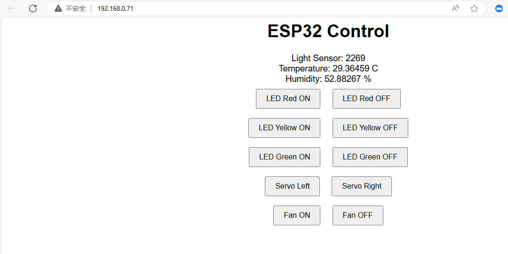

