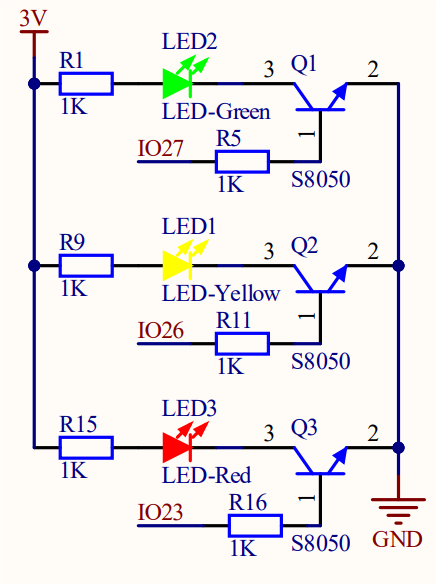

# 3.1 LED Blink

## 3.1.1 Overview

LED Blink is one of the simplest entry-level programming projects. It only needs an LED and then upload the code on the ESP32 Coding Box. This simple project helps beginners better master basic concepts.

## 3.1.2 Schematic Diagram



**LED lighting on:** The output current of the IO ports is limited, so the LED brightness may not be enough. Therefore, a NPN triode (Q2) is added to the circuit as a switch. We only need to add a high(low) level at the triode base pin 1 to light it up(out).

**Triode on/off:** To put it simple, when the base(pin 1) receives a high level, the collector(pin 3) and the transmitter(pin 2) are connected, so then VCC passes through the current-limiting resistor to the LED and then into the triode to GND, forming a loop. At this time, LED is on. When pin 1 receives a low level, pin 3 and 2 are disconnected so the current loop cannot be formed, resulting LED off.

## 3.1.3 Test Code

**Code:**

Open Thonny. Connect the board to computer and choose the port. In Files, open **3-1-led.py** and click .

```python
'''
 * Filename    : 3-1-led
 * Thonny      : Thonny 4.1.4
 * Auther      : http//www.keyestudio.com
'''
from machine import Pin
import time

led = Pin(23,Pin.OUT) 	# Set IO23 as the red LED control pin，set pin to output

while True:
    led.on()			#red led on
    time.sleep(1)		#delay 1S
    led.off()			#red led off
    time.sleep(1)		#delay 1S

```

 **Result:**

After uploading the code, red LED will blink with an interval of 1 second.

## 3.1.4  Extension

If you want the LED to blink more frequently, just modify the delay time to 200mS. Let’s have a try!

**Code:**

Open Thonny. Connect the board to computer and choose the port. In Files, open **3-1-led2.py** and click .

```python
'''
 * Filename    : 3-1-led2
 * Thonny      : Thonny 4.1.4
 * Auther      : http//www.keyestudio.com
'''
from machine import Pin
import time

led = Pin(23,Pin.OUT) 	# connect the led to pin IO23, set it to output

while True:
    led.on()				#red led on
    time.sleep_ms(200)		#delay 200mS
    led.off()				#red led off
    time.sleep_ms(200)		#delay 200mS


```

**Result:**

After uploading the code, the red LED will blink with an interval of 200mS. Compared to the previous experiment, it blinks more frequently.

## 3.1.5 Code Explanation

1. `from machine import Pin`

   Import Pin from machine to enable its functions.

   **machine.Pin**

   ```python
   machine.Pin(id,mode,pull,value)
   ```

   id ：ESP32 GPIO pin number. For example, if you enable GPIO23, fill in with 23.

   mode ：pin mode can be one of the followings:

   ​	Pin.IN(0) - set pin to input

   ​	Pin.OUT(1) - set pin to (normal)output

   ​	Pin.OPEN_DRAIN(2) - set pin to open drain output

   pull ：specifies whether the pin is connected to a (weak-)pull resistor; it is valid only at input mode, and can be one of the followings:

   ​	None - no pull-up/down

   ​	Pin.PULL_UP(1) - enable pull-up resistor

   ​	Pin.PULL_DOWN(2) - enable pull-down resistor

   value ：only work at Pin.OUT and Pin.OPEN_DRAIN mode; assign the initial output pin value. Or else, the peripheral state of the pin stays still. 0 is low(off) while 1 is high(on).

   Pin.on() - set pin to high

   Pin.off() - set pin to low

2. `import time`

   Import **time** type so that its related functions can be adopted.

3. `led = Pin23, Pin.OUT)`

   connect LED to pin io23, set pin to output.

Q ：Why "output"?

A ：The code is written for the mainboard. For the board, pin io23 is outputting power levels (high or low) to the connected module.

4. `while True:`

   Statements in this function will execute in a loop.

   Formula of while loop function:

```python
while (condition):
    (statements)...
```

5. `led.on()` and `led.off()`

   At pin io23 on the mainboard, respectively output high(1) and low(0); i.e., output high(1)/low(0) to LED module to make it on/off.

6. `time.sleep(1)` 

   Delay 1s.

   `time.sleep_ms`(1)

   Delay 1ms, this is more common.

   `time.sleep_us`(1)

   Delay 1us, this is a underlying code which is not commonly used.

   Conversion: 1s = 1000ms, 1ms = 1000us

   Q ：Why delay?

   A ：If you output a high level to LED, it will be always on. Yet, we add a delay of 1s, so it lights up for only 1s. Delay time is the ON/OFF time of LED.

