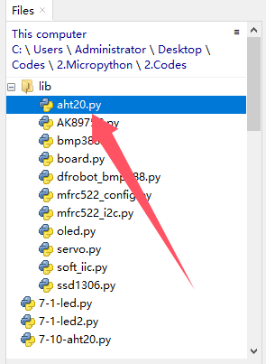
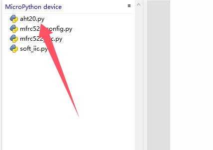
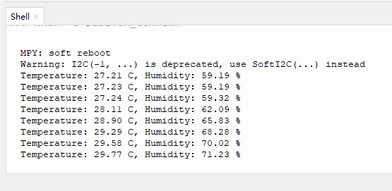

# 3.10 Temperature and Humidity Sensor

## 3.10.1 Overview

AHT20 temperature and humidity sensor adopts I2C interface and 20Bit ADC, and its operating voltage is 2V-5V. It features small volume, stable performance and high precision (accuracy: temperature ±0.3℃, humidity ±2%RH). So it is widely used in smart home, consumer electronics, medical and automotive. The sensor is stable and can work in harsh environments.

##  3.10.2 Schematic Diagram


ATH20 temperature and humidity sensor transmits data via I2C interface, and it works according to resistive and capacitive technology. It detects the temperature because the material's conductivity changes with temperature, and it reflects humidity through the change in the capacitance value. The temperature measurement range is -40 ° C to +85 ° C with accuracy of ±0.3 ° C, and the humidity range is 0% ~ 100%RH ±2%RH. Besides, it features high accuracy, high reliability and long-term stability. With I2C protocol, ATH20 provides real-time and accurate temperature and humidity data under a variety of environmental conditions.

## 3.10.3 Test Code

Open **3-10-aht20.py**.

Before uploading code, library is required. In lib file, open **aht20.py**, and choose *Upload to /* .



Successfully loaded:



**Code:**

```python
'''
 * Filename    : 3-10-aht20
 * Thonny      : Thonny 4.1.4
 * Auther      : http//www.keyestudio.com
'''
#import I2C and Pin from machine
from machine import I2C, Pin
#import AHT20 from aht20 library
from aht20 import AHT20
import time
#create an I2C object and define SDA and SCL pin
i2c = I2C(scl=Pin(22), sda=Pin(21))
#create an AHT20 object, initialize I2C object to communicate through I2C bus and AHT20 sensor
sensor = AHT20(i2c)

while True:	
    try:
        #Store the values of temperature and humidity in the temperature and humidity variables
        temperature, humidity = sensor.read_temperature_humidity()
        #Formatted output variable value of temperature and humidity, keep two decimal places
        print("Temperature: {:.2f} C, Humidity: {:.2f} %".format(temperature, humidity))
    #Read the detect value, if there is an error, print “Failed to read from sensor:”
    except RuntimeError as e:
        print("Failed to read from sensor: ", e)
    time.sleep(1)	#delay 1S

```

**Result:**

After uploading the code, Shell prints temperature and humidity values and refreshes the results per second.

