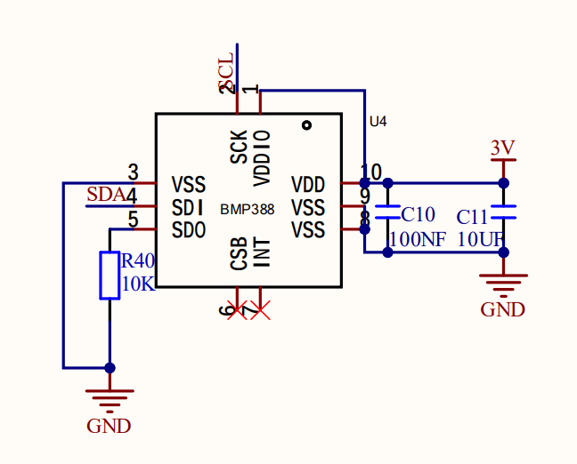
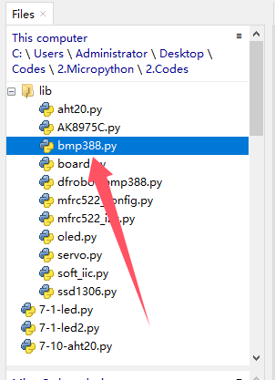
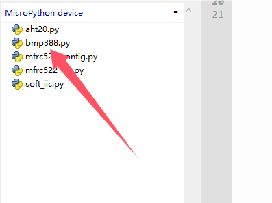
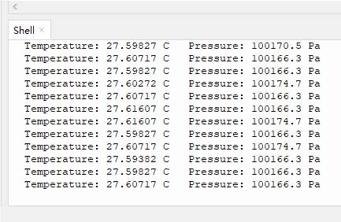

# 3.11 Pressure Sensor

## 3.11.1 Overview

BMP388 pressure sensor is a pneumatic MEMS sensor a very compact package, featuring small size, low power consumption but high performance. In brief, it is a combination of the temperature and pressure sensor, which is perfect for mobile applications. 

This module adopts proven piezoresistive pressure sensing technology with high accuracy and linearity, as well as long-term stability and high EMC stability. Besides, it maximize flexibility in multi-device working, and is ideal for altitude tracking in consumer electronics drones, wearables, smart homes, etc. 

As for improvement, we can optimize the device in terms of power consumption, resolution and filtering performance.

##  3.11.2 Schematic Diagram



Based on piezoelectric pressure sensing technology, the BMP388 pressure sensor accurately measures pressure and temperature. It is capable of measuring air pressure in the 300 ~ 1250 hPa range without consuming much power (consuming only 3.4 µA at 1 Hz operating frequency). In addition, the built-in infinite impulse response filter can effectively reduce effects from external interference.

## 3.11.3 Test Code

Open **3-11-bmp388.py**.

Before uploading code, library is required. In lib file, open **bmp388.py**, and choose *Upload to /* .



Successfully loaded:



**Code:**

```python
'''
 * Filename    : 3-11-bmp388
 * Thonny      : Thonny 4.1.4
 * Auther      : http//www.keyestudio.com
'''
import machine
#import BMP388 from BMP388 library
from bmp388 import BMP388 
import time

# create BMP388 object and set SDA and SCL pin, set IIC frequency to 100KHz
i2c = machine.SoftI2C(scl=machine.Pin(22), sda=machine.Pin(21), freq=100000)

# create a BMP388 object, pass the previously created i2c object to it, and communicate with the BMP388 sensor via the I2C bus, set BMP388 IIC address to 0x76
bmp = BMP388(i2c, i2c_addr=0x76)

while True:
    # read the temperature value
    temperature = bmp.read_temperature()
    # read the pressure value
    pressure = bmp.read_pressure()
    # print the read value
    print("Temperature:", temperature, "C "," Pressure:", pressure, "Pa")
    time.sleep(1)


```

**Result:**

After uploading code, the shell prints the values read by BMP388 sensor.

