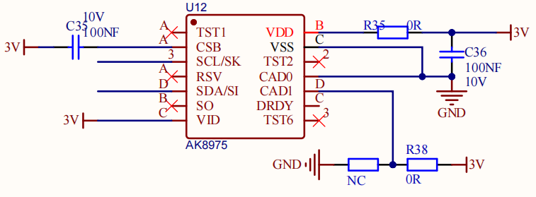
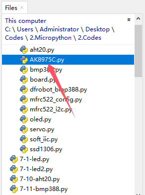
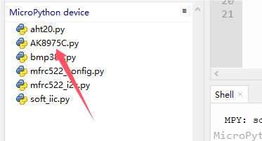
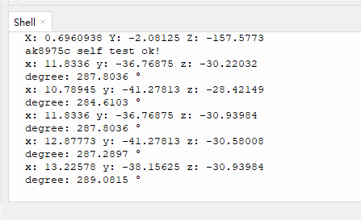

# 3.12 (Direction Recognition) Geomagnetic Sensor

## 3.12.1 Overview

AK8975C geomagnetic sensor is a three-axis electronic compass IC with high sensitivity. It can output 13-bit data and accurately detect X, Y, Z axes geomagnetic values. Thus, it is suitable for portable devices with navigation function such as mobile phones and tablets.

##  3.12.2 Schematic Diagram



The AK8975C geomagnetic sensor works in the principle of electromagnetic induction. It takes the Earth's magnetic field as a measurement benchmark to sense changes in the magnetic field through its internal magnetic material and coils. Specifically, when the magnetic material is affected by geomagnetic field, a directional constrained electron spin deflection will happen due to the field force, which in turn forms a magnetic field. This field induces potential signals in the coil.

This sensor amplifies and processes the induced potential signals, which are then transmitted to the system for further calculation, analysis and processing. So it measures geomagnetic magnetic field in the axis X, Y, and Z to determine the direction.

## 3.12.3 Test Code

Open **3-12-ak8975.py**.

Before uploading code, library is required. In lib file, open **AK8975C.py**, and choose *Upload to /* .



Successfully loaded:



**Code:**

```python
'''
 * Filename    : 3-12-ak8975
 * Thonny      : Thonny 4.1.4
 * Auther      : http//www.keyestudio.com
'''
from machine import Pin
#import ak8975c from AK8975C
from AK8975C import ak8975c
import time

scl = Pin(22)
sda = Pin(21)
#create an ak8975c object, initialize I2C bus and SCL and SDA pin
Triaxial = ak8975c(scl, sda)

while True:
    Triaxial.measure()  # measure values
    print('x:',Triaxial.X,'y:',Triaxial.Y,'z:',Triaxial.Z)  # Print the geomagnetic strength of the XYZ axis
    if Triaxial.AK8975_GET_AZIMUTH(Triaxial.X, Triaxial.Y) == True:  # Print the value of the course Angle only if the Angle can be calculated
        print('degree:', Triaxial.angle_val,'°')

```

**Result:**

After uploading code, the shell prints the sensor values. Move the coding box to see the changes of these values.

