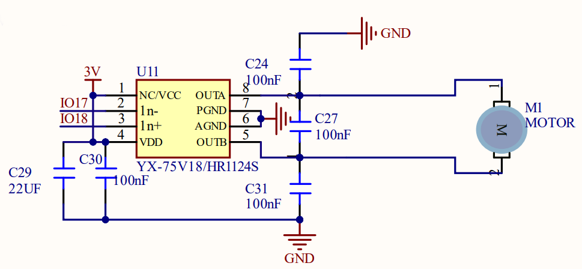

# 3.13 Fan/Motor Module

## 3.13.1 Overview

The motor adopts HR1124S motor control chip that is a single channel H-bridge driver chip used in DC motors. The H-bridge drive uses PMOS and NMOS power tubes with low on-resistance, ensuring lower power loss and longer safe working time. In addition, its standby and static working current are both low, so it is commonly used in toys.

##  3.13.2 Schematic Diagram




**Motor control logic table:**

| IO18 | IO17 |      motor state      |
| :--: | :--: | :-------------------: |
| HIGH | LOW  |    forward rotate     |
| LOW  | HIGH |    reverse rotate     |
| HIGH | HIGH | stop (a gradual stop) |
| LOW  | LOW  | brake (a brake stop)  |

## 3.13.3 Test Code

In Files, open **3-13-fan.py** and click .

**Code:**

```python
'''
 * Filename    : 3-13-fan
 * Thonny      : Thonny 4.1.4
 * Auther      : http//www.keyestudio.com
---------------------------------------------
motor rotation logic table:
---------------------------------------------
  IO18(MA) 	| IO17(MB)  |     motor state		|
---------------------------------------------
  HIGH 		|   LOW   	|       forward rotate 		|
---------------------------------------------
   LOW 		|  HIGH  	|       reverse rotate 		|
---------------------------------------------
  HIGH 		|  HIGH  	|   stop (a gradual stop) |
---------------------------------------------
   LOW 		|   LOW   	|   brake (a brake stop)	|
---------------------------------------------
'''

from machine import Pin
import time

#set motor control pin A to IO18
MA = Pin(18,Pin.OUT)
#set motor control pin B to IO17
MB = Pin(17,Pin.OUT)

while True:
    #forward rotate
    MA.on()
    MB.off()
    time.sleep(2)
    #reverse rotate
    MA.off()
    MB.on()
    time.sleep(2)
    #stop
    MA.off()
    MB.off()
    time.sleep(2)

```

**Result:**

After uploading code, you will see the fan forward rotates for 2s and then reverses for another 2s. Then it stops. These actions repeat.