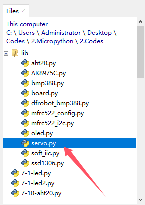
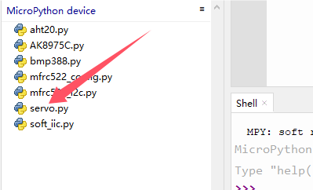

# 3.14 Servo

## 3.14.1 Overview

The 9g servo features small size but high performance and precision and is with good torque and accuracy, so it is perfect for small machines. With up to 180 degrees rotation angle, it enables extremely precise rotation and control and can be started fast with low noise.

##  3.14.2 Schematic Diagram

**Angle range:** 180°(there are 360°, 180° and 90°)

**Drive voltage:** 3.3V / 5V

Usually three wires:


**GND:** grounded, in brown

**VCC:** connect to +5v (3.3V) power, in red

**S:** signal pin to control PWM signal, in orange


**Control principle**: The rotation Angle of the servo is controlled by adjusting the duty cycle of the PWM (pulse width modulation) signals. Theoretically, the period of the standard PWM signal is fixed at 20ms (50Hz), so the pulse width should be 1ms ~ 2ms. But in fact, it is 0.5ms ~ 2.5ms, corresponding to the servo angle of  0° ~ 180°. Note that the angle for the same signal varies from servo brands.

## 3.14.4 Test Code

Open **3-14-servo.py** 

Before uploading code, library is required. In lib file, open **servo.py**, and choose *Upload to /*.



Successfully loaded:



**Code:**

```python
'''
 * Filename    : 3-14-servo
 * Thonny      : Thonny 4.1.4
 * Auther      : http//www.keyestudio.com
'''
import machine
import time
#import Servo from servo library
from servo import Servo

servo = Servo(pin=25)  # connect servo to pin

while True:
    # Set angle
    servo.set_angle(0)  # rotate servo to 0 degree
    time.sleep(1)
    servo.set_angle(90)  # rotate servo to 90 degree
    time.sleep(1)
    servo.set_angle(180)  # rotate servo to 180 degree
    time.sleep(1)


```

**Result:**

After uploading code, the servo rotates to 0 degree, 90 degree and 180 degree accordingly, with each position staying for 1 second, and then it back to 0 degree. It repeats these rotations.

## 3.14.5 Extension

In Files, open **3-14-servo2.py** and click .

**Code:**

```python
'''
 * Filename    : 3-14-servo2
 * Thonny      : Thonny 4.1.4
 * Auther      : http//www.keyestudio.com
'''
import machine
import time
#import Servo from servo library
from servo import Servo

servo = Servo(pin=25)  # connect servo to pin

while True:
    #rotate servo from 0 degree to 180 degree
    for angle in range(0,180):
        servo.set_angle(angle)  # rotate servo to 180 degree
        time.sleep_ms(10)		# delay 10ms
    #rotate servo from 180 degree to 0 degree
    for angle in range(180,-1,-1):
        servo.set_angle(angle)  # rotate servo to 0 degree
        time.sleep_ms(10)


```

**Result:**

After uploading code, the servo repeatedly and gradually rotates from 0 degree to 180 degree and then gradually back to 0 degree.

## 3.14.6 Code Explanation

1. `for angle in range(0,180):`

   This `for` loop traverses all integers from 0 to 179,

   `range(0,180)` generates a sequence containing 0 but not 180.

2. `for angle in range(180,-1,-1):`

   This `for` loop is similar to the above one but in reverse order, i.e., all integers from 180 to 0. 

   In `range(180,-1,-1)`, -1 means step = -1. So this loop traverses elements from large to small.