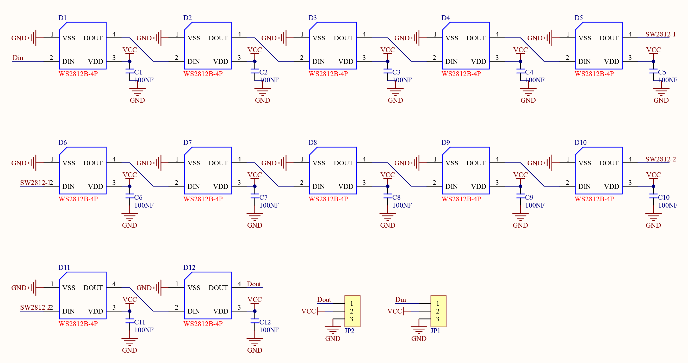

# 3.15 WS2818 RGB LED

## 3.15.1 Overview

WS2812 RGB LED is an external control LED integrating control circuit and light emitting circuit. It adopts single-line return-to-zero code communication, and supports 256 gray levels to display full-colors. The integrated chip inside each pixels efficiently stabilizes color output. So it is widely used in lighting, display and decoration.

##  3.15.2 Schematic Diagram



From the Schematic Diagram, ws2812 connects and transmits data over a single wire, which is the communication method named single-bus return-to-zero code (single NZR). The data enters in serial through the DIN port, and each pixel receives and processes 24 bits data (R, G, B color channels with 8 bits each). 

For detailed information of transmission mode, please refer the specification of ws2812.

## 3.15.3 Test Code

In Files, open **3-15-rgbLed.py** and click .

 **Code:**

```python
'''
 * Filename    : 3-15-rgbLed
 * Thonny      : Thonny 4.1.4
 * Auther      : http//www.keyestudio.com
'''
#Import Pin, neopiexl and time modules.
from machine import Pin
import neopixel
import time

pin = Pin(16, Pin.OUT)	#define SK6812 control pin to IO16
num_pixels = 12			#set the number of SK6812 beads to 12
#initialize SK6812 beads
np = neopixel.NeoPixel(pin, num_pixels)

red = [255,0,0]	#set display color to red

while True:
    np[0] = red		#the first bead lights up in red. 12 beads: number from 0-11
    np.write()		#refresh to display the set color
    

```

 **Result:**

After uploading code, the first bead of ws2812 module will light up in red.

##  3.15.4 Extension

Light up all LED circulating red, green, and blue.

In Files, open **3-15-rgbLed2.py** and click .

 **Code:**

```python
'''
 * Filename    : 3-15-rgbLed2
 * Thonny      : Thonny 4.1.4
 * Auther      : http//www.keyestudio.com
 ----------------------------------------
    color = [red,green,blue]
    color stores the color values.
    red.green,blue corespond to RGB values, ranging from 0-255
    Red [255,0,0]
    set the color you want to display according to RGB color table
'''
#Import Pin, neopiexl and time modules.
from machine import Pin
import neopixel
import time

pin = Pin(16, Pin.OUT)	#define SK6812 control pin to IO16
num_pixels = 12			#set SK6812 beads to 12
#initialize SK6812
np = neopixel.NeoPixel(pin, num_pixels)
red = [255,0,0]	#red
green = [0,255,0]#green
blue = [0,0,255]	#blue

while True:
    for i in range(num_pixels):		#for loop: add i from 0 to 11
        np[i] = red		#show red at i
        np.write()		#refresh to display the set color
        time.sleep_ms(50)	#delay 50ms to change the color of the ring gradually
    time.sleep(1)	#Pause 1 second after all display
    for i in range(num_pixels):
        np[i] = green		#show green at i
        np.write()	
        time.sleep_ms(50)
    time.sleep(1)
    for i in range(num_pixels):	
        np[i] = blue		#show blue at i
        np.write()
        time.sleep_ms(50)
    time.sleep(1)

```

**Result:** 

After uploading code, ws2812 repeatedly lights up in red, green and blue with 1s each color.