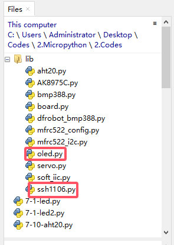

# 3.16 OLED Display

## 3.16.1 Overview

OLED display is also called organic light-emitting diode or organic dot laser display. This display is self-luminous. It adopts a very thin coating of organic materials and glass substrate which will light up if current passes through. Therefore, it does not require a back-light. Note that it will not light up when just powering on; programing and wiring are also needed.

Besides, it features large viewing Angle, low power consumption, high contrast, thin display, fast response, simple structure, and can work on flexion boards within a wide temperature range.

##  3.16.2 Schematic Diagram

Communication mode: I2C communication

Internal driver chip: SSD1306

Resolution: 128 x 64

## 3.16.3 Test Code

Open **3-16-oled.py**.

Before uploading code, library is required. In lib file, open **oled.py** and **ssH1106**, and choose *Upload to /*.



Successfully loaded:


**Code:** 

```python
'''
 * Filename    : 3-16-oled
 * Thonny      : Thonny 4.1.4
 * Auther      : http//www.keyestudio.com
-----------------------------------------
oled.clear()
clear display. If you want to display new content, you have to clear the last display; or the two content will be overlapped

oled.oled.show()
refresh to display the new content on OLED

oled.show_text("******", X,Y)
set code. input content to be displayed in the double quotation marks,
and set value of X，Y to control the starting position of the display.
'''
import machine
from oled import OLED

# Initialize I2C interface
i2c = machine.SoftI2C(scl=machine.Pin(22), sda=machine.Pin(21))

# create OLED example
oled = OLED(i2c)

# clear display
oled.clear()

# show text
oled.show_text("KEYESTUTDIO", 20, 0)

# show text
oled.show_text("Hello World!", 20, 10)
oled.show_text("MicroPython", 20, 20)

# show
oled.oled.show()

```

**Result:**

After uploading code, you will see the OLED shows the text you set. On the first line, "KEYESTUTDIO" is displayed; "Hello World!" shows on the second line and "MicroPython" is on the third.

