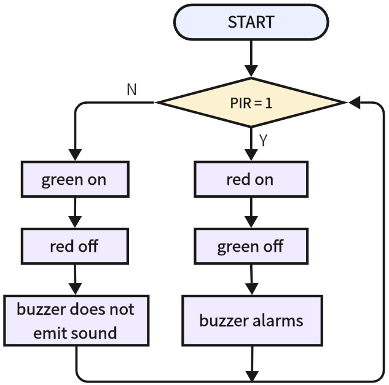

# 3.20 Intrusion Alarm

## 3.20.1 Overview

Intrusion alarm is a device alerting illegal intrusion into a prevention area. It plays an important role in security. We can see it everywhere: families, stores, warehouses, supermarkets and so on. 

All in all, it protects our personal and property safety.

## 3.20.2 Test Code

**Code Flow:**



**Code:**

In Files, open **3-20-lntrusionAlarm.py** and click .

```python
'''
 * Filename    : 3-20-lntrusionAlarm
 * Thonny      : Thonny 4.1.4
 * Auther      : http//www.keyestudio.com
'''
from machine import Pin,PWM
import time

#set PWM output pin to IO32, frequency to 5000 Hz, duty cycle to 50% (8-bit resolution middle value is 128, duty cycle ranges from 0-255)
spk = PWM(Pin(32), freq=5000, duty=128)

redLED = Pin(23,Pin.OUT)
greenLED = Pin(27,Pin.OUT)
pir = Pin(19,Pin.IN)

while True:
    #read pir sensor value and assign it to variable PIR
    PIR = pir.value()
    print("pir:",PIR)	#print PIR value
    if PIR == 1:		#determine whether PIR = 1
        greenLED.off()	#green off
        redLED.on()		#red on
        spk.duty(50)	#set the PWM duty cycle of the speaker
        spk.freq(880)	#set the frequency of the speaker
    else:
        redLED.off()	#red off
        greenLED.on()	#green on
        spk.duty(0)		#set the duty cycle of the speaker to 0, stop emitting sound
    time.sleep(0.1)

```

**Result:**

After uploading the code, when the sensor detects a motion around, the speaker alarms, the red LED turns on and the green one is off. If no intrusion is detected, the red LED will go off and the green will be on; at the same time, the speaker stays quiet. 

