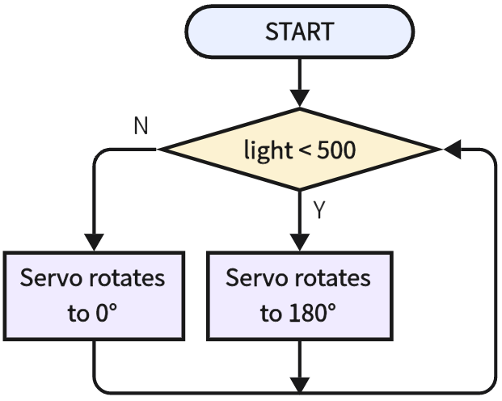

# 3.21 Window Close In Dark

## 3.21.1 Overview

In this project, we program to make the window automatically close when getting dark. So the photoresistor is required to sense the ambient light. We set a threshold for the resistor. When ambient light value is lower than the threshold, the servo closes the window. 

## 3.21.2 Test Code

**Code Flow:**



**Code:**

In Files, open **3-21-automaticWindow.py** and click .

```python
'''
 * Filename    : 3-21-automaticWindow
 * Thonny      : Thonny 4.1.4
 * Auther      : http//www.keyestudio.com
'''
from machine import ADC,Pin
import time
#import Servo from servo library
from servo import Servo

servo = Servo(pin=25)  #set control pin to IO25

adc=ADC(Pin(36))			#set ADC input pin to GPIO 36
adc.atten(ADC.ATTN_11DB)	#set voltage range to 0-3.3V
adc.width(ADC.WIDTH_12BIT)	#set ADC resolution

while True:
    light = adc.read()
    if light < 500:	#determine whether light < 500
        servo.set_angle(180)  # set angle to 180 degree
    else:
        servo.set_angle(0)  # set angle to 0 degree
    time.sleep_ms(300)

```

**Result:**

After uploading the code, cover the photoresistor with something (or your hand), and the servo will rotate to 180 degree. Remove the cover, and the analog value exceeds 500, so the servo rotates to 0 degree.

