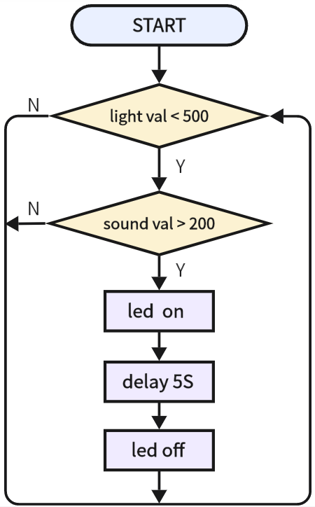

# 3.22 Voice Control Light

## 3.22.1 Overview

Voice-control-light device mainly consists of a sound sensor, a photoresistor and an LED. The photoresistor is adopted to avoid LED lighting up during daytime. The sound sensor measures sound volume to determine whether it is reached the set threshold. If yes, the LED will light up for a few seconds. 

## 3.22.2 Test Code

**Code Flow:**



**Code:**

In Files, open **3-22-hallwayLight.py** and click .

```python
'''
 * Filename    : 3-22-hallwayLight
 * Thonny      : Thonny 4.1.4
 * Auther      : http//www.keyestudio.com
'''
from machine import Pin,ADC
import time

light = ADC(Pin(36))
light.atten(ADC.ATTN_11DB)	#set voltage range to 0-3.3V
light.width(ADC.WIDTH_12BIT)	#set ADC resolution

sound = ADC(Pin(34))
sound.atten(ADC.ATTN_11DB)	#set voltage range to 0-3.3V
sound.width(ADC.WIDTH_12BIT)	#set ADC resolution

led = Pin(23,Pin.OUT)

while True:
    #read light sensor value and determine whether it is less than 500. If not, exit the loop
    while light.read() < 500:
        #read the sound sensor value and determine whether it is greater than 200. If yes, turn on led for 5s
        if sound.read() > 200:
            led.on()
            time.sleep(5)
            led.off()

```

**Result:**

After uploading code, the LED never lights up no matter how loud the noise you make. Cover the photoresistor, and make some sounds, and you will see the LED light up for 5 seconds. 

