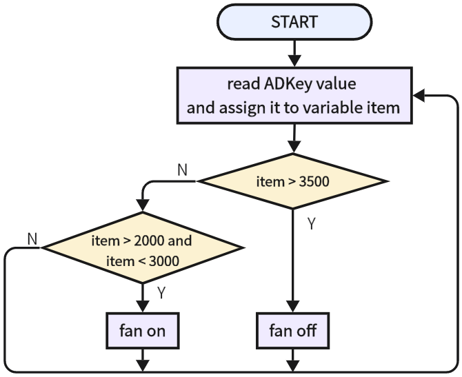

# 3.24 Button Control Fan

## 3.24.1 Overview

In this experiment, we program to control the fan by a button.

## 3.24.2 Test Code

**Code Flow:**



**Code:**

In Files, open **3-24-electricFan.py** and click .

```python
'''
 * Filename    : 3-24-electricFan
 * Thonny      : Thonny 4.1.4
 * Author      : http://www.keyestudio.com
'''
from machine import Pin,ADC
import time

key = ADC(Pin(33))			#set ADC input pin to GPIO 33
key.atten(ADC.ATTN_11DB)	#set voltage range to 0-3.3V
key.width(ADC.WIDTH_12BIT)	#set ADC resolution

#set motor control pin A to IO18
MA = Pin(18,Pin.OUT)
#set motor control pin B to IO17
MB = Pin(17,Pin.OUT)

while True:
    item = key.read()	#read the analog value of button
    if item > 3500:	#determine whether the red button is pressed. If yes, motor stops
        MA.off()
        MB.off()
    elif item > 2000 and item < 3000:	#determine whether the yellow button is pressed. If yes, motor rotates
        MA.on()
        MB.off()
    time.sleep_ms(300)


```

**Result:**

After uploading code, when we press the yellow button, the fan will turn on. When we press the red button, the fan stops working. 

