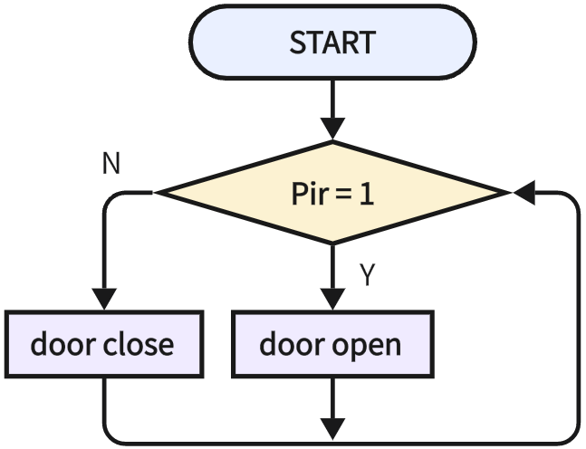

# 3.25 Auto-door

## 3.25.1 Overview

Many shopping malls open their doors when someone approaches and close them when no one is detected. Herein, we adopt a PIR motion sensor to simulate this kind of auto-door. The door opens when someone is detected and closes when no one is present.

## 3.25.2 Test Code

**Code Flow:**



**Code:**

In Files, open **3-25-lnductionDoor.py** and click .

```python
'''
 * Filename    : 3-25-lnductionDoor
 * Thonny      : Thonny 4.1.4
 * Author      : http://www.keyestudio.com
'''
from machine import Pin
import time
from servo import Servo

pir = Pin(19,Pin.IN)
servo = Servo(pin=25)

while True:
    Pir = pir.value()
    if Pir == 1:
        servo.set_angle(0)  # rotate servo to 0 degree
    else:
        servo.set_angle(180)  # rotate servo to 180 degree
    time.sleep_ms(300)
    

```

**Result:**

After uploading the code, wave your hand over the PIR motion sensor, and the servo will rotate to 180 degree (door open). After a while, it will back to 0 degree (door close) if nothing is detected.