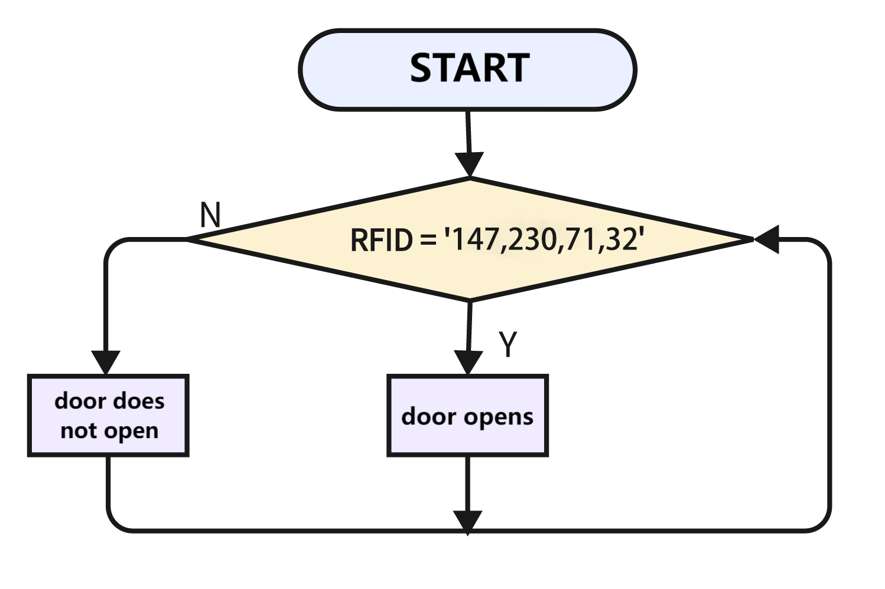

# 3.26 Access Card

## 3.26.1 Overview

A common access card is a  magnetic card or a key chain. So in this experiment, we make a simple access device through servo, a magnetic card and an RFID module.

## 3.26.2 Test Code

**Code Flow:** 

<p style="color:red;">ATTENTION: IC card code in the experiment is unique. You need to replace it with yours (details please see in chapter 7.8).</p>



**Code:**

In Files, open **3-26-accessControl.py** and click .

```python
'''
 * Filename    : 3-26-accessControl
 * Thonny      : Thonny 4.1.4
 * Author      : http://www.keyestudio.com
'''
import machine
import time
#import mfrc522 from mfrc522_i2c library
from mfrc522_i2c import mfrc522

from servo import Servo

servo = Servo(pin=25) 

#i2c config
addr = 0x28		#rfid IIC communication address
scl = 22		#IIC SCL pin
sda = 21		#IIC SDA pin

#create an MFRC522 object, send it to I2C SCL and SDA pin and device address
rc522 = mfrc522(scl, sda, addr)
#Initialize MFRC522. This is essential and ensures the working state of the module
rc522.PCD_Init()
#display the detailed information of MFRC522 reader, used to debug and ensure the device to normally work
rc522.ShowReaderDetails()

while True:
    #check whether there is an RFID card in the sensing area
    if rc522.PICC_IsNewCardPresent():
        #Try to read the serial number of the card. Return True if the card's serial number was successfully read.
        if rc522.PICC_ReadCardSerial() == True:
            rc522UID = rc522.uid.uidByte[0 : rc522.uid.size]
            #print “Card UID:” and UID value
            print("Card UID:",rc522UID)
            if rc522UID == [147, 230, 71, 32]:
                servo.set_angle(0)  # rotate servo to 0 degree
                time.sleep(2)		#delay 2S
                servo.set_angle(180)  # rotate servo to 180 degree


```

**Result:**

After uploading the code, put your card at the sensing area of the RFID module, and the servo will rotate to 180 degree for 3s and then come back. If the card code is not correct, the servo will stay still.

