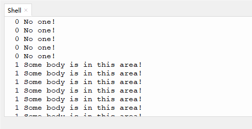

# 3.3 PIR Motion Sensor

## 3.3.1 Overview

The PIR motion sensor adopts RE200B-P element. 

Based on pyroelectric effect, the sensor is able to detect the infrared ray emitted by human body or animal. With Fresnel lens, it can even detect farther and wider. When a nearby human or animal motion is detected, the sensor outputs a high level.

##  3.3.2 Schematic Diagram


**Working principle:** The human body maintains at 37 degrees, so it will emit a specific wavelength of about 10μm infrared. The sensor captures 10μM infrared to determine whether there is a motion.

## 3.3.3 Test Code

 **Code:**

In Files, open **3-3-pir.py** and click .

```python
'''
 * Filename    : 3-3-pir
 * Thonny      : Thonny 4.1.4
 * Auther      : http//www.keyestudio.com
'''
from machine import Pin
import time

PIR = Pin(19, Pin.IN)  # set pin IO19 to the pir input pin
while True:
    PIR_value = PIR.value()	#read Pir sensor value and assign it to variable value
    print(PIR_value, end = " ") #print PIR_value without wrapping
    if PIR_value == 1:		#determine whether PIR_value = 1
        print("Some body is in this area!")#if PIR_value = 1, execute the code
    else:	#or else
        print("No one!")
    time.sleep(0.1)	#delay 0.1S(100ms)

```

**Result:**

Click “Run current script” to run the code. “Shell” prints the corresponding value and characters. When a motion is detected, value = 1,  and “shell” shows “1 Somebody is in this area!” If no motion is detected, value = 0, “shell” prints “0 No one!”

Press “Ctrl+C” or click “Stop/Restart backend” to quit the execution.



## 3.3.4 Code Explanation

1. `if-else` determines PIR sensor state. Different contents will be printed according to its state.

- （if）`PIR_value == 1`: an object or a motion is detected, “Some body is in this area!” is printed.
- （else）`PIR_value` ≠ 1(PIR_value = 0): “No one!” is printed.

2. `print(PIR_value, end = " ")`：Print `PIR_value` without wrapping. `end=" "` means no wrap and ends with a space to continuously display changes in sensor status on the same line. 

