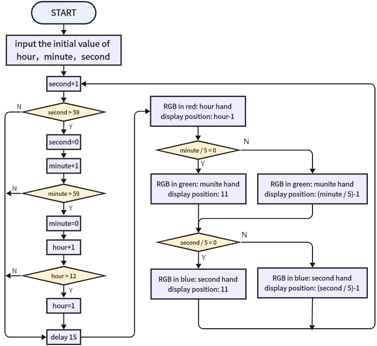
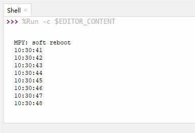

# 3.30 RGB Ring Clock

## 3.30.1 Overview

In this project, we build an informal clock with an RGB ring, whose three colors represent hour, minute and second respectively. Since the ring only boasts 12 beads, each bead is 5 seconds/minutes (60/12=5).

## 3.30.2 Test Code

 **Code Flow:**

As shown in the flowchart, we use red for hour, green for minutes, blue for seconds. When second = 60, minute adds 1, and when minute = 60, hour adds 1. 

Note that here we adopt 60/5=12 rather than 59/5=11.8, this is because the variable type is integer and the value should be divided by 5. And 60 can be perfectly divided into 12 parts.



**Code:**

In Files, open **3-30-rgbClock.py** and click .

```python
'''
 * Filename    : 3-30-rgbClock
 * Thonny      : Thonny 4.1.4
 * Auther      : http//www.keyestudio.com
'''
from machine import Pin
import neopixel
import time  
  
hour = 10 	#set hour
minute = 30 #set minute
second = 40	#set second

pin = Pin(16, Pin.OUT)	#set SK6812 control pin to IO16
num_pixels = 12			#set SK6812灯 pixels to 12
#initialize SK6812
np = neopixel.NeoPixel(pin, num_pixels)

red = [255,0,0]	#red-hour
green = [0,255,0]#green-minute
blue = [0,0,255]	#blue-second
  
def setClock():  
    global hour, minute, second  # Use the global keyword to modify global variables
    second += 1  
    if second > 59:  
        second = 0  
        minute += 1  
        if minute > 59:  
            minute = 0  
            hour += 1  
            if hour > 12:  
                hour = 1  
    print(f"{hour:02d}:{minute:02d}:{second:02d}")  # Print time, format output  
    time.sleep(1)  
  
while True:  
    setClock() 
    if second // 5 == 0:
        for i in range(0,11):	#clear second
            np[i] = 0,0,0
        np[11] = blue
        np.write()		#refresh display
    else:
        np[int(second // 5 - 1)] = blue
        np.write()		#refresh display
    if minute // 5 == 0:
        np[11] = green
        np.write()		#refresh display
    else:
        np[int(minute // 5 - 1)] = green
        np.write()		#refresh display
    np[(hour-1)] = red
    np.write()		#refresh display

```

 **Result:**

Before uploading code, you need to input an initial time in the following blocks of variables hour, minute, second. Herein, we set to 10: 30: 40.



After uploading code, you will see the RGB ring shows the time: red for hour, green for minute, blue for second. A minute passes as blue runs a circle. 

Only one color will be displayed when they are overlapped. Blue will not cover green while green will not cover red. 

<p style="color:red;">Note that this is an informal clock without a clock chip. So its errors begin to accumulate over time.</p>

