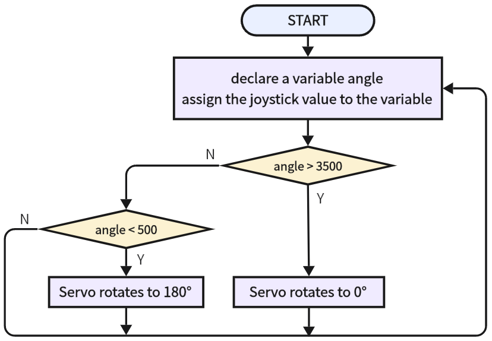

# 3.31 Joystick Control Servo

## 3.31.1 Overview

We control the servo via the axis X of the joystick. This model is widely applied to mechanical ON/OFF of lights and doors.

## 3.31.2 Test Code

**Code Flow:**



**Code:**

In Files, open **3-31-remoteControlServo.py** and click .

```python
'''
 * Filename    : 3-31-remoteControlServo
 * Thonny      : Thonny 4.1.4
 * Auther      : http//www.keyestudio.com
'''
from machine import Pin,ADC
import machine 
import time
#import Servo from servo library
from servo import Servo

servo = Servo(pin=25)  # set servo pins

rocker_x=ADC(Pin(35))	#set joystick axis x input to IO35
rocker_x.atten(ADC.ATTN_11DB)
rocker_x.width(ADC.WIDTH_12BIT)

while True:
    val = rocker_x.read()
    print(val)
    if val > 3500:
        servo.set_angle(0)
    elif val < 500:
        servo.set_angle(180)
    time.sleep(1)

```

 **Result:**

After uploading code, push the joystick to the left and the servo rotates to 180 degree. Push it to the right and the servo rotates to 0 degree.

