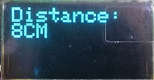

# 3.32 Ultrasonic Ranger

## 3.32.1 Overview

In this project, we combine the ultrasonic sensor and the OLED module to build a distance meter, whose detection range is 4-300CM.

## 3.32.2 Test Code

In Files, open **3-32-rangeFinder.py** and click .

**Code:**

```python
'''
 * Filename    : 3-32-rangeFinder
 * Thonny      : Thonny 4.1.4
 * Auther      : http//www.keyestudio.com
'''
import machine
from machine import Pin,PWM
from oled import OLED
import time

# initialize I2C interface
i2c = machine.SoftI2C(scl=machine.Pin(22), sda=machine.Pin(21))

# create OLED example
oled = OLED(i2c)


# define the control pins of the ultrasonic sensor
Trig = Pin(5, Pin.OUT) 
Echo = Pin(4, Pin.IN)

distance = 0 # set initial value to 0
soundVelocity = 340 #Set the speed of sound.

def getDistance():
    # maintain Trig pin at high for 10us to enable the ultrasonic sensor
    Trig.value(1)
    time.sleep_us(10)
    Trig.value(0)
    #start counting, The initial time of ultrasonic wave propagation in the air
    while Echo.value() == 0:
        Start = time.ticks_us()
    #The time of receiving the reflected ultrasonic wave
    while Echo.value() == 1:
        Stop = time.ticks_us()
    #The received time minus the initial time is the total time
    Time = time.ticks_diff(Stop,Start)
    #Calculate the distance according to the formula gives the result in meters.
    #Divide by 1000 to convert to centimeters.
    distance =  Time * soundVelocity //2 // 10000
    #Return the result of the calculation
    return distance

while True:
    #Assign the measured distance value to the variable distance
    distance = getDistance()
    # clear display
    oled.clear()
    #show distance
    oled.show_text("Distance:", 0, 0)
    #Use str() to turn the value of the variable distance into a string
    oled.show_text(str(distance), 0, 10)
    oled.show_text("CM", 30, 10)
    oled.oled.show()
    time.sleep(1)


```

**Result:**

After uploading code, “Distance:” will be displayed on the first line. What followed is the distance value in “CM” in the second line.



