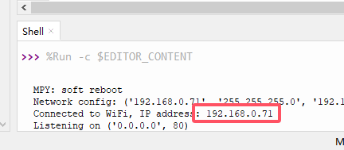
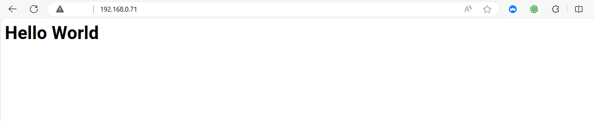

# 3.34 WiFi

## 3.34.1 Overview

ESP32 boasts a built-in Wi-Fi and Bluetooth nodule that is widely used in Internet of Things (IoT). With this function, it can remotely control the data transmission through the wireless network. 

In applications, ESP32 can be used as a client to connect to a Wi-Fi network, or as a hotspot to create its own network. Through these connections, ESP32 receives commands to control external devices, such as turning on/off lights and adjusting temperature. In the code, protocols like HTTP and MQTT are used to communicate with the server to achieve data sending and receiving, so as to remotely control and monitoring.

## 3.34.2 ESP32 WiFi Introduction

ESP32 development board comes with built-in Wi-Fi (2.4G) and Bluetooth (4.2), which enable it to easily connect to Wi-Fi network and communicate with other devices in the network. You can display web pages in your browser via ESP32.


- Base station mode (STA / Wi-Fi Client mode): ESP32 is connected to Wi-Fi hotspot (AP).
- AP mode (Soft-AP / Wi-Fi hotspot mode): Wi-Fi device(s) is(are) connected to ESP32.
- AP-STA mode: ESP32 is both Wi-Fi hotspot and a Wi-Fi device connected to another Wi-Fi.
- These modes supports multiple security modes, including WPA, WPA2 and WEP.
- It is able to scan Wi-Fi hotspot (active or passive)
- It support promiscuous mode monitoring IEEE802.11 Wi-Fi packets.

------

For more wifi reference, please visit [https://docs.espressif.com/projects/esp-idf/en/latest/esp32/api-reference/network/esp_wifi.html](https://docs.espressif.com/projects/esp-idf/en/latest/esp32/api-reference/network/esp_wifi.html)

espressif official: [https://www.espressif.com.cn/en/home](https://www.espressif.com.cn/en/home)


##  3.34.3 Test Code

In Files, open **3-34-wifi.py** and click .

**Code:**

```python
'''
 * Filename    : 3-34-wifi
 * Thonny      : Thonny 4.1.4
 * Auther      : http//www.keyestudio.com
'''
import network
import socket
import time
import machine

# WiFi connection
SSID = 'your WiFi name'  # your WiFi name
PASSWORD = 'your WiFi password'  # your WiFi password

# connect to WiFi
def connect_wifi(ssid, password):
    wlan = network.WLAN(network.STA_IF)  # Create WLAN objects using STA mode (client mode)
    wlan.active(True)  # activate WLAN interface
    wlan.connect(ssid, password)  # Connect to the specified WiFi network

    timeout = 10  # Connect timeout duration in seconds
    while not wlan.isconnected() and timeout > 0:  # If the connection fails and the timeout period does not expire, check the connection status again
        print("Connecting to WiFi...")
        time.sleep(1)
        timeout -= 1

    if not wlan.isconnected():  # If the connection is not successful after timeout, an exception is thrown
        raise Exception("Could not connect to WiFi")
    
    print('Network config:', wlan.ifconfig())  # Output network configuration (IP address, subnet mask, gateway, and DNS)
    print('Connected to WiFi, IP address:', wlan.ifconfig()[0])  # output the IP address of the successful connection
    return wlan

# create HTML page
def web_page():
    html = """<html>
    <head>
        <title>ESP32 Web Server</title>
    </head>
    <body>
        <h1>Hello World</h1>
    </body>
    </html>"""
    return html  # Return a simple HTML page with "Hello World"

# Start the Web server
def start_server():
    wlan = connect_wifi(SSID, PASSWORD)  # connect to WiFi
    addr = socket.getaddrinfo('0.0.0.0', 80)[0][-1]  # Obtain the local IP address and port 80
    s = socket.socket()  # Create a socket object
    s.bind(addr)  # Bind sockets to addresses and ports
    s.listen(5)  # Start listening for incoming connections. The maximum number of connections is 5
    print('Listening on', addr)  # Print the address and port on which the server is listening

    while True:
        cl, addr = s.accept()  # Accept a client connection
        print('Client connected from', addr)  # Print the address of the client
        request = cl.recv(1024)  # Receive client requests, up to 1024 bytes
        request = str(request)  # Convert the request to a string
        print('Content = %s' % request)  # Print request content
        
        response = web_page()  # Generate HTML response
        cl.send('HTTP/1.1 200 OK\n')  # Send the HTTP response header
        cl.send('Content-Type: text/html\n')  # Specify the content type as HTML
        cl.send('Connection: close\n\n')  # Close connection
        cl.sendall(response)  # Send HTML page content
        cl.close()  # Close the client connection

# Run server
try:
    start_server()  # Try starting the Web server
except Exception as e:
    print('Failed to start server:', e)  # If the startup fails, an error message is displayed
    machine.reset()  # Restart the device to try to reconnect

```

**Result:**

After uploading code, the Shell will display the IP address. Connect your computer/mobile phone and ESP32 to the same wifi, and access the IP address and you will see “Hello world”.



