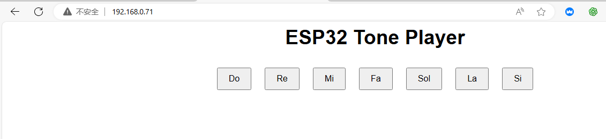

# 3.37 WiFi Piano

## 3.37.1 Overview

In this project, we set seven buttons to control the speaker to play tones of Do, Re, Mi, Fa, So, La, Si.

## 3.37.2 Test Code

In Files, open **3-37-wifiWebPiano.py** and click .

**Code:**

```python
'''
 * Filename    : 3-37-wifiWebPiano
 * Thonny      : Thonny 4.1.4
 * Auther      : http//www.keyestudio.com
'''
import network
import socket
import machine
import time

# WiFi connection information
SSID = 'your WiFi name'  # your WiFi name
PASSWORD = 'your WiFi password'  # your WiFi password

# connect to WiFi
def connect_wifi(ssid, password):
    wlan = network.WLAN(network.STA_IF)  # Create WLAN objects using STA mode (client mode)
    wlan.active(True)  # activate WLAN interface
    wlan.connect(ssid, password)  # Connect to the specified WiFi network

    timeout = 10  # Connect timeout duration, in seconds
    while not wlan.isconnected() and timeout > 0:  # If the connection fails and the timeout period does not expire, check the connection status again
        print("Connecting to WiFi...")
        time.sleep(1)
        timeout -= 1

    if not wlan.isconnected():  # If the connection is not successful after timeout, an exception is thrown
        raise Exception("Could not connect to WiFi")
    
    print('Network config:', wlan.ifconfig())  # Output network configuration (IP address, subnet mask, gateway, and DNS)
    print('Connected to WiFi, IP address:', wlan.ifconfig()[0])  # The IP address of the successful connection is displayed
    return wlan

# create HTML page
def web_page():
    html = """<html>
    <head>
        <title>ESP32 Web Server</title>
        <style>
            body { font-family: Arial, sans-serif; text-align: center; }
            button { padding: 10px 20px; font-size: 16px; margin: 10px; }
        </style>
        <script>
            function playTone(tone) {
                var xhr = new XMLHttpRequest();
                xhr.open("GET", "/play_" + tone, true);
                xhr.send();
            }
        </script>
    </head>
    <body>
        <h1>ESP32 Tone Player</h1>
        <button onclick="playTone('do')">Do</button>
        <button onclick="playTone('re')">Re</button>
        <button onclick="playTone('mi')">Mi</button>
        <button onclick="playTone('fa')">Fa</button>
        <button onclick="playTone('sol')">Sol</button>
        <button onclick="playTone('la')">La</button>
        <button onclick="playTone('si')">Si</button>
    </body>
    </html>"""
    return html  # Return an HTML page with seven keys, one for each note

# Start the Web server
def start_server():
    wlan = connect_wifi(SSID, PASSWORD)  # connect to WiFi
    addr = socket.getaddrinfo('0.0.0.0', 80)[0][-1]  # Obtain the local IP address and port 80
    s = socket.socket()  # Create a socket object
    s.bind(addr)  # Bind sockets to addresses and ports
    s.listen(5)  # Start listening for incoming connections. The maximum number of connections is 5
    print('Listening on', addr)  # Print the address and port on which the server is listening

    while True:
        cl, addr = s.accept()  # Accept a client connection
        print('Client connected from', addr)  # Print the address of the client
        request = cl.recv(1024)  # Receive client requests, up to 1024 bytes
        request = str(request)  # Convert the request to a string
        print('Content = %s' % request)  # Print request content
        
        response = web_page()  # Generate HTML response

        # Check the request path and play the corresponding note
        if '/play_do' in request:
            play_tone('do')
        elif '/play_re' in request:
            play_tone('re')
        elif '/play_mi' in request:
            play_tone('mi')
        elif '/play_fa' in request:
            play_tone('fa')
        elif '/play_sol' in request:
            play_tone('sol')
        elif '/play_la' in request:
            play_tone('la')
        elif '/play_si' in request:
            play_tone('si')

        cl.send('HTTP/1.1 200 OK\n')
        cl.send('Content-Type: text/html\n')
        cl.send('Connection: close\n\n')
        cl.sendall(response)
        cl.close()  # Close the client connection

# play tone
def play_tone(tone):
    tones = {
        'do': 261.63,
        're': 293.66,
        'mi': 329.63,
        'fa': 349.23,
        'sol': 392.00,
        'la': 440.00,
        'si': 493.88
    }
    frequency = tones.get(tone, 0)
    if frequency > 0:
        pwm = machine.PWM(machine.Pin(32))  # Output PWM signal using GPIO32 pin
        pwm.freq(int(frequency))
        pwm.duty(512)  # Set the duty cycle to 50%
        time.sleep_ms(200)  # play tone to 1s
        pwm.deinit()  # turn off PWM

# run server
try:
    start_server()  # Try starting the Web server
except Exception as e:
    print('Failed to start server:', e)  # If the startup fails, an error message is displayed
    machine.reset()  # Restart the device to try to reconnect

```

**Result:**

Upload the code, and the OLED shows the IP address after connecting to wifi. 

Connect your computer/mobile phone and ESP32 to the same wifi, and you can access the IP address to see the control page through your device. 



