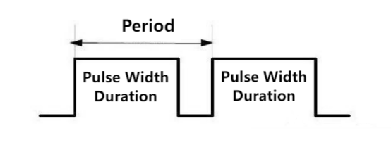
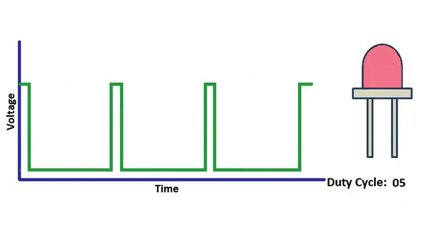
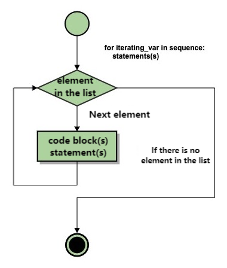

# 3.4 Power Amplifier

## 3.4.1 Overview

The 8002b power amplifier mainly consists of a speaker and an audio amplification chip. It can amplify small audio signals for about 8.5 times. These amplified sounds will be played through its speaker. Besides, it can also play some music or melodies. 

##  3.4.2 Schematic Diagram


The power amplifier is enabled by square wave. The square wave can be changed by the duty cycle of PWM.

- The greater the duty cycle is, the louder the sound will be.

Or the tone can be adjusted via the frequency of PWM:

- The higher the frequency is, the higher the tone will be.

**What is PWM?**

PWM (Pulse width modulation) is a scheme that simulates the change of analog signals by digital signal.

Pulse width is the high level part in a complete square wave cycle. Therefore, PWM is a modulation of high level. Of course, in other words, the cycle is fixed, so it adjust the low level part as well. 



- **PWM frequency**

  Frequency is the number of times the signal goes from high to low level and back to high in 1 second (this is one cycle), that is, how many cycles there are in a second PWM.

  Unit: Hz

  Expression: 50Hz; 100Hz

- **PWM cycle**

  $ T= \frac {1}{f}$      $ Cycle = \frac {1}{Frequency}$

  When frequency is 50Hz, i.e., the cycle is 20ms, there are 50 PWM cycles within 1s.

- **PWM duty cycle**

  Duty cycle is the ratio of the time of the high level to the that of the whole cycle in a cycle.

  - Unit: % (1% ~ 100%)


  - **Cycle**: The time of a pulse signal. Frequency is the number cycles in 1s.
  - **Pulse width time**: high level time.

  

  <center>The Relationship between Duty Cycle and LED Brightness.gif<center>


The longer the high level is, the greater the duty cycle will be, and the brighter the LED will be.

  **The PWM frequency corresponding to the seventh note**

  

## 3.4.3 Test Code

**Code:**

In Files, open **3-4-speaker.py** and click .

```python
'''
 * Filename    : 3-4-speaker
 * Thonny      : Thonny 4.1.4
 * Auther      : http//www.keyestudio.com

-----------------------------
| Pitch names |  Frequency  |
|---------------------------|
|    C(Do)    |     523     |
|    D(Re)    |     587     |
|    E(Mi)    |     659     |
|    F(Fa)    |     698     |
|    G(So)    |     784     |
|    A(La)    |     880     |
|    B(Si)    |     988     |
-----------------------------
'''
from machine import Pin, PWM
import time

#set pin IO32 to PWM output pin, frequency is 5000 Hz, duty cycle is 50% (The median value of 8-bit resolution is 128, the duty cycle ranges from 0-255)
trumpet = PWM(Pin(32), freq=5000, duty=128) 

a = [523,587,659,698,784,880,988] #define an array to store frequency

for i in a:				#for loop array "a", If there are n sets of data, cycle n times
    trumpet.duty(10)	#control PWM duty cycle （0-255）, sound volume is adjustable
    trumpet.freq(i)		#set frequency, emit sound by controlling frequency
    time.sleep(0.5)		#delay 0.5S
    trumpet.duty(0)		#set duty cycle to 0 to turn off the amplifier

```

 **Result:**

Click “Run current script” to run the code. The amplifier emits tones of Do, Re, Mi, Fa, So, La, Si.

## 3.4.4 Code Explanation

1. `from machine import Pin, PWM`

   import PWM function.

    **machine.PWM**

   `machine.PWM(pin)`：PWM object constructor, it reinitializes the specified GPIO and sets to PWM output.

   ​	pin: GPIO object that needs to be set to PWM output.

   `PWM.freq（value）`：set PWM output frequency.

   ​	value : PWM output frequency. The value should conform to the PWM frequency calculation formula.

   `PWM.duty（value）`：set duty cycle. The corresponding value is calculated automatically through value.

   ​	value: set duty cycle ratio, within 

2. `trumpet = PWM(Pin(32) ,freq=5000, duty=128)` 

   `Pin(32)`：set pin GPIO32 to output PWM

   `freq=5000`：set PWM frequency to 5000 Hz

   `duty=128`：at 8 bit resolution, set PWM duty cycle to 128, corresponding to 50%. Duty cycle range: 0-255

3. `a = [523,587,659,698,784,880,988]`

   In python, [ ] means a list, elements in which are separated with comma.

   Create a list “a”, elements: 523, 587, 659, 698, 784, 880, 988, corresponds to tone C, D, E, F, G, A, B.

4. ```python
   for i in a:
   	trumpet.duty(10) #tone at duty cycle of 10, sound decrease
       trumpet.freq(i)
       time.sleep(0.5)
   ```

   **for statement** in Python: play tone at duty cycle of 10, each tone for 0.5s.

   In Python, for loop is an iteration statement, which is used for loop of a traversal list (including strings, lists, elements, dictionaries, collections) or executes a loop a specified number of times. 

   Grammatical structure of for loop:

   ```python
   for iterating_var in sequence:
      statements(s)
   ```

   Flow of for statement:

   

   traversal string:

   ```python
   # define string name
   hopy = "reaipaobu"
   # for loop processes string
   for x in hopy: 
          print(x)
   ```

   Results:

   ```
   r
   e
   a
   i
   p
   a
   o
   b
   u
   ```

   As you can see, for loop takes the contents of the string in turn. So it is also called traversal loop.