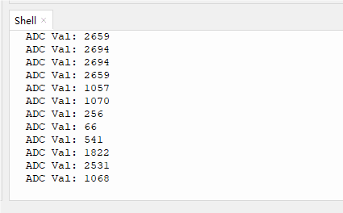

# 3.5 Photoresistor

## 3.5.1 Overview

Photoresistor is photoelectric device that works according to semiconductor photoconductivity. It can be used to sense the brightness of the current environment to output a corresponding analog value.

##  3.5.2 Schematic Diagram


Photoresistor takes advantage of the photoelectric effect of semiconductors. Its resistance varies with ambient light. 

In the light, the semiconductor material absorbs photon energy to produce electron-hole pairs, increasing the conductivity and reducing the resistance. The brighter the light is, the lower the resistance will be. From the changes of resistance, it can sense light intensity accurately. Therefore, it is widely used in automatic lighting, photoelectric control, real-time monitoring and regulation of light.

## 3.5.4 Test Code

In Files, open **3-5-light.py** and click .

**Code:**

```python
'''
 * Filename    : 3-5-light
 * Thonny      : Thonny 4.1.4
 * Auther      : http//www.keyestudio.com
'''
# Import Pin, ADC and DAC modules.
from machine import ADC,Pin,DAC
import time

adc=ADC(Pin(36))			#set pin GPIO 36 to ADC input pin
adc.atten(ADC.ATTN_11DB)	#set voltage range to 0-3.3V
adc.width(ADC.WIDTH_12BIT)	#set ADC resolution

while True:			
    adcVal=adc.read()	#read the sensor value and assign it to variable adcVal
    print("ADC Val:",adcVal)	#print the adcVal value
    time.sleep(0.5)				#delay 0.5s

```

**Result:**

Click “Run current script” to run the code. “Shell” displays the ADC value of photoresistor. Press “Ctrl+C” or click “Stop/Restart backend” to quit the execution.

