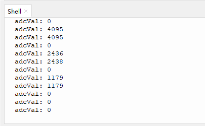
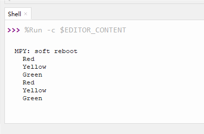

# 3.6 AD Button

## 3.6.1 Overview

The AD button requires only one analog pin to read multiple button states, which greatly saves IO ports. It adopts analog acquisition, and the output voltages vary from pressed buttons, so that different analog values can be obtained. We can determine which button is pressed according to these values.

##  3.6.2 Schematic Diagram


From the Schematic Diagram: 

When no button is pressed, the output at signal pin IO33 is pulled down by R34 (connected to GND. So the analog value of IO33 is 0, that is, low level 0V;

When button S1(the red button) is pressed, pin IO33 is connected to VCC. So the analog value of IO33 is 4095 (voltage = 3.3V).

When button S2(the yellow button) is pressed, the voltage of IO33 is that between R32 and R34: VCCxR34/(R32+R34) ≈ 2.2V, and the analog value is about 2432;

When button S3(the green button) is pressed, the voltage of IO33 is that between R32+R33 and R34: VCCxR34/(R32+R33+R34) ≈ 1.1V, and the analog value is about 1175.

## 3.6.4 Test Code

In Files, open **3-6-adKey.py** and click .

**Code:**

```python
'''
 * Filename    : 3-6-adKey
 * Thonny      : Thonny 4.1.4
 * Auther      : http//www.keyestudio.com
'''
# Import Pin and ADC modules.
from machine import ADC,Pin
import time 

adc=ADC(Pin(33))			#set pin GPIO 33 to ADC input pin
adc.atten(ADC.ATTN_11DB)	#set voltage range to 0-3.3V
adc.width(ADC.WIDTH_12BIT)	#set ADC resolution

while True:				
    adcVal = adc.read() 	#read AD button value and assign it to adcVal
    print("adcVal:",adcVal)	#print the adcVal value
    time.sleep(0.3)			#delay 0.3S

```

**Result:**

Click “Run current script” to run the code. “Shell” displays the ADC value of AD button. Press “Ctrl+C” or click “Stop/Restart backend” to quit the execution.



##  3.6.5 Extension

**AD button logic table:**

|      button       | the analog value of button being pressed | the analog value of button being released |
| :---------------: | :--------------------------------------: | :---------------------------------------: |
|  the red button   |                   4095                   |                     0                     |
| the green button  |                about 2432                |                     0                     |
| the yellow button |                about 1175                |                     0                     |

**AD button logic table:**


**Code:**

We add a condition statement to determine the read analog value of AD button module so that we can tell which button is pressed.

In Files, open **3-6-adKey2.py** and click .

```python
'''
 * Filename    : 3-6-adKey2
 * Thonny      : Thonny 4.1.4
 * Auther      : http//www.keyestudio.com
'''
# Import Pin and ADC modules.
from machine import ADC,Pin
import time 

adc=ADC(Pin(33))			#set pin GPIO 33 to ADC input pin
adc.atten(ADC.ATTN_11DB)	#set voltage range to 0-3.3V
adc.width(ADC.WIDTH_12BIT)	#set ADC resolution

while True:			
    itme = adc.read() 	#read analog value of AD button and assign it to item
    if itme > 3500:	#determine whether itme > 3500, if yes, print “Red”
        print("Red")
    elif (itme > 2000) and (itme < 3000):	#determine whether 2000<itme<3000, if yes, print “Yellow”
        print("Yellow")
    elif itme > 900 and itme < 1500:	#determine whether 900<itme<1500, if yes, print “Green”
        print("Green")
    time.sleep(0.3)		#delay 0.3S


```

 **Result:**

After uploading the code, Shell will print the colors of the buttons. If one of the buttons is pressed, its color will be displayed: “Red”, “Green” or “Yellow”.

