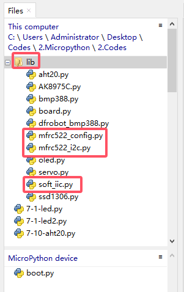
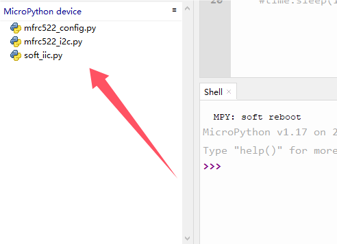
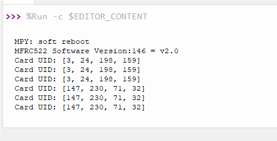

# 3.8 NFC Sensor

## 3.8.1 Overview

RFID-RC522 module adopts Phillips MFRC522 original chip in card reading circuit, which is easy to use and with low cost. It is suitable for equipment and reader development, advanced applications, RF card terminal design and producing.

##  3.8.2 Schematic Diagram


**RFID (Radio Frequency Identification)**: 

The card reader is composed of a frequency transmitter module and a high level magnetic field. The Tag transponder is a device to be sensed without a battery. It consists only of tiny integrated circuit chips, media for storing data, and antennas for receiving and transmitting signals. To read the data in the tag, it must be placed within the reading range of the reader. After that, the reader will generate a magnetic field. According to Lenz's law (magnetic energy generates electricity), the RFID Tag will be powered, thus activating the device.

<p style="color:red;">NOTE: this module only recognize card working at 13.56MHz. It is recommended to use the provided card in the kit.</p>

## 3.8.3 Test Code

Open **rfid.py**.

Before uploading code, library is required. In lib file, open **mfrc522_config.py**, **mfrc522_i2c.py** and **soft_iic.py**, and choose *Upload to /*.



Successfully loaded: 



**Code:**

```python
'''
 * Filename    : 3-8-rfid
 * Thonny      : Thonny 4.1.4
 * Auther      : http//www.keyestudio.com
'''
import machine
import time
#import mfrc522 from mfrc522_i2c
from mfrc522_i2c import mfrc522

#i2c config
addr = 0x28		#rfid IIC communication address
scl = 22		#IIC SCL pin
sda = 21		#IIC SDA pin

#create an MFRC522 object, I2C SCL and SDA pin and device address
rc522 = mfrc522(scl, sda, addr)
#initialize MFRC522 module, this is essential to ensure working state
rc522.PCD_Init()
#show MFRC522 reader information, used to debug and ensure working state
rc522.ShowReaderDetails()        

while True:
    #detect whether there is an RFID card within the sensing area
    if rc522.PICC_IsNewCardPresent():
        #try to read the card ID. If the ID can be successfully read, return True.
        if rc522.PICC_ReadCardSerial() == True:
            #print “Card UID:” and complete UID
            print("Card UID:",rc522.uid.uidByte[0 : rc522.uid.size])

```

**Result:** 

After uploading the code, cover the RFID sensing area with the IC card or the key in the kit, and you will see the serial monitor prints the ID numbers. 



