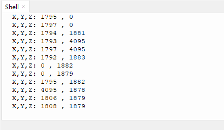

# 3.9 Axis-X&Y Joystick Module

## 3.9.1 Overview

Axis-X&Y Joystick is a high-precision input device for bidirectional control. Its X and Y axes are separated to control horizontal and vertical movements respectively. This module contains 10K resistance so that it ensures the stability and accuracy of signals. 

##  3.9.2 Schematic Diagram


ESP32 Axis-X&Y Joystick works based on a two-axis potentiometer that detects movements on two axes. When the joystick moves on axis X or Y, the resistance of the potentiometer changes, outputting analog voltage signals. After being received by ESP32 analog input pin (ADC), these signals will be read by ESP32 board and converted to digital values. Therefore, the joystick coordinate can be easily revealed during controlling. 

## 3.9.3 Test Code

In Files, open **3-9-joystick.py** and click .

**Code:**

```python
'''
 * Filename    : 3-9-joystick
 * Thonny      : Thonny 4.1.4
 * Auther      : http//www.keyestudio.com
'''
from machine import Pin, ADC
import time
# Initialize the joystick module (ADC function)
rocker_x=ADC(Pin(35))	#set pin IO39 to joystick axis X input
rocker_y=ADC(Pin(39))	#set pin IO35 to joystick axis Y input

# Set the acquisition range of voltage of the two ADC channels to 0-3.3V,
# and the acquisition width of data to 0-4095.
rocker_x.atten(ADC.ATTN_11DB)
rocker_y.atten(ADC.ATTN_11DB)
rocker_x.width(ADC.WIDTH_12BIT)
rocker_y.width(ADC.WIDTH_12BIT)
 
# In the code, configure Z_Pin to pull-up input mode.
# In loop(), use Read () to read the value of axes X and Y 
# and use value() to read the value of axis Z, and then display them.
while True:
    print("X,Y,Z:",rocker_x.read(),",",rocker_y.read())
    time.sleep(0.5)

```

**Result:**

After uploading the code, Shell prints the values on axis X and Y. Toggle the joystick, and these value changes. 

