MicroPython is a stripped-down version of Python 3 language, which includes a small portion of the Python standard library. It can run in microcontrollers and restricted environments after being optimized. Here are the main features of MicroPython:

1. **Compatibility**: MicroPython strives to be as compatible as possible with normal Python (CPython), which means that if you know Python, you already know the basics of MicroPython. 
2. **Hardware access**: In addition to core Python libraries, MicroPython includes modules such as "machines" for accessing low-level hardware, giving developers direct control over the hardware resources of the microcontroller. 
3. **Interactive prompt (REPL)**: MicroPython provides an interactive prompt (REPL) so that users execute commands directly from a desktop computer on an embedded platform. This is very useful for fast real-time testing and debugging of embedded systems. 
4. **Multi-threading support**: MicroPython firmware supports multi-threading, which enables a single microcontroller to handle multiple embedded tasks simultaneously, thus speeding up the executions.
5. **Open source project**: MicroPython is an open source project whose source code is available on Github. It follows the MIT license and is free to use for educational and commercial purposes. 
6. **Wide support**: MicroPython supports a variety of microcontroller boards and RTOS (real-time operating systems), such as ESP32, ESP8266, STM32, etc. In addition, it also provides rich libraries and modules to meet different development needs. 

# 2.1 Download Thonny

## 2.1.1 Windows

**OS: Windows 10**

Download: [Thonny Official](https://thonny.org)

Move your mouse to “Windows” and you will see the optional versions.


## 2.1.2 MAC

Similar to Windows.


# 2.2 Install Thonny

Two methods:

- Install Thonny+Python package

	Recommended for beginners: When you install, the Python environment and Thonny will be packaged so both installed. There are also two ways to install the package:

	- Installer

		

	- Portable variant

		

- Install Thonny only

  Recommended for developers: When the user already has a python environment, `pip install thonny` comes in handy to install Thonny separately.

  

Please just install according to your needs.

## 2.2.1 Installer

Here we demonstrate how to install `Installer with 64-bit Python 3.10` on <span style="background:#ff0;color:#000">64bit Windows 10</span>.

(1）After downloading, click  . And you will see **Select Setup Install Mode**, choose **Install for me only**.


（2）**Next** .


（3）Tick **I accept the agreement** and **Next**.


（4）The default path is Disk C, or you can click **Browse...** to modify the path. After that, click **Next**.


（5）Choose a path to create the program's shortcuts, and click **Next**.


（6）Tick **Create desktop icon** and click **Next**.

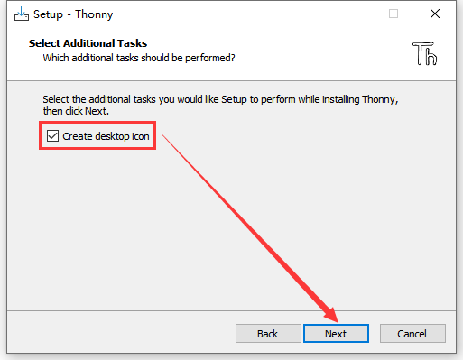

（7）Install.


（8）“**Finish**”


（9）Open Thonny and choose your language.


（10）Main interface:


## 2.2.2 Portable Variant

Here we demonstrate how to install `Portable variant with 64-bit Python 3.10` on <span style="background:#ff0;color:#000">64bit Windows 10</span>.

(1）After downloading and being unzipped, click  to choose your language.


（2）Main interface:


（3）For convenience, please send it to Desktop(create shortcut).

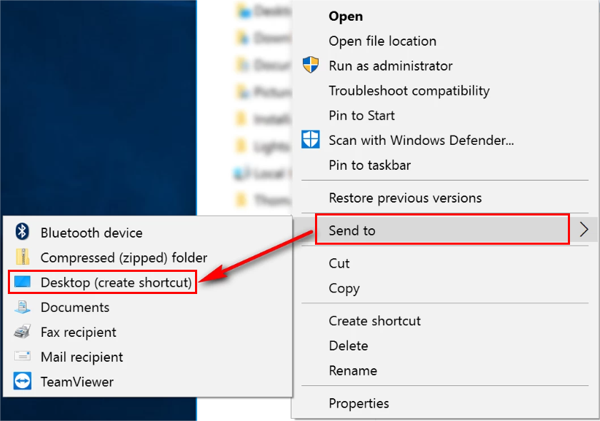

Shortcut: 


# 2.3 Board Driver

During installing, please connect the coding box to the computer!

## 2.3.1 Windows：

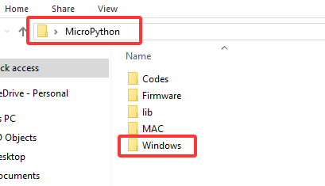

windows 10 and later versions boasts their own drivers. If your computer is, connect the box and click Computer – attribute – Device Manager.


As follows, if you see a yellow exclamation mark, you need to install manually,


Click  to Upload driver. 


“Brose my computer for drivers”.


Find and open the driver file **usb_ch341_3.1.2009.06**.


Close the interface and wait for connection.


As follows:


## 2.3.2 MAC：

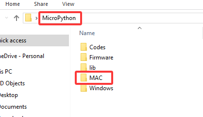

Step 1: Download the driver from the Website and extract the file to the local installation directory.


Step 2: For details about how to install the driver in pkg format by default, see Step 3. If OS X 11.0 or later does not support Rosetta, refer to Step 4 to install the dmg driver.

Before installation, please forward to “System Preferences”->“Security & Privacy”->“General” page, below the title “Allow apps downloaded from:” choose the choice 2->“Mac App Store and identified developers”, then the driver will work normally.

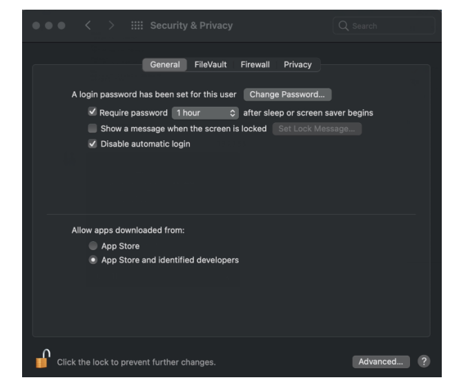

Step 3: To install the driver in pkg format, tap the driver file → Continue→ Install


Then the installation will be successful


To install the pkg format driver on OS X 11.0 and later: Open “LaunchPad”→“CH34xVCPDriver”→Install


When using OS X 10.9 to OS X 10.15, click “Restart” to restart your computer, and perform the following steps after the restart.


Step 4: To install the dmg driver, tap the dmg file and drag “CH34xVCPDriver” to enter the application folder in the operating system.


Then open “LaunchPad”→“CH34xVCPDriver”→Install


Then the installation will be successful

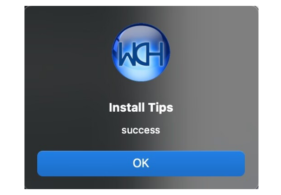

When inserting the CH340 control board into the USB port, open System Report -> Hardware ->USB. On the right is USB Device Tree. If the USB device is working properly, you will find a device whose “Vendor ID” is [0x1a86].


Open “Terminal” program under Applications-Utilities folder and type the command “ls /dev/tty*”.

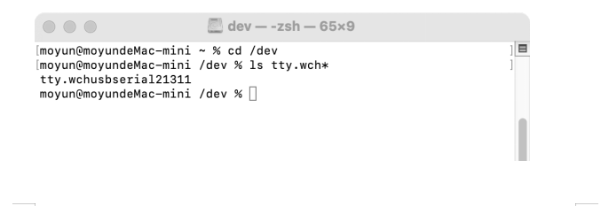

You should see the “tty.wchusbserialx” where “x” is the assigned device number similar to Windows COM port assignment.

# 2.4 Burn FIRMWARE

MicroPython firmware is required to operate on ESP32.

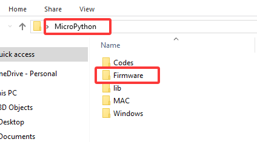

A. Connect the coding box to computer after installing driver. USB port cannot be recognized if there is no driver.

B. Click `Run` and `Configure interpreter...`

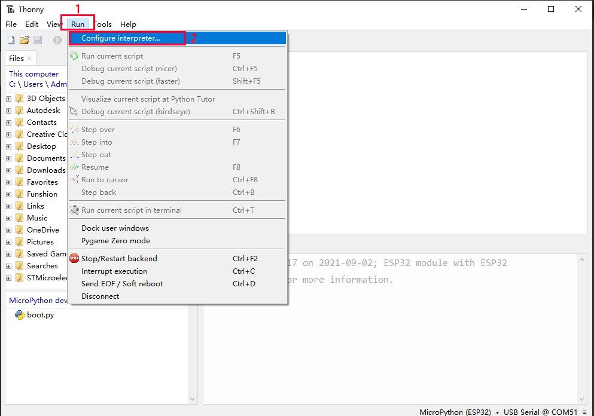

C. Set interpreter to `MicroPython(ESP32) `, check the port in Device Manager. Click `install or updare MicroPython(esptool)`

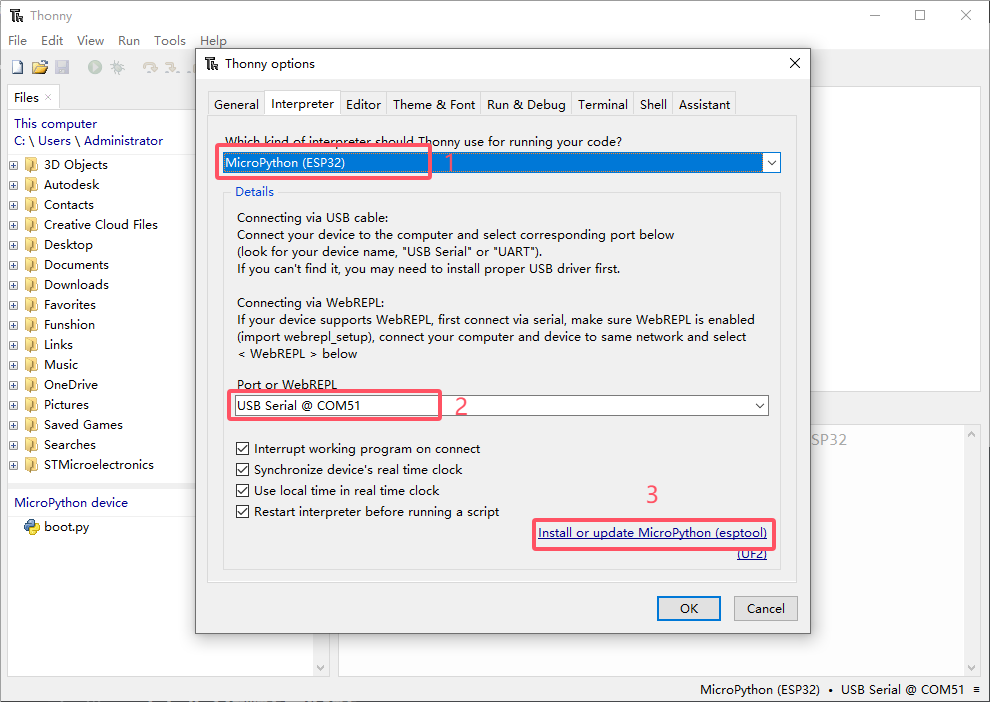

D. Click  to choose `Select local MicroPython image...`

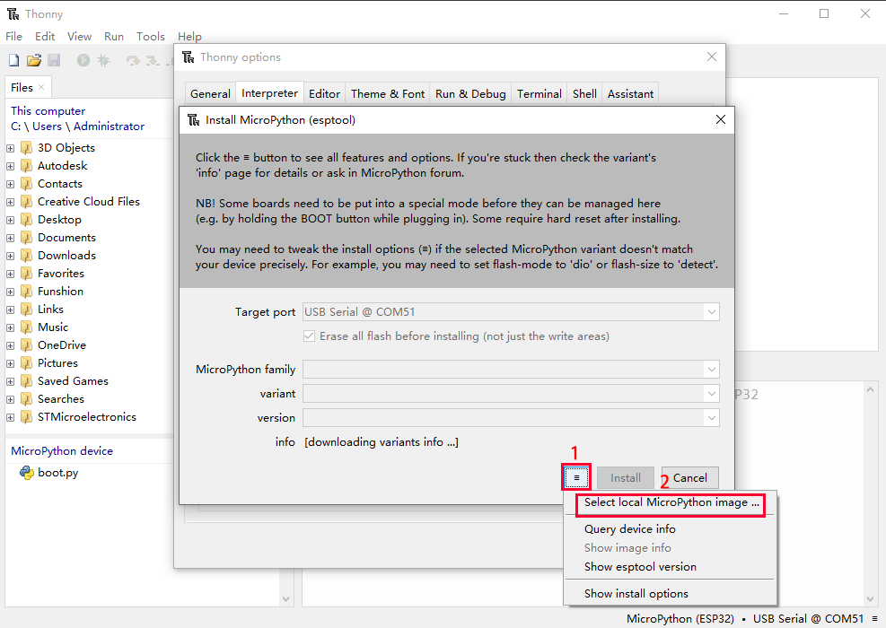

E. Open file `esp32-20210902-v1.17.bin`

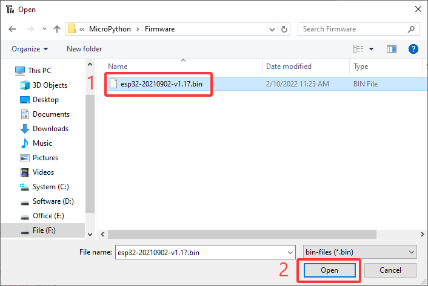

F. Click `install` and wait. 

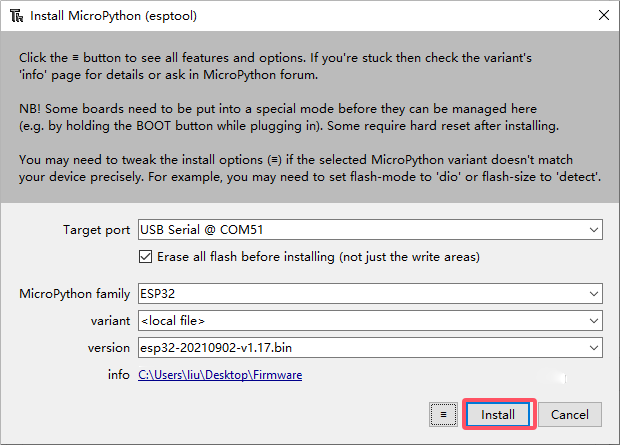

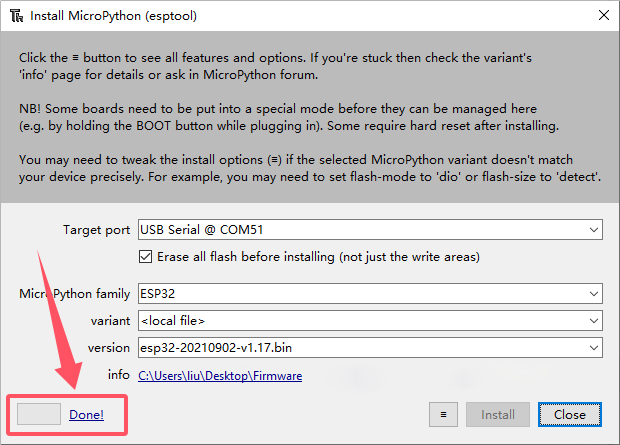

# 2.5 Thonny

## 2.5.1 Interface

Click **View** and tick **Files** to open the file path management.


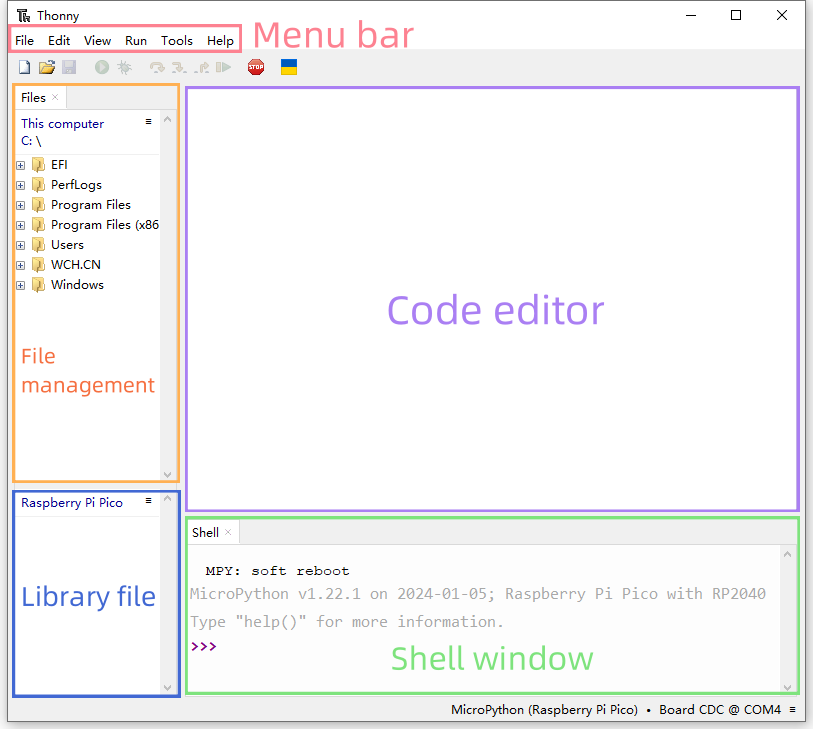

## 2.5.2 Toolbar


|            ICON             |            FUNCTION            |
| :-------------------------: | :----------------------------: |
|   |          New (Ctrl+N)          |
|   |        Open... (Ctrl+O)        |
|   |         Save (Ctrl+S)          |
|   |    Run current script (F5)     |
|   |      Debug current script      |
|   |         Step over (F6)         |
|  |         Step into (F7)         |
|  |            Step out            |
|  |          Resume (F8)           |
|  | Stop/Restart backend (Ctrl+F2) |


# 2.6 Testing ESP32 MicroPython

Download the project file in `1.1 Code Download`


Click on 'This computer' in the “Files” section and enter the 'Codes' file according to the location where the file is stored

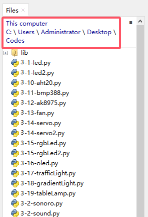

Connect to the coding box. If you cannot see the port, please install driver. If the code still cannot be uploaded after connecting to the port, please check whether the firmware is installed to the box. For how to download them, please refer to:

Driver: `2.3 Board Driver`; Firmware: `2.4 Burn FIRMWARE`

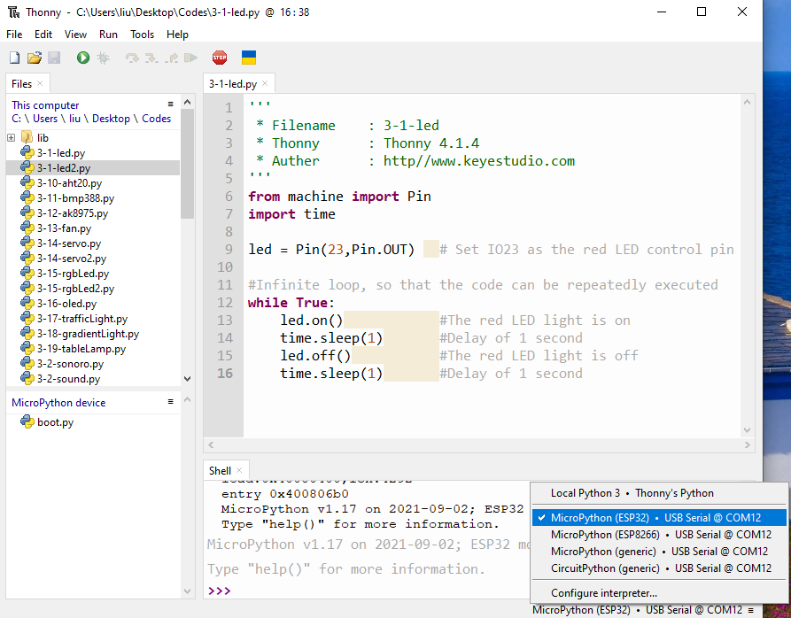

## 2.6.1 Test Shell Command

Input the following code in Shell.

```python
print('hello world')
```

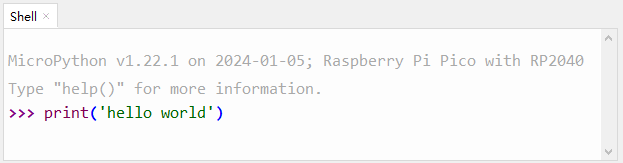

Press "Enter" and the Shell prints **hello world**.


## 2.6.2 Test Online Running

Click to open code **3-1-led.py**.

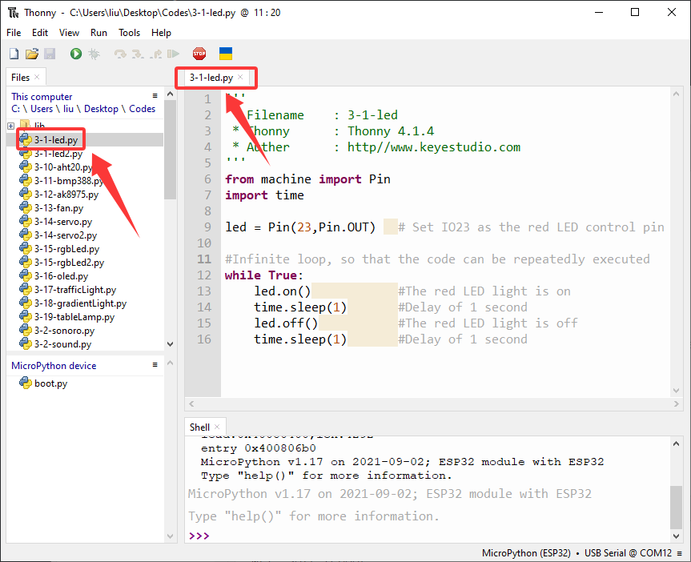

Click  to run the code, and the LED on the board will flashes: on for 1s and off for 1s.

## 2.6.3 Test Offline Running

Click  to create a new script, copy and paste **3-1-led.py** in the editing area.

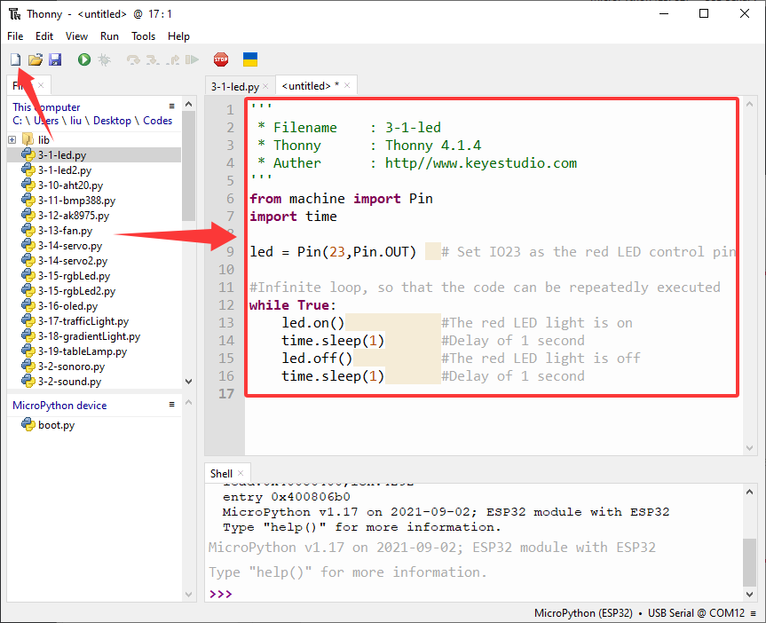

Click  to save it to MicroPython device.

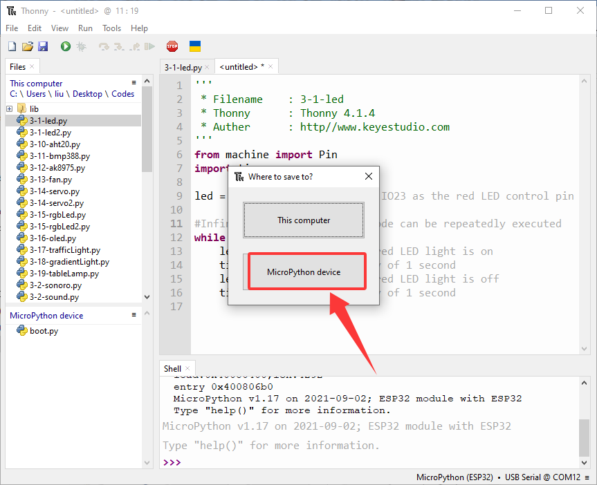

We name it as **main.py**.

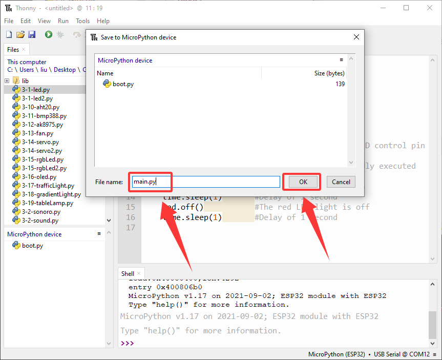

After saving, the main.py code will automatically execute as long as the coding box is powered on. You will see the red LED flashes per second. Note that it will not run after saving unless the reset button is pressed.

If you want to run a code offline, it must be loaded to the coding box with a name of `main.py`.


