.. _6-python-tutorial:

6. Python Tutorial
==================

.. _61-resource-compression-package:

6.1 Ressourcen-Kompressionspaket
--------------------------------

Das Ressourcenpaket enthält Code, Bibliotheken, Firmware und die Thonny-Software. Sie müssen diese Ressource haben, um mit dem Lernen fortzufahren.

:download:`Resource-compression-package <./Resource-compression-package.7z>`

.. _62-get-starter-with-thonny:

6.2 Einstieg mit Thonny
-----------------------

.. _621-open-the-thonny-package:

6.2.1 Öffnen des Thonny-Pakets
~~~~~~~~~~~~~~~~~~~~~~~~~~~~~~

Bitte beachten Sie den unten gezeigten Ordner:

|image1|

.. _622-thonny-interface:

6.2.2 Thonny-Oberfläche
~~~~~~~~~~~~~~~~~~~~~~~

Öffnen Sie Thonny

|image2|

Hauptschnittstellenfunktionen:

|image3|

|image4|

.. _623-select-esp32-development-environment:

6.2.3 Auswahl der ESP32-Entwicklungsumgebung
~~~~~~~~~~~~~~~~~~~~~~~~~~~~~~~~~~~~~~~~~~~~

Klicken Sie auf Python.exe, dann wählen Sie Interpreter konfigurieren

|image5|

Wählen Sie MicroPython(ESP32) in der Interpreter-Oberfläche aus

|image6|

.. _624-installing-firmware:

6.2.4 Firmware installieren
~~~~~~~~~~~~~~~~~~~~~~~~~~~

Download-Link: \ https://micropython.org/download/esp32/

Wählen Sie die Version V1.17 zum Herunterladen aus

|image7|

Natürlich stellen wir auch die heruntergeladene Firmware zur Verfügung, wie unten gezeigt.

|image-20250408113209943|

MicroPython-Firmware flashen

Verbinden Sie das Smart Home über USB mit Ihrem Computer.

Klicken Sie auf Firmware installieren oder aktualisieren

|image8|

Port auswählen

|image9|

Klicken Sie auf Durchsuchen, um die heruntergeladene Firmware Version V1.17 zu finden

|image10|

|image11|

Klicken Sie auf Installieren

|image12|

Wählen Sie Port oder WebREPL als Treiber für das ESP32-Hauptboard CH340(COM)

|image13|

|image14|
Die ESP32-Umgebung wurde installiert.

Thonny-Oberfläche

|image15|

.. _63-python-projects:

6.3 Python-Projekte
-------------------

Für alle Projekte wird Code bereitgestellt, der im
Resource-compression-package verfügbar ist.

|image-20250408113455542|

Projekt 1: LED steuern
~~~~~~~~~~~~~~~~~~~~~~

Wir lernen zunächst, wie man eine LED steuert.

|image16|

**Funktionsprinzip**

LED ist ebenfalls eine Leuchtdiode, die zu einem
elektronischen Modul verarbeitet werden kann. Sie leuchtet, wenn wir die Pins so steuern, dass sie ein High-Signal ausgeben,
ansonsten ist sie aus.

**Parameter**

=================== ===========
**Betriebsspannung** **DC 3~5V**
=================== ===========
**Betriebsstrom**    **<20mA**
**Leistung**         **0.1W**
=================== ===========

**Steuerpin**

========== ==
Gelbe LED  12
========== ==
\          
========== ==

.. _project-11-led-flashing:

Projekt 1.1 LED Blinken
^^^^^^^^^^^^^^^^^^^^^^^^

**Beschreibung**

Wir können den LED-Pin so steuern, dass er High- und Low-Pegel ausgibt, um die LED blinken zu lassen.

**Testcode**

.. code:: python

   from machine import Pin
   import time

   led = Pin(12, Pin.OUT)# Erstelle ein LED-Objekt, verbinde die externe LED mit Pin 0 und setze Pin 0 in den Ausgabemodus
   while True:
       led.value(1)# LED einschalten
       time.sleep(1)# 1 Sekunde warten
       led.value(0)# LED ausschalten
       time.sleep(1)# 1 Sekunde warten

Öffne den Beispielcode

|image17|

|image18|

**Testergebnis**

Klicke den Knopf

|image19|

Wir sehen, dass die gelbe LED blinkt.

.. _project-12-breathing-led:

Projekt 1.2 Atmende LED
^^^^^^^^^^^^^^^^^^^^^^^^^

**Beschreibung**

Eine „atmende LED“ ist ein Phänomen, bei dem die Helligkeit einer LED
sanft von dunkel zu hell und wieder zu dunkel wechselt, dies kontinuierlich geschieht und die Illusion einer „atmenden“ LED erzeugt. Aber wie steuert man die Helligkeit der LED?

Es ist sinnvoll, PWM zu verwenden. Dabei wird in einer Zeiteinheit die Anzahl der High- und Low-Pegel ausgegeben; je mehr Zeit der High-Pegel einnimmt, desto größer ist der PWM-Wert und desto heller leuchtet die LED.
|image20|

**Testcode**

.. code:: python

   import time
   from machine import Pin,PWM

   #Die Art und Weise, wie die ESP32 PWM-Pins ausgeben, unterscheidet sich von herkömmlichen Controllern.
   #Die Frequenz und das Tastverhältnis können durch Konfigurieren der PWM-Parameter in der Initialisierungsphase geändert werden.
   #Definieren Sie die Ausgangsfrequenz von GPIO 0 als 10000Hz und das Tastverhältnis als 0 und weisen Sie sie PWM zu.
   pwm =PWM(Pin(12,Pin.OUT),10000)

   try:
       while True: 
   #Der Bereich des Tastverhältnisses ist 0-1023, daher verwenden wir die erste for-Schleife, um PWM zu steuern und das Tastverhältnis zu ändern,
   #wodurch PWM 0% - 100% ausgibt; Verwenden Sie die zweite for-Schleife, um PWM 100% - 0% ausgeben zu lassen.  
           for i in range(0,1023):
               pwm.duty(i)
               time.sleep_ms(1)
               
           for i in range(0,1023):
               pwm.duty(1023-i)
               time.sleep_ms(1)  
   except:
   #Jedes Mal, wenn PWM verwendet wird, wird der Hardware-Timer eingeschaltet, um damit zusammenzuarbeiten. Daher muss nach jeder Verwendung von PWM
   #deinit() aufgerufen werden, um den Timer auszuschalten. Andernfalls kann PWM beim nächsten Mal nicht funktionieren.
       pwm.deinit()

**Testergebnis**

Klicken Sie auf die Schaltfläche.

|image21|

Die LED wird allmählich dunkler und dann wieder heller, zyklisch, wie beim menschlichen
Atmen.

Projekt 2: Tischlampe
~~~~~~~~~~~~~~~~~~~~~

**Beschreibung**

Die übliche Tischlampe verwendet LED-Leuchten und Tasten, mit denen das
Licht durch Drücken der Taste ein- und ausgeschaltet werden kann.

**Tastenprinzip**

Das Tastenmodul ist ein digitaler Sensor, der nur 0 oder 1 lesen kann. Wenn
das Modul nicht gedrückt wird, befindet es sich im High-Pegel-Zustand, also 1, wenn
gedrückt, ist es ein Low-Pegel 0.

|image22|

**Pins der Taste**

============ ======
**Taste 1** **16**
============ ======
**Taste 2** **27**
============ ======

.. _project-21-read-the-button:

Projekt 2.1 Taste auslesen
^^^^^^^^^^^^^^^^^^^^^^^^^^

**Beschreibung**

Wir werden den Statuswert der Taste auslesen und im seriellen Monitor anzeigen,
um ihn anschaulich zu sehen.

**Testcode**

.. code:: python

   from machine import Pin
   import time

   button1 = Pin(16, Pin.IN, Pin.PULL_UP)
   button2 = Pin(27, Pin.IN, Pin.PULL_UP)

   while True:
       btnVal1 = button1.value()  # Liest den Wert von Taste 1
       btnVal2 = button2.value()
       print("button1 =",btnVal1)  # Gibt ihn in der Shell aus
       print("button2 =",btnVal2)
       time.sleep(0.1) #Verzögerung 0,1s

**Testergebnis**

Klicken Sie auf die Ausführen-Schaltfläche, dann sehen Sie die Statuswerte von button1 und
button2 in der Shell ausgegeben. Drücken Sie die Taste des Smart Home, und Sie
sehen die Änderung der Statuswerte.

|image23|

.. _project-22-table-lamp:
Project 2.2. Tischlampe
^^^^^^^^^^^^^^^^^^^^^^^

**Beschreibung**

Für eine einfache gewöhnliche Tischlampe: Klicken Sie auf den Knopf, wird sie eingeschaltet, klicken Sie erneut, wird die Lampe ausgeschaltet.

**Testcode**

Berechnen Sie die Anzahl der Klicks auf den Knopf und nehmen Sie den Rest bei Division durch 2, so erhalten Sie zwei Zustände 0 oder 1.

.. code:: python

   from machine import Pin
   import time

   button1 = Pin(16, Pin.IN, Pin.PULL_UP)
   led = Pin(12, Pin.OUT)
   count = 0

   while True:
       btnVal1 = button1.value()  # Liest den Wert von Knopf 1
       #print("button1 =",btnVal1)  # Gibt ihn in der Shell aus
       if(btnVal1 == 0):
           time.sleep(0.01)
           while(btnVal1 == 0):
               btnVal1 = button1.value()
               if(btnVal1 == 1):
                   count = count + 1
                   print(count)
       val = count % 2
       if(val == 1):
           led.value(1)
       else:
           led.value(0)
       time.sleep(0.1) #Verzögerung 0.1s
       

**Testergebnis**

Die Shell gibt die Anzahl der Klicks auf den Knopf aus, dann schalten Sie die LED mit einem Klick ein, mit einem weiteren Klick wird sie ausgeschaltet.

|image24|

Projekt 3: PIR-Bewegungssensor
~~~~~~~~~~~~~~~~~~~~~~~~~~~~~~

**Beschreibung**

Der PIR-Bewegungssensor hat viele Anwendungsszenarien im Alltag, wie z.B. automatische Induktionslampe für Treppen, automatischer Induktionswasserhahn am Waschbecken usw.

Er ist ebenfalls ein digitaler Sensor wie Taster, der zwei Zustände 0 oder 1 hat. Er wird ausgelöst, wenn sich Personen bewegen.

|image25|

**Steuerpin**

================= ==
PIR-Bewegungssensor 14
================= ==
\                 
================= ==

.. _project-31-read-the-pir-motion-sensor:

Projekt 3.1 PIR-Bewegungssensor auslesen
^^^^^^^^^^^^^^^^^^^^^^^^^^^^^^^^^^^^^^^^^

Wir geben den Wert des PIR-Bewegungssensors über den seriellen Monitor aus.

**Testcode**

.. code:: python

   from machine import Pin
   import time

   PIR = Pin(14, Pin.IN)
   while True:
       value = PIR.value()
       print(value, end = " ")
       if value == 1:
           print("Jemand ist in diesem Bereich!")
       else:
           print("Niemand!")
       time.sleep(0.1)

**Testergebnis**

Wenn Sie still vor dem Sensor stehen, ist der Messwert 0, bewegen Sie sich ein wenig, ändert er sich auf 1.

|image26|
.. _project-32-pir-motion-sensor:

Projekt 3.2 PIR-Bewegungsmelder
^^^^^^^^^^^^^^^^^^^^^^^^^^^^^^

Wenn sich jemand vor dem Sensor bewegt, leuchtet die LED auf.

**Testcode**

.. code:: python

   from machine import Pin
   import time

   PIR = Pin(14, Pin.IN)
   led = Pin(12, Pin.OUT)

   while True:
       value = PIR.value()
       print(value)
       if value == 1:
           led.value(1)# LED einschalten
       else:
           led.value(0)
       time.sleep(0.1)

**Testergebnis**

Bewege deine Hand vor dem Sensor, die LED wird eingeschaltet. Nach einigen
Sekunden der Bewegungslosigkeit schaltet sich die LED aus.

Projekt 4: Musik abspielen
~~~~~~~~~~~~~~~~~~~~~~~~~~

**Beschreibung**

Auf der Auto-Erweiterungsplatine befindet sich ein Audio-Leistungsverstärker,
der als externe Verstärkerausrüstung zum Abspielen von Musik dient.

In diesem Projekt werden wir damit ein Musikstück abspielen.

**Komponentenwissen**

**Passiver Summer:**

Der Audio-Leistungsverstärker (wie der passive Summer) hat keine
interne Oszillation. Beim Steuern müssen wir Rechtecksignale mit
unterschiedlichen Frequenzen an den Pluspol der Komponente einspeisen und den Minuspol
auf Masse legen, um den Leistungsverstärker zu steuern und Töne mit
unterschiedlichen Frequenzen zu erzeugen.

|image27|

**Steuerpin**

============== ==
Passiver Summer 25
============== ==
\              
============== ==

.. _project-41-play-happy-birthday:

Projekt 4.1 Happy Birthday abspielen
^^^^^^^^^^^^^^^^^^^^^^^^^^^^^^^^^^^^

**Testcode**

.. code:: python

   from machine import Pin, PWM
   from time import sleep
   buzzer = PWM(Pin(25))

   buzzer.duty(1000) 

   # Happy Birthday
   buzzer.freq(294)
   sleep(0.25)
   buzzer.freq(440)
   sleep(0.25)
   buzzer.freq(392)
   sleep(0.25)
   buzzer.freq(532)
   sleep(0.25)
   buzzer.freq(494)
   sleep(0.25)
   buzzer.freq(392)
   sleep(0.25)
   buzzer.freq(440)
   sleep(0.25)
   buzzer.freq(392)
   sleep(0.25)
   buzzer.freq(587)
   sleep(0.25)
   buzzer.freq(532)
   sleep(0.25)
   buzzer.freq(392)
   sleep(0.25)
   buzzer.freq(784)
   sleep(0.25)
   buzzer.freq(659)
   sleep(0.25)
   buzzer.freq(532)
   sleep(0.25)
   buzzer.freq(494)
   sleep(0.25)
   buzzer.freq(440)
   sleep(0.25)
   buzzer.freq(698)
   sleep(0.25)
   buzzer.freq(659)
   sleep(0.25)
   buzzer.freq(532)
   sleep(0.25)
   buzzer.freq(587)
   sleep(0.25)
   buzzer.freq(532)
   sleep(0.5)
   buzzer.duty(0)
**Testergebnis**

Der passive Summer spielt „Happy Birthday“.

Projekt 5: Automatische Türen und Fenster
~~~~~~~~~~~~~~~~~~~~~~~~~~~~~~~~~~~~~~~~~~

**Beschreibung**

Automatische Türen und Fenster benötigen ein Stromgerät, das mit einem 180-Grad-Servo und einigen Sensoren automatischer wird. Durch Hinzufügen eines Regensensors kann man den Effekt erzielen, dass sich die Fenster bei Regen automatisch schließen. Wenn man einen RFID hinzufügt, können wir den Effekt des Aufziehens zum Öffnen der Tür realisieren und so weiter.

**Komponentenwissen**

**Servo:**

Ein Servo ist ein Positionsservoantrieb, der aus einem Gehäuse, einer Leiterplatte, einem kernlosen Motor, einem Getriebe und einem Positionsdetektor besteht.

Sein Arbeitsprinzip ist, dass der Servo das vom MCU oder Empfänger gesendete Signal empfängt und ein Referenzsignal mit einer Periode von 20 ms und einer Breite von 1,5 ms erzeugt, dann die erfasste Gleichspannungs-Vorspannung mit der Spannung des Potentiometers vergleicht und die Spannungsdifferenzausgabe erhält.

Der IC auf der Leiterplatte beurteilt die Drehrichtung und treibt dann den kernlosen Motor zum Starten der Drehung an. Die Kraft wird über das Untersetzungsgetriebe auf den Schwenkarm übertragen, und das Signal wird vom Positionsdetektor zurückgesendet, um zu beurteilen, ob die Positionierung erreicht wurde, was für Steuerungssysteme geeignet ist, die eine konstante Winkeländerung erfordern und aufrechterhalten werden können.

Wenn die Motordrehzahl konstant ist, wird das Potentiometer durch das kaskadierte Untersetzungsgetriebe angetrieben, was dazu führt, dass die Spannungsdifferenz 0 ist und der Motor aufhört zu drehen. Im Allgemeinen liegt der Winkelbereich der Servodrehung bei 0° bis 180°.

Die Pulsperiode des Steuer-Servos beträgt 20 ms, die Pulsbreite 0,5 ms bis 2,5 ms, und die entsprechende Position liegt bei -90° bis +90°. Hier ist ein Beispiel für einen 180°-Servo:

|image28|

Im Allgemeinen hat ein Servo drei Leitungen in Braun, Rot und Orange. Die braune Leitung ist Masse, die rote ist die Plusleitung und die orange ist die Signalleitung.

|image29|

|image30|

**Pin**

======================= ==
Der Servo des Fensters  5
======================= ==
Der Servo der Tür       13
======================= ==

.. _project-51-control-the-door:

Projekt 5.1 Türsteuerung
^^^^^^^^^^^^^^^^^^^^^^^^

**Testcode**

.. code:: python

   from machine import Pin, PWM
   import time
   pwm = PWM(Pin(13))  
   pwm.freq(50)

   '''
   Tastverhältnis entsprechend dem Winkel
   0°----2.5%----25
   45°----5%----51.2
   90°----7.5%----77
   135°----10%----102.4
   180°----12.5%----128
   '''
   angle_0 = 25
   angle_90 = 77
   angle_180 = 128

   while True:
       pwm.duty(angle_0)
       time.sleep(1)
       pwm.duty(angle_90)
       time.sleep(1)
       pwm.duty(angle_180)
       time.sleep(1)

**Testergebnis**

Der Servo der Tür dreht sich mit der Tür hin und her

.. _project-52-close-the-window:
Projekt 5.2 Fenster schließen
^^^^^^^^^^^^^^^^^^^^^^^^^^^^^

**Beschreibung**

Wir werden einen Servo und einen Regentropfensensor verwenden, um ein Gerät zu bauen, das Fenster automatisch schließt, wenn es regnet.

**Komponentenwissen**

**Regentropfensensor:** Dies ist ein analoges Eingangsmodul, je größer die von Wasser bedeckte Fläche auf der Erkennungsoberfläche ist, desto größer ist der zurückgegebene Wert (Bereich 0~4096).

**Testcode**

.. code:: python

   # Import Pin, ADC and DAC modules.
   from machine import ADC,Pin,DAC,PWM
   import time
   pwm = PWM(Pin(5))  
   pwm.freq(50)

   # Turn on and configure the ADC with the range of 0-3.3V 
   adc=ADC(Pin(34))
   adc.atten(ADC.ATTN_11DB)
   adc.width(ADC.WIDTH_12BIT)

   # Read ADC value once every 0.1seconds, convert ADC value to DAC value and output it, and print these data to “Shell”. 
   try:
       while True:
           adcVal=adc.read()
           dacVal=adcVal//16
           voltage = adcVal / 4095.0 * 3.3
           print("ADC Val:",adcVal,"DACVal:",dacVal,"Voltage:",voltage,"V")
           if(voltage > 0.6):
               pwm.duty(46)
           else:
               pwm.duty(100)
           time.sleep(0.1)
   except:
       pass

**Testergebnis**

Zuerst öffnet sich das Fenster automatisch, und wenn Sie den Regentropfensensor mit Ihrer Hand berühren (die Wasser auf der Haut hat), schließt sich das Fenster.

Projekt 6: Atmosphärenlampe
~~~~~~~~~~~~~~~~~~~~~~~~~~~

**Beschreibung**

Die Atmosphärenlampe des Smart Homes besteht aus 4 SK6812RGB LEDs. RGB-LEDs gehören zu einfachen Leuchtmodulen, die die Farbe anpassen können, um den Lichteffekt in verschiedenen Farben zu erzeugen. Darüber hinaus können sie breit eingesetzt werden in Gebäuden, Brücken, Straßen, Gärten, Höfen, Etagen und anderen Bereichen der dekorativen Beleuchtung und Veranstaltungsdekoration, zu Weihnachten, Halloween, Valentinstag, Ostern, Nationalfeiertag sowie anderen Festen und Szenen mit Atmosphäre.

In diesem Experiment werden wir verschiedene Lichteffekte erzeugen.

**Komponentenwissen**

Aus dem Schaltplan können wir sehen, dass diese vier RGB-LEDs alle in Reihe geschaltet sind. Tatsächlich können wir, egal wie viele es sind, einen Pin verwenden, um eine RGB-LED zu steuern und sie jede Farbe anzeigen zu lassen. Jede RGB-LED ist ein unabhängiges Pixel, bestehend aus den Farben R, G und B, das 256 Helligkeitsstufen darstellen kann und die vollständige echte Farbdarstellung von 16.777.216 Farben ermöglicht.

Außerdem enthält der Pixelpunkt eine Datenlatch-Signalformungs-Verstärkerschaltung und eine Signalformungsschaltung, die effektiv sicherstellt, dass die Farbe des Pixellichts sehr konsistent ist.

|image31|

|image32|

**Pin**

====== ==
SK6812 26
====== ==
\      
====== ==

.. _project-61-rgb-sk6812:

Projekt 6.1 RGB Sk6812
^^^^^^^^^^^^^^^^^^^^^^

Wir werden SK6812 steuern, um verschiedene Lichteffekte anzuzeigen.

**Testcode**

.. code:: python

   #Import Pin, neopiexl and time modules.
   from machine import Pin
   import neopixel
   import time

   #Define the number of pin and LEDs connected to neopixel.
   pin = Pin(26, Pin.OUT)
   np = neopixel.NeoPixel(pin, 4) 

   #brightness :0-255
   brightness=100                                
   colors=[[brightness,0,0],                    #red
           [0,brightness,0],                    #green
           [0,0,brightness],                    #blue
           [brightness,brightness,brightness],  #white
           [0,0,0]]                             #close

   #Nest two for loops to make the module repeatedly display five states of red, green, blue, white and OFF.    
   while True:
       for i in range(0,5):
           for j in range(0,4):
               np[j]=colors[i]
               np.write()
               time.sleep_ms(50)
           time.sleep_ms(500)
       time.sleep_ms(500)
**Testergebnis**

Die Atmosphärenlampen des Smart Homes zeigen Rot, grünliches Blau sowie Weiß an.

.. _project-62-button-concrol-sk6812:

Projekt 6.2 Button Concrol Sk6812
^^^^^^^^^^^^^^^^^^^^^^^^^^^^^^^^^

**Beschreibung**

Es gibt zwei Schaltertasten, um die Farbe der Atmosphärenlampe zu ändern.

**Testcode**

.. code:: python

   #Importiere Pin-, neopixel- und Zeit-Module.
   from machine import Pin
   import neopixel
   import time

   button1 = Pin(16, Pin.IN, Pin.PULL_UP)
   button2 = Pin(27, Pin.IN, Pin.PULL_UP)
   count = 0

   #Definiere die Anzahl der Pins und LEDs, die mit neopixel verbunden sind.
   pin = Pin(26, Pin.OUT)
   np = neopixel.NeoPixel(pin, 4) 

   #Helligkeit :0-255
   brightness=100                                
   colors=[[0,0,0],
           [brightness,0,0],                    #rot
           [0,brightness,0],                    #grün
           [0,0,brightness],                    #blau
           [brightness,brightness,brightness]  #weiß
           ]                             #aus

   def func_color(val):
       for j in range(0,4):
           np[j]=colors[val]
           np.write()
           time.sleep_ms(50)
           
   #Verschachtelte zwei for-Schleifen, damit das Modul wiederholt fünf Zustände anzeigt: Rot, Grün, Blau, Weiß und AUS.    
   while True:
       btnVal1 = button1.value()  # Liest den Wert von Taste 1
       #print("button1 =",btnVal1)  # Gibt ihn in der Shell aus
       if(btnVal1 == 0):
           time.sleep(0.01)
           while(btnVal1 == 0):
               btnVal1 = button1.value()
               if(btnVal1 == 1):
                   count = count - 1
                   print(count)
                   if(count <= 0):
                       count = 0
                   
       btnVal2 = button2.value()        
       if(btnVal2 == 0):
           time.sleep(0.01)
           while(btnVal2 == 0):
               btnVal2 = button2.value()
               if(btnVal2 == 1):
                   count = count + 1
                   print(count)
                   if(count >= 4):
                       count = 4
       
       if(count == 0):
           func_color(0)
       elif(count == 1):
           func_color(1)
       elif(count == 2):
           func_color(2)
       elif(count == 3):
           func_color(3)
       elif(count == 4):
           func_color(4)

**Testergebnis**

Wir können die Farbe der Atmosphärenlampe durch Drücken der Tasten 1 und 2 wechseln.

Projekt 7: Ventilator
~~~~~~~~~~~~~~

**Beschreibung**

In diesem Projekt lernen wir, wie man einen kleinen Ventilator baut.

**Komponentenwissen**

Der kleine Ventilator verwendet einen 130 DC-Motor und sichere Ventilatorblätter. Sie können PWM-Ausgang verwenden, um die Ventilatordrehzahl zu steuern.

|image33|
**Steuermethode**

Zur Steuerung des Motors des Lüfters werden zwei Pins benötigt, einer für INA und
zwei für INB. Der PWM-Wertbereich liegt bei 0~255. Wenn die PWM-Ausgabe der
beiden Pins unterschiedlich ist, kann sich der Lüfter drehen.

================= ====================
INA - INB <= -45  Dreht im Uhrzeigersinn
================= ====================
INA - INB >= 45   Dreht gegen den Uhrzeigersinn
INA ==0, INB == 0 Stopp
================= ====================

**Steuerpins**

=== ==
INA 19
=== ==
INB 18
=== ==

.. _project-71-fan:

Projekt 7.1 Lüfter
^^^^^^^^^^^^^^^^^^

Wir können die Drehgeschwindigkeit des Lüfters im
gegen den Uhrzeigersinn und im Uhrzeigersinn steuern.

**Testcode**

.. code:: python

   from machine import Pin,PWM
   import time
   #Zwei Pins des Motors
   INA =PWM(Pin(19,Pin.OUT),10000)#INA entspricht IN+
   INB =PWM(Pin(18,Pin.OUT),10000)#INB entspricht IN- 

   try:
       while True:
           #Gegen den Uhrzeigersinn 2s
           INA.duty(0) #Der Bereich des Tastverhältnisses ist 0-1023
           INB.duty(700)
           time.sleep(2)
           #Stopp 1s
           INA.duty(0)
           INB.duty(0)
           time.sleep(1)
           #Dreht im Uhrzeigersinn für 2s
           INA.duty(600)
           INB.duty(0)
           time.sleep(2)
           #Stopp 1s
           INA.duty(0)
           INB.duty(0)
           time.sleep(1)
   except:
       INA.duty(0)
       INB.duty(0)
       INA.deinit()
       INB.deinit()

**Testergebnis**

Der Lüfter dreht sich mit unterschiedlichen Geschwindigkeiten im Uhrzeigersinn und gegen den Uhrzeigersinn.

.. _project-72-button-control-fan:

Projekt 7.2 Tastensteuerung Lüfter
^^^^^^^^^^^^^^^^^^^^^^^^^^^^^^^^^^

Taste eins steuert den Lüfterein-/ausschalter.

**Testcode**

.. code:: python

   from machine import Pin,PWM
   import time
   #Zwei Pins des Motors
   INA =PWM(Pin(19,Pin.OUT),10000)#INA entspricht IN+
   INB =PWM(Pin(18,Pin.OUT),10000)#INB entspricht IN-
   button1 = Pin(16, Pin.IN, Pin.PULL_UP)
   count = 0

   try:
       while True:
           btnVal1 = button1.value()  # Liest den Wert von Taste 1
           if(btnVal1 == 0):
               time.sleep(0.01)
               while(btnVal1 == 0):
                   btnVal1 = button1.value()
                   if(btnVal1 == 1):
                       count=count + 1
                       print(count)
           val = count % 2
           if(val == 1):
               INA.duty(0) #Der Bereich des Tastverhältnisses ist 0-1023
               INB.duty(700)
           else:
               INA.duty(0)
               INB.duty(0)
   except:
       INA.duty(0)
       INB.duty(0)
       INA.deinit()
       INB.deinit()
**Testergebnis**

Klicken Sie auf Taste 1, der Lüfter beginnt sich zu drehen, drücken Sie dann erneut Taste 1,
der Lüfter stoppt.

Projekt 8: LCD1602 Display
~~~~~~~~~~~~~~~~~~~~~~~~~~

**Beschreibung**

Wie wir alle wissen, ist der Bildschirm eine der besten Möglichkeiten für Menschen, mit
elelektronischen Geräten zu interagieren.

**Komponentenwissen**

1602 ist eine Zeile, die 16 Zeichen anzeigen kann. Es gibt zwei Zeilen,
die das IIC-Kommunikationsprotokoll verwenden.

|image34|

**Steuerpins**

=== ===
SDA SDA
=== ===
SCL SCL
=== ===

.. _project-81-lcd-1602-display-characters:

Projekt 8.1 LCD 1602 Display Zeichen
^^^^^^^^^^^^^^^^^^^^^^^^^^^^^^^^^^^^^

**Beschreibung**

Wir verwenden die Bibliotheksdateien i2c_lcd.py und lcd_api.py, die im ESP32-Speicher
gespeichert werden sollten.

|image35|

**Vorgänge**

Öffnen Sie „Thonny“, klicken Sie auf „Dieser Computer“ → „D:“ → „2. Python
Projects“ → „pj8_1_lcd1602“. Wählen Sie „i2c_lcd.py“, klicken Sie mit der rechten Maustaste
und wählen Sie „\ **Hochladen nach /**\ “, warten Sie, bis „i2c_lcd.py“ auf den ESP32 hochgeladen wurde;
wählen Sie dann „lcd_api.py“, klicken Sie mit der rechten Maustaste und wählen Sie
„\ **Hochladen nach /**\ “, warten Sie, bis „lcd_api.py“ auf den ESP32 hochgeladen wurde.

|Img|

|image36|

Die gespeicherten Namen sind i2c_lcd.py und lcd_api.py

|image37|

**Testcode**

.. code:: python

   from time import sleep_ms, ticks_ms 
   from machine import I2C, Pin 
   from i2c_lcd import I2cLcd 

   DEFAULT_I2C_ADDR = 0x27

   i2c = I2C(scl=Pin(22), sda=Pin(21), freq=400000) 
   lcd = I2cLcd(i2c, DEFAULT_I2C_ADDR, 2, 16)

   lcd.move_to(1, 0)
   lcd.putstr('Hello')
   lcd.move_to(1, 1)
   lcd.putstr('keyestudio')

   # Die folgende Codezeile sollte im REPL getestet werden:

   # 1. Um einen String auf dem LCD auszugeben:
   #    lcd.putstr('Hello world')
   # 2. Um die Anzeige zu löschen:
   #lcd.clear()
   # 3. Um die Cursorposition zu steuern:
   # lcd.move_to(2, 1)
   # 4. Um den Cursor anzuzeigen:
   # lcd.show_cursor()
   # 5. Um den Cursor zu verbergen:
   #lcd.hide_cursor()
   # 6. Um den Cursor zum Blinken zu bringen:
   #lcd.blink_cursor_on()
   # 7. Um das Blinken des Cursors zu stoppen:
   #lcd.blink_cursor_off()
   # 8. Um das aktuell angezeigte Zeichen auszublenden:
   #lcd.display_off()
   # 9. Um das aktuell ausgeblendete Zeichen anzuzeigen:
   #lcd.display_on()
   # 10. Um die Hintergrundbeleuchtung auszuschalten:
   #lcd.backlight_off()
   # 11. Um die Hintergrundbeleuchtung einzuschalten:
   #lcd.backlight_on()
   # 12. Um ein einzelnes Zeichen auszugeben:
   #lcd.putchar('x')
   # 13. Um ein benutzerdefiniertes Zeichen auszugeben:
   #happy_face = bytearray([0x00, 0x0A, 0x00, 0x04, 0x00, 0x11, 0x0E, 0x00])
   #lcd.custom_char(0, happy_face)
   #lcd.putchar(chr(0))
**Testergebnis**

Die erste Zeile des LCD1602 zeigt hello und die zweite Zeile zeigt
keyestudio.

.. _project-82-dangerous-gas-alarm:

Projekt 8.2 Gefahrenalarm für gefährliche Gase
^^^^^^^^^^^^^^^^^^^^^^^^^^^^^^^^^^^^^^^^^^^^^^

**Beschreibung**

Wenn ein Gassensor eine hohe Konzentration gefährlicher Gase erkennt,
gibt der Summer einen Alarmton aus und das Display zeigt dangerous an.

**Komponentenwissen**

**MQ2 Rauchsensor**:

Es ist ein Gasleck-Überwachungsgerät für Häuser und Fabriken, das für
Flüssiggas, Benzol, Alkyl, Alkohol, Wasserstoff sowie Rauchdetektion
geeignet ist. Unser Sensor führt zum digitalen Pin D und zum analogen
Ausgangspin A, der in diesem Projekt als digitaler Sensor an D
angeschlossen ist.

|image38|

**Steuerpin**

========== ==
Gassensor 23
========== ==
\          
========== ==

**Testcode**

.. code:: python

   from time import sleep_ms, ticks_ms 
   from machine import SoftI2C, Pin 
   from i2c_lcd import I2cLcd 

   DEFAULT_I2C_ADDR = 0x27

   scl_pin = Pin(22, Pin.OUT, pull=Pin.PULL_UP)  # GPIO22 mit internem Pull-up aktiviert
   sda_pin = Pin(21, Pin.OUT, pull=Pin.PULL_UP)  # GPIO21 mit internem Pull-up aktiviert

   i2c = SoftI2C(scl=Pin(22), sda=Pin(21), freq=100000) 
   lcd = I2cLcd(i2c, DEFAULT_I2C_ADDR, 2, 16)

   from machine import Pin
   import time
   gas = Pin(23, Pin.IN, Pin.PULL_UP)

   while True:
       gasVal = gas.value()  # Liest den Wert von Taste 1
       print("gas =",gasVal)  # Gibt ihn in der Shell aus
       lcd.move_to(1, 1)
       lcd.putstr('val: {}'.format(gasVal))
       if(gasVal == 1):
           #lcd.clear()
           lcd.move_to(1, 0)
           lcd.putstr('Safety       ')
       else:
           lcd.move_to(1, 0)
           lcd.putstr('dangerous')
       time.sleep(0.1) #Verzögerung 0,1s

**Testergebnis**

Der Bildschirm zeigt im Normalzustand „safety“ an. Wenn der Gassensor
jedoch einige gefährliche Gase wie Kohlenmonoxid in einer bestimmten
Konzentration erkennt, gibt der Summer einen Alarmton aus und der
Bildschirm zeigt „dangerous“ an.

Projekt 9: Temperatur- und Feuchtigkeitssensor
~~~~~~~~~~~~~~~~~~~~~~~~~~~~~~~~~~~~~~~~~~~~~~

**Komponentenwissen**

Sein Kommunikationsmodus ist serielle Daten und Single-Bus. Der
Temperaturmessbereich liegt bei -20 ~ +60℃, die Genauigkeit beträgt ±2℃.
Der Feuchtigkeitsbereich liegt bei 5 ~ 95%RH, die Genauigkeit beträgt ±5%RH.

|image39|

**Steuerpin**

=============================== ==
Temperatur- und Feuchtigkeitssensor 17
=============================== ==
\                               
=============================== ==

.. _project-91-temperature-and-humidity-tester:

Projekt 9.1 Temperatur- und Feuchtigkeitstester
^^^^^^^^^^^^^^^^^^^^^^^^^^^^^^^^^^^^^^^^^^^^^^^

**Testcode**
.. code:: python

   # Importiere die Module machine, time und dht. 
   import machine
   import time
   import dht
   from time import sleep_ms, ticks_ms 
   from machine import SoftI2C, Pin 
   from i2c_lcd import I2cLcd 

   # Verbinde DHT11 mit Pin(17).
   DHT = dht.DHT11(machine.Pin(17))

   DEFAULT_I2C_ADDR = 0x27

   i2c = SoftI2C(scl=Pin(22), sda=Pin(21), freq=100000) 
   lcd = I2cLcd(i2c, DEFAULT_I2C_ADDR, 2, 16)

   while True:
       DHT.measure() # Starte DHT11, um einmal Daten zu messen.
      # Rufe die eingebaute Funktion von DHT auf, um Temperatur-
      # und Feuchtigkeitsdaten zu erhalten und drucke sie in der „Shell“.
       print('temperature:',DHT.temperature(),'℃','humidity:',DHT.humidity(),'%')
       lcd.move_to(1, 0)
       lcd.putstr('T= {}'.format(DHT.temperature()))
       lcd.move_to(1, 1)
       lcd.putstr('H= {}'.format(DHT.humidity()))
       time.sleep_ms(1000)

**Testergebnis**

Das LCD1602 zeigt die Temperatur (T = \*\* ° C) und die Luftfeuchtigkeit (H =
\*\* %RH) an. Wenn man in den T/H-Sensor hineinatmet, kann man sehen, dass die
Luftfeuchtigkeit ansteigt.

Projekt 10: RFID RC522 Modul
~~~~~~~~~~~~~~~~~~~~~~~~~~~~~

**Komponentenwissen**

Radiofrequenz-Identifikation, der Kartenleser besteht aus einem Radio-
frequenzmodul und einem hochfrequenten Magnetfeld. Der Tag-Transponder ist
ein Sensorgerät, das keine Batterie enthält. Es enthält nur winzige
integrierte Schaltkreise und Medien zur Datenspeicherung sowie Antennen zum
Empfangen und Senden von Signalen.

Um die Daten im Tag zu lesen, legt man ihn zuerst in den Lesebereich des
Kartenlesers. Der Leser erzeugt ein Magnetfeld, das gemäß dem Lenzschen Gesetz
Strom erzeugen kann, dann versorgt der RFID-Tag das Gerät mit Energie und
aktiviert es dadurch.

|image40|

**Steuerpins**

Verwenden Sie IIC-Kommunikation

=== ===
SDA SDA
=== ===
SCL SCL
=== ===

.. _project-101-open-the-door:

Projekt 10.1 Tür öffnen
^^^^^^^^^^^^^^^^^^^^^^

Öffnen Sie den Ordner, in dem sich die Dateien mfrc522_config.py, soft_iic.py und
mfrc522_i2c.py befinden.

Öffnen Sie „Thonny“, klicken Sie auf „Dieser Computer“ → „D:“ → „2. Python
Projects“ → „pj10_rc522_RFID“. Wählen Sie „mfrc522_config.py“ aus, klicken Sie mit der rechten Maustaste
und wählen Sie „\ **Hochladen nach /**\ “, warten Sie, bis „mfrc522_config.py“
auf den ESP32 hochgeladen wurde; wählen Sie „soft_iic.py“ aus, klicken Sie mit der rechten Maustaste
und wählen Sie „\ **Hochladen nach /**\ “, warten Sie, bis „soft_iic.py“ auf den ESP32 hochgeladen wurde; wählen Sie dann „mfrc522_i2c.py“ aus, klicken Sie mit der rechten Maustaste
und wählen Sie „\ **Hochladen nach /**\ “, warten Sie, bis „mfrc522_i2c.py“ auf den ESP32 hochgeladen wurde.

|image41|

|image42|

|image43|

Die gespeicherten Namen sind mfrc522_config.py, soft_iic.py und mfrc522_i2c.py.

|image44|

**Testcode**

.. code:: python

   from machine import Pin, PWM,I2C, Pin
   import time
   from mfrc522_i2c import mfrc522

   pwm = PWM(Pin(13))  
   pwm.freq(50)
   button1 = Pin(16, Pin.IN, Pin.PULL_UP)
   #i2c Konfiguration
   addr = 0x28
   scl = 22
   sda = 21
       
   rc522 = mfrc522(scl, sda, addr)
   rc522.PCD_Init()
   rc522.ShowReaderDetails()            # Zeige Details des PCD - MFRC522 Kartenleser Details

   data = 0

   while True:
       if rc522.PICC_IsNewCardPresent():
           #print("Ist eine neue Karte vorhanden!")
           if rc522.PICC_ReadCardSerial() == True:
               print("Karten UID:")
               #print(rc522.uid.uidByte[0 : rc522.uid.size])
               for i in rc522.uid.uidByte[0 : rc522.uid.size]:
                   data = data + i
           print(data)
           if(data == 510):
               pwm.duty(128)
               print("öffnen")
           else:
               print("Fehler")
           data = 0
       btnVal1 = button1.value()
       if(btnVal1 == 0):
           pwm.duty(25)
           print("schließen")
       time.sleep(1)
**Testergebnis**

Halten Sie die bereitgestellte Karte an den RFID-Induktionsbereich, die Tür dreht sich
und öffnet sich, und die Anzeige zeigt "open". Drücken Sie Taste 1 und die Tür dreht sich
und schließt sich. Wenn Sie jedoch einen anderen blauen Induktionsblock darüberhalten,
zeigt die Anzeige "Error".

|image45|

Projekt 11: Morsecode
~~~~~~~~~~~~~~~~~~~~~

Morsecode, auch bekannt als Morsepasswort, ist ein an-und-aus
Signalcode, der verschiedene Buchstaben, Zahlen und Satzzeichen
in unterschiedlichen Sequenzen ausdrückt. Jetzt verwenden wir ihn als unser Passworttor.

Der Morsecode entspricht den folgenden Zeichen:

|image46|

.. _project-111-morse-code-open-the-door:

Projekt 11.1 Morsecode Tür öffnen
^^^^^^^^^^^^^^^^^^^^^^^^^^^^^^^^^^

**Beschreibung**

Wir verwenden |image47|\ als das richtige Passwort. Außerdem gibt es eine
Button-Bibliotheksdatei OneButton, die sehr einfaches Klicken, Doppelklicken,
Langdrücken und andere Funktionen ermöglicht. Für das Morsepasswort steht Klicken für “.”,
Langdrücken und Loslassen für “-”.

**Testcode**

.. code:: python

   # Importiere machine, time und dht Module.
   from machine import Pin, PWM
   from time import sleep_ms, ticks_ms 
   from machine import SoftI2C, Pin 
   from i2c_lcd import I2cLcd 

   DEFAULT_I2C_ADDR = 0x27

   # Initialisiere SCL/SDA Pins und aktiviere internen Pull-up
   scl_pin = Pin(22, Pin.OUT, pull=Pin.PULL_UP)  # GPIO22 mit internem Pull-up
   sda_pin = Pin(21, Pin.OUT, pull=Pin.PULL_UP)  # GPIO21 mit internem Pull-up

   i2c = SoftI2C(scl=Pin(22), sda=Pin(21), freq=100000) 
   lcd = I2cLcd(i2c, DEFAULT_I2C_ADDR, 2, 16)

   button1 = Pin(16, Pin.IN, Pin.PULL_UP)
   button2 = Pin(27, Pin.IN, Pin.PULL_UP)
   count = 0
   time_count = 0
   password = ""   # Eingabepasswort
   correct_password = "-.-"  # Richtiges Passwort
   lcd.putstr("Enter password")
   pwm = PWM(Pin(13))  
   pwm.freq(50)

   while True:
       btnVal1 = button1.value()  # Liest den Wert von Taste 1
       if(btnVal1 == 0):
           sleep_ms(10)
           while(btnVal1 == 0):
               time_count = time_count + 1  # Beginnt zu zählen, wie lange die Taste gedrückt wird
               sleep_ms(200)                # Zeit wird in 200ms-Schritten akkumuliert
               btnVal1 = button1.value()
               if(btnVal1 == 1):
                   count = count + 1
                   print(count)
                   print(time_count)
                   if(time_count > 3):      # Wenn Taste länger als 200*3ms gedrückt, füge "-" zum Passwort hinzu
                       lcd.clear()
                       #lcd.move_to(1, 1)
                       password = password + "-"
                   else:
                       lcd.clear()
                       password = password + "."  # Andernfalls füge "." hinzu
                   lcd.putstr('{}'.format(password)) 
                   time_count = 0
                   
       btnVal2 = button2.value()
       if(btnVal2 == 0):
           if(password == correct_password):  # Wenn Passwort korrekt ist
               lcd.clear()
               lcd.putstr("open")
               pwm.duty(128)  # Tür öffnen
               password = ""  # Passwort löschen
               sleep_ms(1000)
           else:              # Wenn Passwort falsch ist
               lcd.clear()
               lcd.putstr("error")
               pwm.duty(25)  # Tür schließen
               sleep_ms(2000)
               lcd.clear()
               lcd.putstr("enter again")
               password = ""  # Passwort löschen
**Testergebnis**

Zuerst zeigt das LCD1602 „Passwort eingeben“ an, dann klicken oder lange
auf Taste 1 drücken, um das Passwort einzugeben. Wenn wir das richtige Passwort
„-.-“ eingeben, dann Taste 2 drücken, öffnet sich die Tür und das LCD1602 zeigt
„offen“ an.

Wenn andere falsche Passwörter eingegeben werden, bleibt die Tür geschlossen und
das LCD1602 zeigt einen Fehler an, der 2 Sekunden später „erneut eingeben“ anzeigt.

Projekt 12: WiFi
~~~~~~~~~~~~~~~~

Der einfachste Weg, auf das Internet zuzugreifen, ist die Verbindung über WiFi. Das
ESP32-Hauptsteuerungsboard ist mit einem WiFi-Modul ausgestattet, wodurch unser
Smart Home einfach mit dem Internet verbunden werden kann.

|image48|

.. _project-121-wifi-station:

Projekt 12.1 WiFi Station
^^^^^^^^^^^^^^^^^^^^^^^^^

**Beschreibung**

Wir verbinden das Smart Home mit einem LAN, das entweder das WiFi in Ihrem Zuhause
oder der Hotspot Ihres Telefons ist. Nach erfolgreicher Verbindung wird eine Adresse
zugewiesen. Wir geben die zugewiesene Adresse in der Shell aus.

**Testcode**

Hinweis: ssiD und Passwort im Code sollten mit Ihrem eigenen WiFi-Namen und Passwort
ausgefüllt werden.

|image49|

.. code:: python

   import time
   import network #Importiere das Netzwerkmodul

   #Geben Sie den korrekten Routernamen und das Passwort ein
   ssidRouter     = 'LieBaoWiFi359' #Geben Sie den Routernamen ein
   passwordRouter = 'wmbd315931' #Geben Sie das Router-Passwort ein

   def STA_Setup(ssidRouter,passwordRouter):
       print("Setup start")
       sta_if = network.WLAN(network.STA_IF) #Setze ESP32 in den Station-Modus
       if not sta_if.isconnected():
           print('verbinde mit',ssidRouter)
   #Aktiviere den Station-Modus des ESP32, initiiere eine Verbindungsanfrage zum Router
   #und gebe das Passwort ein, um die Verbindung herzustellen.
           sta_if.active(True)
           sta_if.connect(ssidRouter,passwordRouter)
   #Warte, bis der ESP32 erfolgreich mit dem Router verbunden ist.
           while not sta_if.isconnected():
               pass
   #Gib die dem ESP32 zugewiesene IP-Adresse in der „Shell“ aus.
       print('Verbunden, IP-Adresse:', sta_if.ifconfig())
       print("Setup Ende")

   try:
       STA_Setup(ssidRouter,passwordRouter)
   except:
       sta_if.disconnect()

**Testergebnis**

Wenn die WiFi-Verbindung erfolgreich ist, gibt der serielle Monitor den verbundenen
WiFi-Namen und die zugewiesene IP-Adresse aus.

|image50|

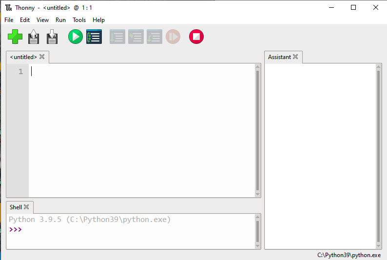
.. |image3| image:: media/d41b79772c9846fd8bf295c8451f8321.png
.. |image4| image:: media/3d04fe6893ca104e4e593a0786cb3799.png
.. |image5| image:: media/30d66dba96cfabbe2bd3b6c858564ef2.png
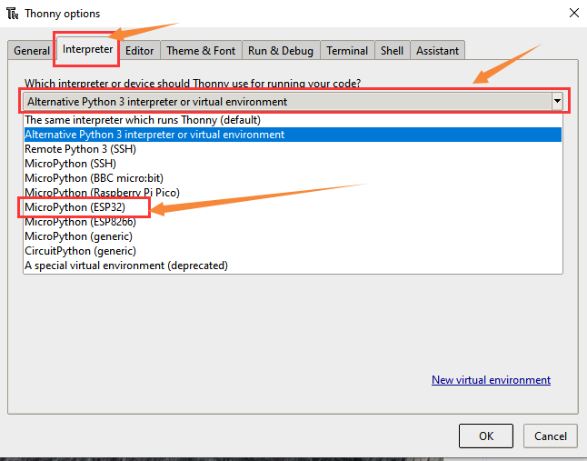
.. |image7| image:: media/4f1f3b0568c3ae2ca3288431df340184.png
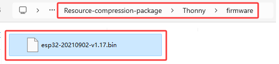
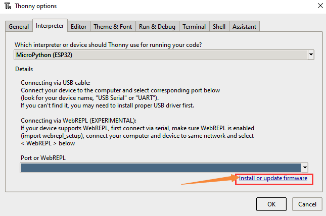
.. |image9| image:: media/d3bff3f1b25076733717273e94616088.png
.. |image10| image:: media/ad4cfc202f014101ddd9f5373773635f.png
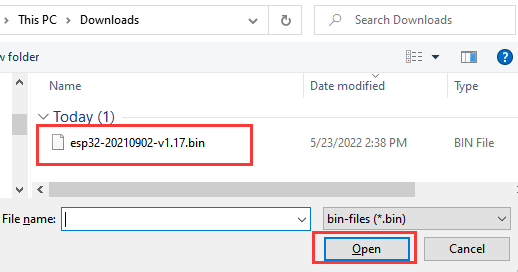
.. |image12| image:: media/507ff0c04761a509f729a8c4e88e4b27.png
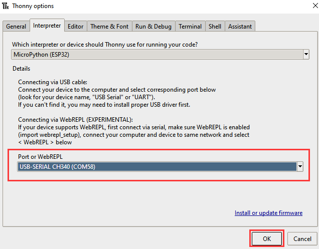
.. |image14| image:: media/19514aef3fdd86fb2c033c6441d8ff6e.png
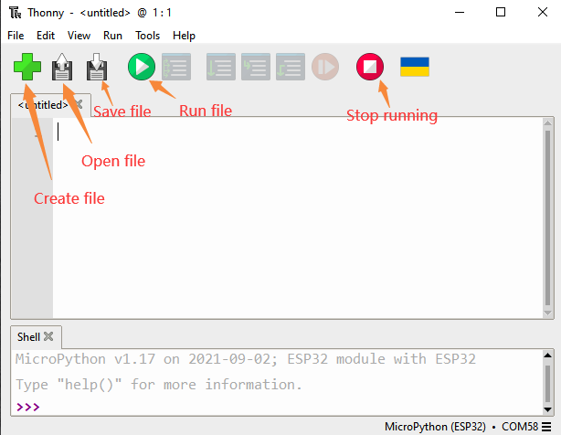
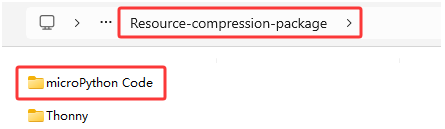
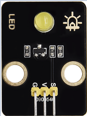
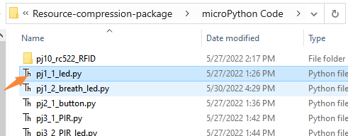
.. |image18| image:: media/166384572a1fa595858d933aea5af710.png
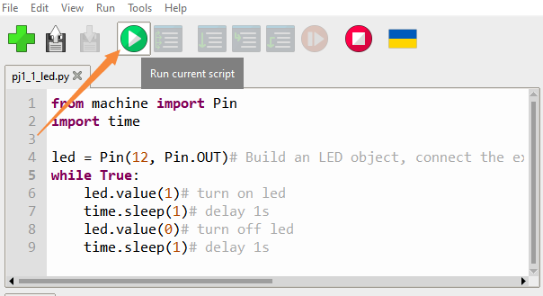
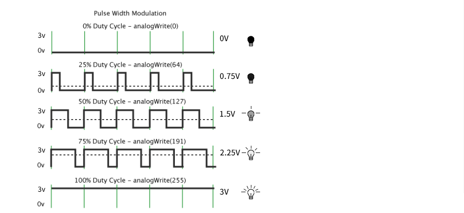
.. |image21| image:: media/609b283e0909b5e5c14809c4ccf892ed.png
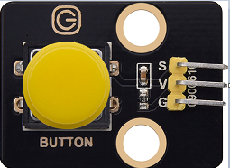
.. |image23| image:: media/1b984da67c0e89a72a9601c39362567d.png
.. |image24| image:: media/1bc079eabd93cb2e8a8e15f0ab7f1367.png
.. |image25| image:: media/c1518252606b111bfa66878a2bfcc965.png
.. |image26| image:: media/f8c6be9a6ad7a6423c1fa1456f771406.png
.. |image27| image:: media/2e6fd6b7975ef84ab94eee896161347b.png
.. |image28| image:: media/708316fde05c62113a3024e0efb0c237.jpeg
.. |image29| image:: media/35084ae289a08e35bdb8c89ceb134ba4.png
.. |image30| image:: media/6cbf6f177ea204f7632b872497fde010.png
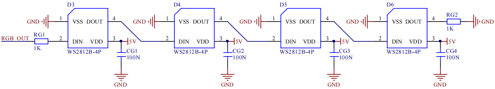
.. |image32| image:: media/c0df93f61c6b9272f62b1847ccfbdb10.png
.. |image33| image:: media/33da52918e88862a94035d61a9050f2e.png
.. |image34| image:: media/066e093f1711ada67d3309ddc9bdc66e.png
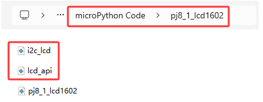
.. |Img| image:: ./media/img-20250603131246.png
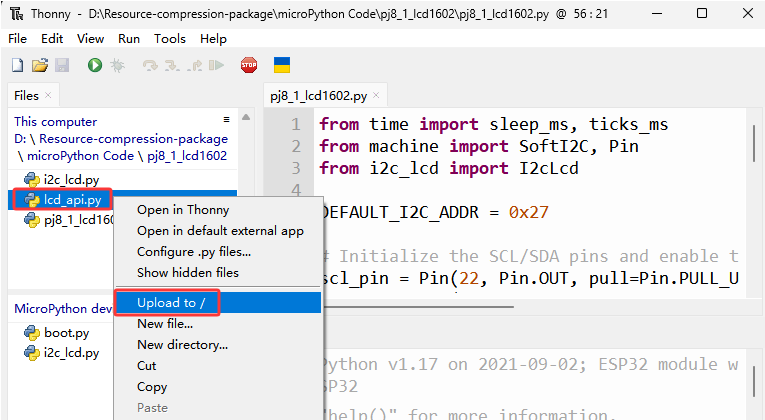
.. |image37| image:: ./media/img-20250603132138.png
.. |image38| image:: media/4550c4935e6c08e595a1e8707b54b551.png
.. |image39| image:: media/0b9c44c3e4f3706638b9cf15871b861c.png
.. |image40| image:: media/982ac6a9da0e8f55465ca5a969ac0dfe.png
.. |image41| image:: ./media/img-20250603132607.png
.. |image42| image:: ./media/img-20250603132647.png
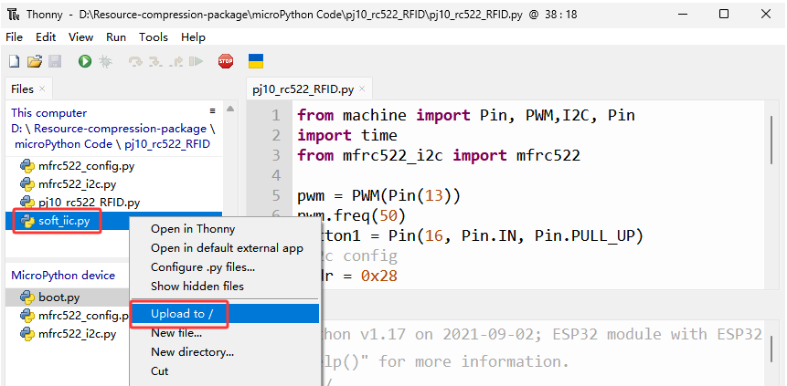
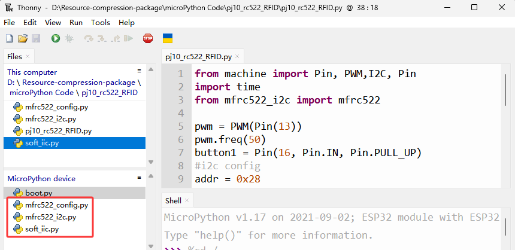
.. |image45| image:: media/03fd569d64704a7e9705c1891f4d4856.png
.. |image46| image:: media/1a5e70c0d091e2617acbfc274827b4fd.png
.. |image47| image:: media/9491f7768f28ee4901e6fdb83632c27c.png
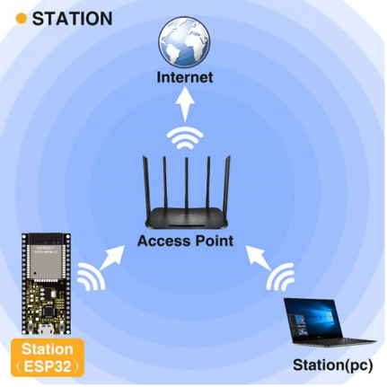
.. |image49| image:: media/278cbdc272b5cc1a6461a7934eabe5c0.png
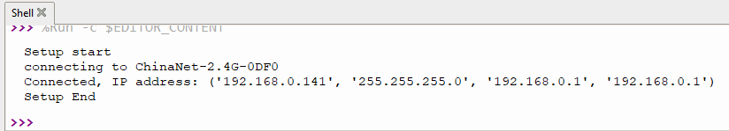