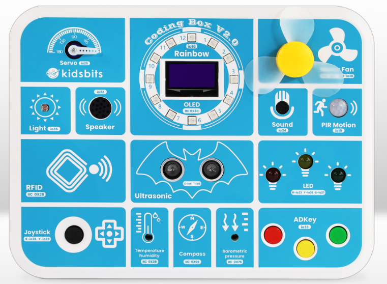
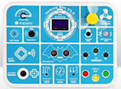
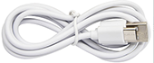
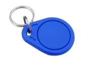
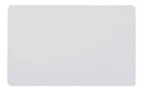

**Thank you for choosing keyestudio!**

**We will endeavor to provide you with better products and services!**

------

**About keyestudio**

Keyestudiois the best-selling brand owned by KEYES Corporation. Our product contains Arduino development and expansion boards, sensors and modules, Raspberry Pi, micro:bit expansion boards as well as smart cars and learning kits, which can help customers at any level to learn about Arduino.

Notably, all of our products are in line with international quality standards and are greatly appreciated in a broad menu of different markets across the world.

Welcome to check out more contents from our official website: [http://www.keyestudio.com](http://www.keyestudio.com)

------

**Obtain Information and After-sales Service**

1. If something is found missing or broken, or you have some difficulty learning the kit, please feel free to email us: [service@keyestudio.com](http://m.138.gz.cn/webadmin/~CAmsnCrrNXhTAySKCerrIfWjjZuuWVfI/~/usr/mod_edituser.jsp?;uid=service@keyestudio.com;;clearCache=)

2. We will endeavor to update projects and products continuously from your sincere advice! Thanks!

------

**Warning**

1. This product contains tiny pins, so please keep out of reach of children under 7 to prevent from lacerations. 
2. This product also contains conductive parts(control board and electronic modules). Please operate according to the requirements of tutorials. Otherwise, improper operation may damage parts due to overheating. In this case, do not touch it and immediately disconnect the circuit power.

------

**Copyright**

Keyestudio trademark and logo are the copyright of KEYES DIY ROBOT co.,LTD. All products under keyestudio brand can’t be copied, sold or resold without authorization by anyone or any company.

If you are interested in our products, please contact to our sales representatives: [fennie@keyestudio.com](http://m.138.gz.cn/webadmin/~CAmsnCrrNXhTAySKCerrIfWjjZuuWVfI/~/usr/mod_edituser.jsp?;uid=fennie@keyestudio.com;;clearCache=)

------

# Introduction to Coding Box

## 1. Introduction

Based on ESP32, this coding box is a learning toolbox for children over 6 years old, as a shell wraps its circuit board, avoiding pins scratched children. 

The ESP32 coding box integrates 16 sensors and modules, including LED, button, 1.3 inch OLED display, photoresistor, sound sensor, speaker, temperature and humidity sensor as well as pressure sensor. Thus, the box can be matched with interesting experiments. In this tutorial, we provide 36 projects, like small lamp, automatic window, sound control light, compass, and environmental monitoring.

Each project contains three programming methods: MicroPython, KidsBlock Desktop graphical programming which only need to build up code blocks, and another online wireless graphical programming which is much easier. So this kit is helpful for the initial cultivation of programming thinking.

## 2. Features

**1. No wiring:** We integrate wiring in circuit board, so no worry about the wrong wiring to burn the module.

**2. Multiple functions:** With ESP32 development board as control board, this box contains 16 sensors and modules, and it is available to either external 7-12V DC power or 6 AA batteries.

**3. Simple structure:** Ready-to-use and full shell package prevents hands from being scratched by pins and protects the board as well.

**4. Strong expansibility:** Four RJ11 interfaces are reserved beyond the shell, all of which are compatible with IIC communication.

**5. Basic programming learning:** Graphical programming for new hands to cultivate programming logic and foundation; MicroPython programming for developers to contact the underlying codes combined with hardware.

## 3. Parameters

**Operating voltage:** 3.3v

**External DC power:** 7-12V

**Built-in battery holder:** 9V (six AA batteries, of 1.5V each)

**USB power:** 5V

**Operating temperature:** 0 °C ~ 50 °C

## 4. Kit List

| #    |         PIC          |       NAME       | QTY  |
| :--- | :------------------: | :--------------: | :--: |
| 1    |   | ESP32 coding box |  1   |
| 2    |   |   Type-c cable   |  1   |
| 3    |  |       Key        |  1   |
| 4    |   |     IC card      |  1   |

