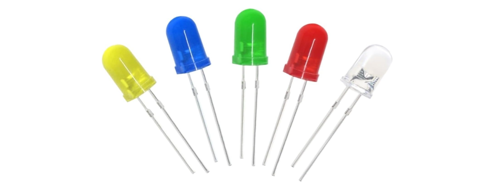
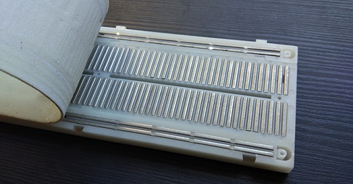
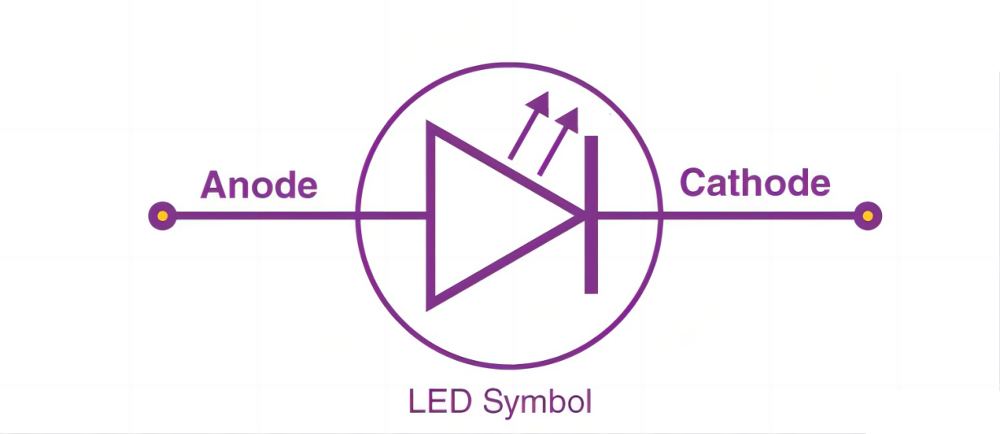
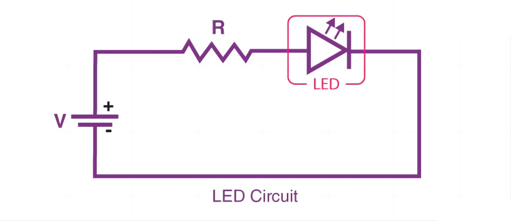
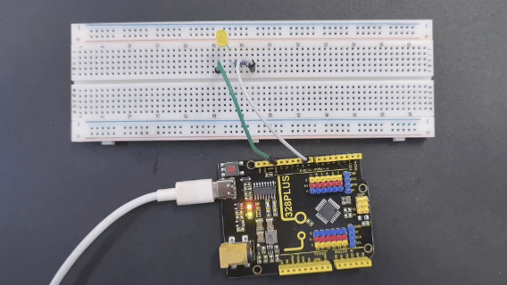

### Project 1 LED Blink



#### Description

LED, also known as a light-emitting diode, is a semiconductor device that can convert electrical energy into visible light. It consists of two different types of semiconductor materials, one with a negative charge and the other with a positive charge. When current flows through the LED, electrons jump from the negative to the positive layer, releasing photons and producing light.

In this project, we will use an Arduino board and an LED to create the classic "Blink" project. Through this project, you will understand the working principle of LEDs and write a simple program to control the blinking of the LED.

#### Hardware

1\. 328 Plus development board x1

2\. 5mm LED x1

3\. 220-ohm resistor x1

4\. Breadboard x1

5\. Jumper wires

#### Component Knowledge

**What is resistor?**

Resistor is the electronic component in the circuit, which limits and regulates current flow. Its unit is (Ω).

The units larger than ohms are kiloohms (KΩ) and megaohms (MΩ). When in use, in addition to the size of the resistance, you must also pay attention to its power. In the project, the leads at both ends of the resistor should be bent at a 90° angle to fit the breadboard properly. If the lead is too long, it can be cut to an appropriate length.


**What is breadboard?**

A breadboard is used to build and test circuits quickly before finalizing any circuit design. The breadboard has many holes into which circuit components like ICs and resistors can be inserted. A typical breadboard is shown below:




The bread board has strips of metal which run underneath the board and connect the holes on the top of the board. The metal strips are laid out as shown below. Note that the top and bottom rows of holes are connected horizontally while the remaining holes are connected vertically.


To use the bread board, the legs of components are placed in the holes. Each set of holes connected by a metal a strip underneath forms anode.

**What is LED?**

A light-emitting diode (LED) is a semiconductor device that emits light when an electric current flows through it. When current passes through an LED, the electrons recombine with holes emitting light in the process. LEDs allow the current to flow in the forward direction and blocks the current in the reverse direction.


Light-emitting diodes are heavily doped p-n junctions. Based on the semiconductor material used and the amount of doping, an LED will emit coloured light at a particular spectral wavelength when forward biased. As shown in the figure, an LED is encapsulated with a transparent cover so that emitted light can come out.

LED Symbol

The LED symbol is the standard symbol for a diode, with the addition of two small arrows denoting the emission of light.



Simple LED Circuit

The figure below shows a simple LED circuit.  
  
The circuit consists of an LED, a voltage supply and a resistor to regulate the current and voltage.

#### LED Working Principle

When the diode is forward biased, the minority electrons are sent from p → n while the minority holes are sent from n → p. At the junction boundary, the concentration of minority carriers increases. The excess minority carriers at the junction recombine with the majority charges carriers.


The energy is released in the form of photons on recombination. In standard diodes, the energy is released in the form of heat. But in light-emitting diodes, the energy is released in the form of photons. We call this phenomenon electroluminescence. Electroluminescence is an optical phenomenon, and electrical phenomenon where a material emits light in response to an electric current passed through it. As the forward voltage increases, the intensity of the light increases and reaches a maximum.

#### LED Specifications

1.8-2.2VDC forward drop

Max current: 20mA

Suggested using current: 16-18mA

Luminous Intensity: 150-200mcd

#### LED Pinout


An LED has a positive (Anode) lead and a negative (Cathode) lead. The schematic symbol of the LED is similar to the diode except for two arrows pointing outwards. The Anode (+) is marked with a triangle, and the Cathode (-) is marked with a line.

The longer lead of an LED is generally the positive (Anode), while the shorter lead is the negative (cathode).

#### Wiring Diagram

1.Insert the LED on the breadboard;

2.Connect one end of the 220 ohm resistor to the row of the breadboard where the LED anode is, and connect the other end of the resistor to digital pin 9 of the development board;

3.Connect the GND pin of the board via jump wire to the row of the breadboard where the LED cathode is.

 

#### Sample Code

```cpp

/*

Keye New RFID Starter Kit

Project 1

LED Blink

Edit By Keyes

*/

void setup() {

pinMode(9, OUTPUT); // Set digital pin 9 as an output

}

void loop() {

digitalWrite(9, HIGH); // Set digital pin 9 to high, turning on the LED

delay(1000); // Wait for 1000 milliseconds (1 second)

digitalWrite(9, LOW); // Set digital pin 9 to low, turning off the LED

delay(1000); // Wait for 1000 milliseconds (1 second)

}

```

#### Code Explanation

First, we need to define a variable to represent the digital pin connected to the LED. In Arduino programming, this can be done with a simple line of code:

```cpp

int ledPin = 9;

```

This line of code defines a variable named `ledPin` and initializes it to 9, indicating that the LED is connected to digital pin number 9 on the Arduino board. In Arduino, each digital pin can be used as either an input or output pin, depending on how we set it up.

Next, we need to set the mode of the `ledPin` so that it can correctly send signals to the LED. This is done using the `pinMode()` function, with the following syntax:

```cpp

pinMode(ledPin, OUTPUT);

```

This line of code sets `ledPin` to output mode (`OUTPUT`). In output mode, the Arduino board can send voltage signals to connected devices. For an LED, this means we can control its on and off states.

Once the pin mode is set, the next step is to control the LED's on and off states by sending high (HIGH) or low (LOW) signals to the LED. This is done using the `digitalWrite()` function, represented by the following two lines of code respectively:

```cpp

digitalWrite(ledPin, HIGH); // Turn on the LED

digitalWrite(ledPin, LOW); // Turn off the LED

```

When the second parameter of the `digitalWrite()` function is `HIGH`, Arduino outputs a high voltage to the `ledPin`, causing the connected LED to light up. Conversely, when the parameter is `LOW`, it outputs a low voltage, and the LED turns off.

To keep the LED state (on or off) for a certain duration, we use the `delay()` function to pause the program execution. For example:

```cpp

delay(1000);

```

This line of code pauses the program for 1000 milliseconds (i.e., 1 second). This means the LED will maintain its current state (either on or off) for one second. By adjusting the number of milliseconds in `delay()`, we can control how long the LED state lasts.

#### Project Result



After uploading the code to the development board, the LED connected to digital pin 9 starts blinking and it will be on and off for 1s.

