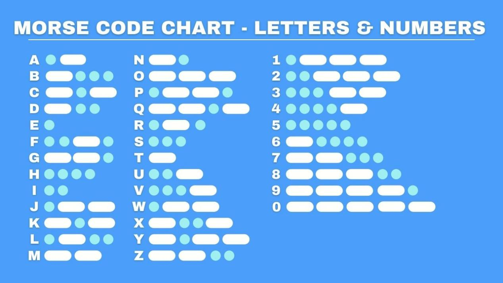
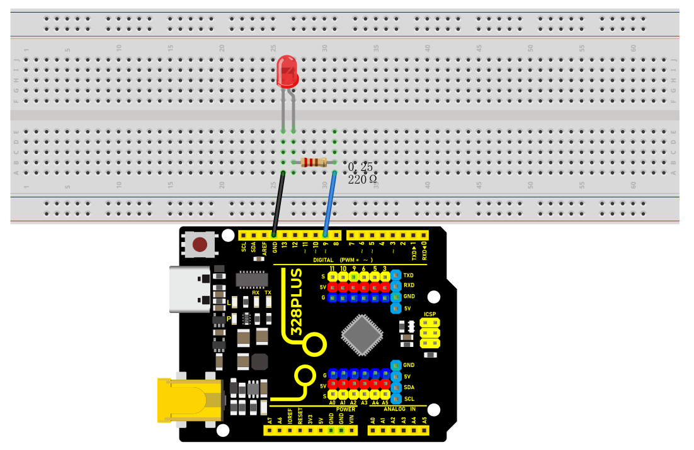
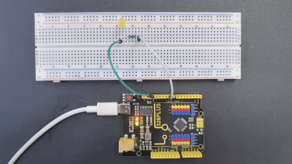

### Project 2 SOS


#### Description

SOS is an internationally accepted distress signal, which consists of three short dot signals, three long dash signals, and three short dot signals(corresponding to "· · · – – – · · ·" in Morse code).

This project will use an LED to simulate the flashing process of the SOS signal. Each dot signal LED flashes for 0.2s, each dash signal flashes for 0.6s, and the interval between two characters is 0.2s.

#### Hardware

1\. 328 Plus development board x1

2\. USB cable x1

3\. Breadboard x1

4\. LED x1

5\. 220Ω resistor x1

6.Jumper wires

#### Working Principle

SOS("Save Our Souls" or "Save Our Ship") is an internationally accepted distress signal. Its working principle is simple but effective.



The SOS signal usually consists of three letters: three short "S" sounds, three long "O" sounds, and three short "S" sounds. This unique rhythm makes it stand out in various noisy environments. Whether in the ticking of the telegraph or the rustling of the radio, SOS can be clearly identified.

Historically, the emergence of the SOS signal changed the fate of countless people. Ships in distress at sea, crashed planes, and anyone in dire straits can seek help from the outside world by sending SOS signals. Once the SOS signal is received, rescue operations begin immediately.

In modern society, the application of SOS has gone far beyond the maritime field. The emergency call function on mobile phones and other communication devices is actually a variant of SOS. As long as you press a specific key combination in an emergency, your location information and help information will be automatically sent to the police, fire and other rescue departments.

#### Wiring Diagram

The wiring is the same as Project 1.




#### Sample Code

```cpp

/*

Keye New RFID Starter Kit

Project 2

SOS

Edit By Keyes

*/

int ledPin = 9; // Define the digital pin to which the LED is connected

// Define the duration of the dot signal '.' and the dash signal '-' in ms

int dotDuration = 200;

int dashDuration = 600;

// Set the pause time between two characters in ms

int pauseDuration = 200;

void setup() {

pinMode(ledPin, OUTPUT); // Set the pin to output mode

}

void loop() {

// S ···

for (int i = 0; i < 3; i++) {

digitalWrite(ledPin, HIGH);

delay(dotDuration);

digitalWrite(ledPin, LOW);

delay(pauseDuration);

}

delay(pauseDuration);

// O ---

for (int i = 0; i < 3; i++) {

digitalWrite(ledPin, HIGH);

delay(dashDuration);

digitalWrite(ledPin, LOW);

delay(pauseDuration);

}

delay(pauseDuration);

// S ···

for (int i = 0; i < 3; i++) {

digitalWrite(ledPin, HIGH);

delay(dotDuration);

digitalWrite(ledPin, LOW);

delay(pauseDuration);

}

delay(3000); // SOS cycle interval is 3 s

}

```

#### Code Explanation

First, we need to define the digital port that connects the LED. In Arduino programming, this can be done with a simple line of code:

```cpp

int ledPin = 9;

```

This line of code declares an integer variable named `ledPin` and initializes it to 9. This means the LED is connected to digital port 9 on the Arduino board. In Arduino, each digital port can be configured as either input or output, used for reading sensors or controlling external devices like LEDs.

Next, we need to configure the mode of this port in the program's `setup()` function. The `setup()` function is an essential part of every Arduino program, automatically executed once when the Arduino board is powered up, for initial settings. To control the LED, we need to set port 9 to output mode:

```cpp

void setup() {

pinMode(ledPin, OUTPUT);

}

```

Here, `pinMode()` is an Arduino function that sets the mode of a specified digital port. `ledPin` is the port number we defined earlier, and `OUTPUT` is a predefined constant indicating that the port will be used for outputting electrical signals.

Subsequently, we'll write the `loop()` function, which is the core of an Arduino program, repeatedly executing after the device is powered up. In this function, we'll implement the logic to control the LED to flash an SOS signal. We use the `digitalWrite()` function to turn the LED on and off, and the `delay()` function to control the speed and interval of the flashing:

```cpp

void loop() {

// S ···

for (int i = 0; i < 3; i++) {

digitalWrite(ledPin, HIGH);

delay(dotDuration);

digitalWrite(ledPin, LOW);

delay(pauseDuration);

}

delay(pauseDuration);

// O ---

for (int i = 0; i < 3; i++) {

digitalWrite(ledPin, HIGH);

delay(dashDuration);

digitalWrite(ledPin, LOW);

delay(pauseDuration);

}

delay(pauseDuration);

// S ···

for (int i = 0; i < 3; i++) {

digitalWrite(ledPin, HIGH);

delay(dotDuration);

digitalWrite(ledPin, LOW);

delay(pauseDuration);

}

delay(3000); // SOS cycle interval is 3 s

}

```

In this section of the code, `digitalWrite(ledPin, HIGH)` and `digitalWrite(ledPin, LOW)` are used to turn the LED connected to port 9 on and off. The `delay()` function controls the time intervals in milliseconds. By adjusting the values in `delay()`, you can change the speed and rhythm of the SOS signal's flashing.

#### Project Result



After uploading the code and powering on, the LED will flash according to the rhythm of the SOS signal: "· · · – – – · · ·", with 3s between each SOS cycle.

