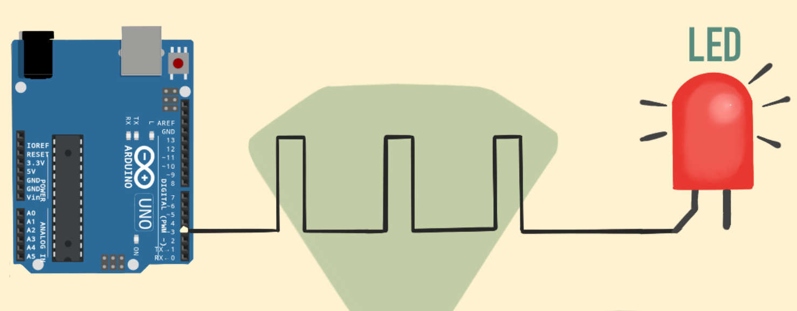
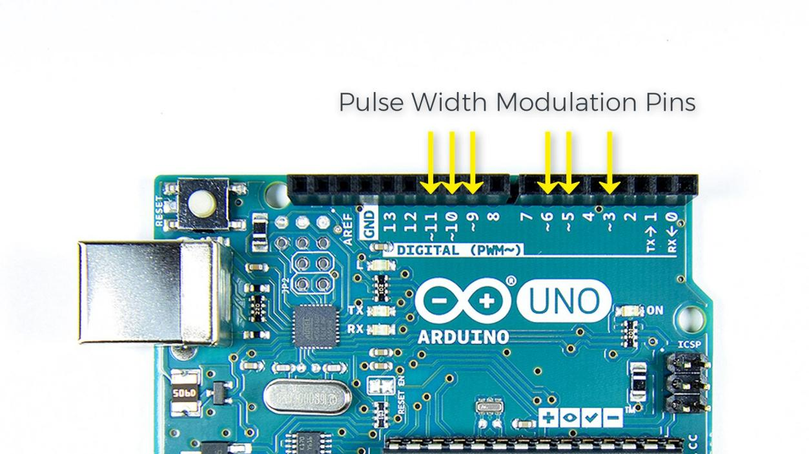
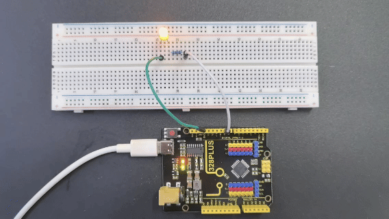

### Project 3 PWM



#### Description

PWM (Pulse Width Modulation) is a common electronic control technology that controls the average value of the output voltage or current by changing the pulse width. To put it simply, it controls the output of energy by controlling the time ratio of "on" and "off".

This project will use an Arduino development board and an LED to control the brightness of the LED through PWM. By writing Arduino code, we will realize the gradient effect of LED brightness to understand the working principle and application of PWM.

#### Hardware

1\. 328 Plus development board x1

2\. LED x1

3\. 220 ohm resistor x1

4\. Breadboard x1

5.Jumper wires

#### Working Principle

Arduino PWM (Pulse Width Modulation) is used to control LED brightness, motor speed, etc. It can control analog devices by quickly switching digital pins to simulate different voltage levels. This project will explore how Arduino PWM works.

The basic principle of PWM is to adjust the average value of the output voltage by changing the width of the pulse. Arduino's digital pins can only output high level (5V) or low level (0V). But if you quickly switch between high and low levels and control the duration of the high level, you can simulate a voltage between 0V and 5V. The proportion of the high level duration to the entire cycle is called the duty cycle. The larger the duty cycle, the higher the output voltage.


Arduino's analogWrite() function can easily implement PWM. It accepts two parameters: pin number and duty cycle. The value range of the duty cycle is 0-255, which corresponds to 0% to 100%. For example, analogWrite(9, 127) means outputting a PWM waveform with a 50% duty cycle on pin 9.

Arduino's timer/counter module is used to generate PWM signals. Different Arduino boards have different numbers of timers/counters. Each timer/counter has multiple channels, and each channel can independently generate a PWM. Arduino UNO has 3 timers and 6 PWM channels, which are located on pins 3, 5, 6, 9, 10, and 11.



The core of the timer/counter is a counter register (TCNTn). It will automatically increase by one every clock cycle until it reaches the set maximum value (TOP), then it will clear to zero and start again. At the same time, there is a comparison match register (OCRnA/B) used to save the duty cycle value. Whenever the counter value is equal to the compare match register, the PWM output will flip (from high level to low level, or from low level to high level). By setting different TOP values and comparison matching values, the PWM frequency and duty cycle can be changed.

Arduino's analogWrite() function will automatically set the timer's working mode, generally using fast PWM mode (Fast PWM). In this mode, the counter continuously counts at a fixed frequency and compares with the compare match register. Once the count value is equal to TOP, the counter will reset to zero and the PWM output will flip.

For example, if we use a 16MHz clock and an 8-bit counter with a TOP value of 255, and a compare match value of 127, then the PWM frequency is 16MHz/(255+1)=62.5kHz. PWM outputs high level when the count value is less than 127, and outputs low level when it is greater than 127. Since 127/256=50%, the PWM waveform with 50% duty cycle is output, which is equivalent to 2.5V DC.

To sum up, Arduino PWM quickly switches the pin level through the timer and adjusts the duty cycle, thereby simulating a continuously variable analog voltage on the digital pin. This provides a simple and flexible means to control LED brightness, motor speed, etc. Understanding the principle of PWM will help you better apply this technology and allow Arduino to create more magical works.

#### Wiring Diagram

The wiring is the same as Project 1.

 

#### Sample Code

```cpp

/*

Keye New RFID Starter Kit

Project 3

PWM

Edit By Keyes

*/

int ledPin = 9; // Define the pin of the LED

int brightness = 0; // Define the brightness variable of the LED

int fadeAmount = 5; // Define the step size of the brightness change

void setup() {

pinMode(ledPin, OUTPUT); // Set LED pin to output mode

}

void loop() {

analogWrite(ledPin, brightness); // Use analogWrite function to output PWM signal

brightness = brightness + fadeAmount; // Adjust brightness variable

if (brightness <= 0 || brightness >= 255) {

fadeAmount = -fadeAmount; // When the brightness reaches the maximum or minimum value, change the direction of the brightness change

}

delay(30); // Delay 30ms to control the speed of brightness change

}

```

#### Code Explanation

The code defines variables and constants to control the LED's behavior:

```cpp

int ledPin = 9; // LED pin

int brightness = 0; // LED brightness

int fadeAmount = 5; // Brightness change step

```

Here, `ledPin` is set to 9, meaning the LED is connected to digital pin 9 on the Arduino board. `brightness` tracks the LED's current brightness, starting at 0 (off). `fadeAmount` is the increment/decrement for brightness changes, set to 5.

The `setup()` function initializes settings:

```cpp

void setup() {

pinMode(ledPin, OUTPUT); // Set LED pin to output mode

}

```

In `setup()`, `pinMode()` sets `ledPin` to output mode (`OUTPUT`), necessary for controlling LED brightness.

The `loop()` function controls LED brightness changes:

```cpp

void loop() {

analogWrite(ledPin, brightness); // Use analogWrite to control LED brightness

brightness = brightness + fadeAmount; // Adjust brightness

if (brightness <= 0 || brightness >= 255) {

fadeAmount = -fadeAmount; // Reverse direction when reaching max/min

}

delay(30); // Delay to control brightness change speed

}

```

In `loop()`, `analogWrite()` outputs a PWM signal to `ledPin`, controlling LED brightness. `brightness` is adjusted by `fadeAmount`, creating a fading effect.

When `brightness` reaches 0 or 255, `fadeAmount` is reversed using `fadeAmount = -fadeAmount;`, making the brightness change direction. This creates a smooth fade between the brightest and darkest states.

Finally, `delay(30);` pauses the program for 30 milliseconds. This delay controls the speed of brightness changes; shorter delays result in faster changes.

#### Project Result

After uploading the code, the LED will show a gradient effect.



The brightness will gradually increase from 0 to 255, then gradually decrease to 0. By adjusting the `fadeAmount` variable, you can change the speed of the brightness change.

